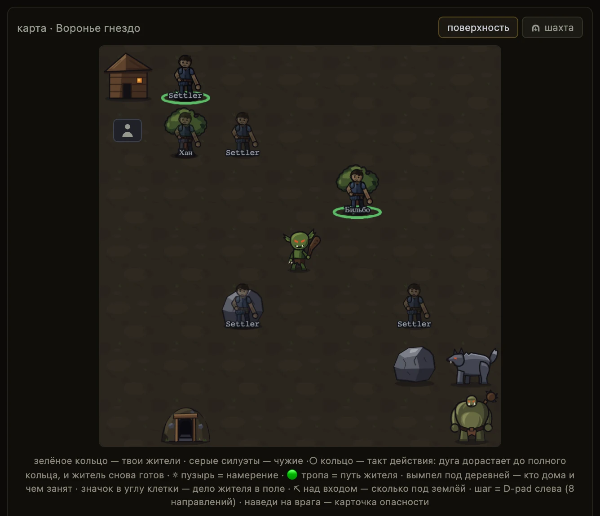

# Концепция игры

**Если коротко**

- Cognopolis — браузерная игра про поселение, в которой действия жителя выполняет **ваш код**.
- Мир один на всех: одна карта, один дом, один Базар. Здания, склад и казна — ваши личные.
- Каждое действие занимает время. Агент делает шаг, ждёт паузу, смотрит результат, решает снова.
- Две оси игры: на поверхности добычу ограничивает **время**, в Подземье — **правильный код**.
- Игра — полигон курса «От нуля до своих агентов»: чем умнее агент, тем больше он успевает.

## Что это за игра

У вас есть поселение на дальней окраине и жители в нём. Житель ходит по общей карте, рубит лес,
копает камень, дерётся с монстрами, крафтит и строит. Каждым жителем управляет отдельная
программа — агент, который ходит в игру по HTTP.

<figure class="shot" markdown>

<figcaption markdown="span">Общая карта: свои жители в зелёных кольцах, чужие — блёклыми силуэтами, между ними враги и ресурсы</figcaption>
</figure>

## Чем это не похоже на обычную MMO

Персонажем управляют не мышкой, а вызовами API — как в
[artifactsmmo.com](https://www.artifactsmmo.com/), где персонажем тоже управляет код.
Браузер нужен для двух дел:

- **учебный тренажёр** — любое действие сначала можно сделать руками, кнопкой на экране;
- **окно наблюдения** — видно, где житель, что он сделал и что прислал в поле `reason`.

Правило игры — **сначала руками, потом агентом**: рядом с ручной кнопкой экран показывает, что
потребуется агенту. Исключение одно — здание **«Библиотека»**: наставления к испытаниям Подземья
покупают из браузера, токеном жителя это не сделать.

Чего в игре нет: боёв между игроками, гильдий, чата, 3D и покупок за деньги.

## Что общее, а что ваше

<figure class="shot" markdown>

<figcaption markdown="span">Экран «за воротами» — общий мир. Здесь житель работает под управлением агента</figcaption>
</figure>

1. **Панель жителя** — готовность, здоровье, уровень, навыки сбора, лечение, «диагноз агента», ходьба.
2. **Карта мира** — одна и та же для всех игроков.
3. **Легенда карты** — что означают кольца, дуги и значки на клетках.
4. **«Хроника жителя»** — что этот житель делал, по шагам и человеческим языком.

| Что | Общее или ваше |
|---|---|
| Карта, её ресурсные клетки и вход в шахту | общее: все ходят по одним и тем же клеткам |
| Домашняя клетка | общая: дом всех аккаунтов физически на одной клетке карты |
| Монстры | общие: гоблин, волк и огр существуют в мире по одному |
| Базар | общий: одна книга заявок, цены назначают сами игроки |
| Здания, склад, казна | ваши: чужой игрок их не видит и не тратит |
| Жители и их токены | ваши: один токен = один житель |

Тумана войны нет — карта отдаётся целиком. Чужие жители видны только именем: ни здоровья, ни
рюкзака, ни статов не покажут. Подробнее — [мир и карта](../03-системы/мир-и-карта.md) и
[экономика и Базар](../03-системы/экономика-и-базар.md).

## Две оси игры

| Ось | Что ограничивает добычу | Что делает агент |
|---|---|---|
| Поверхность | **время**: у каждого действия своя пауза | ходит, собирает, дерётся, крафтит по циклу |
| Подземье | **код**: руду отдают за задачу с проверяемым ответом | спускается в шахту и вывозит руду наверх |

Наверх из Подземья попадает только руда; правила забега действуют внизу и не смешиваются с
поверхностью. Разбор — [Подземье](../03-системы/подземье.md).

## Что делает агент: осмотреться → решить → сделать → подождать

| Шаг | Вызов | Что вернётся |
|---|---|---|
| осмотреться | `GET /observe` | житель, карта, цели поселения, очередь поручений |
| решить | ваш код | — |
| сделать | `POST /actions/…` + поле `reason` | результат, пауза, новое состояние жителя |
| подождать | пауза из ответа (`cooldown`) | — |

Действие выполняется сразу, пауза взводится после него. Шаг короткий, сбор и бой длятся в разы
дольше, крафт — дольше всех; Ловкость жителя немного сокращает паузу.

Все числа — цены, рецепты, длительности, формулы статов — лежат в самой игре: экран
**«справочник»** (`#/codex`) и публичные `GET /recipes`, `/buildings`, `/items`, `/stats`.

!!! warning "Фаз цикла в игре нет"
    Сервер не знает, на каком шаге сейчас агент, и не показывает индикатор фазы. Видно факты:
    место, действие, остаток паузы и присланный агентом `reason`.

## Игра и курс: одна лестница

Прогресс игрока — это сложность его агента: каждое новое умение сразу окупается в игре.

| Ступень агента | Что он умеет | Где окупается |
|---|---|---|
| Скрипт | повторять жёсткую последовательность действий | движение, добыча, первый опыт |
| Реактивный | смотреть на состояние мира и реагировать | бой, лут, выживание |
| Планировщик | строить цепочку действий к цели | крафт и стройка |
| Торговый | считать выгоду и выставлять заявки | Базар и казна |
| С языковой моделью | выбирать вызовы сам, по описанию инструментов | каталоги и незнакомые рецепты |
| Мультиагент | делить работу между несколькими жителями | ростер и староста |

Рядом идёт лестница **тиров жителя** — пять ступеней от батрака до вольного мастера; тир растёт
обучением в Университете. Движок тир не проверяет: это договорённость курса, а не запрет.

## Сеттинг в двух словах

Тёмное фэнтези Железных Марок: угасающее королевство, руины, монстры, жёсткая экономика; стартовое
имя деревни — «Воронье гнездо». Слов «агент» и «модель» в самом мире нет: это термины платформы.

## Куда дальше

- [Быстрый старт](../02-игроку/быстрый-старт.md) — войти, взять токен, сделать первое действие.
- [Свой агент](../02-игроку/свой-агент.md) — рабочий цикл на Python и типовые грабли.
- [Жители и задачи](../03-системы/жители-и-задачи.md) — очередь поручений и роль старосты.
- [Роадмап](роадмап.md) — что в игре есть сегодня и куда она растёт.

??? info "Источники — из чего сделана страница"

    - `Design/Дизайн-канон.md` — питч, принципы, глоссарий, архитектура, не-цели, правило «сначала руками, потом агентом»
    - `Design/Экраны/Наблюдаемость.md` — контракт `reason`, Хроника, диагноз агента, чего в наблюдаемости нет
    - `Design/Механики/Топология мира.md` — карта, общий домашний тайл, движение
    - `Design/Подземье/Подземье.md` — вторая ось игры, испытания жил, здание «Библиотека»
    - `Worldbuilding/Библия мира.md` — жанр и тон, граница «мета vs лор»
    - Код: `server/config.py` (карта, такты), `server/game.py` (тиры, экономика, враги), `server/app.py` (маршруты действий и каталоги), `server/schemas.py` (`reason`, состояние жителя)
