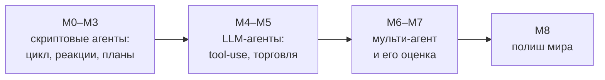

# Путевая карта: от скрипта к городу умов

Cognopolis растёт **майлстоунами** — пронумерованными ступенями M0…M8. Каждая ступень — это
не «фича в бэклоге», а **играбельный вертикальный срез**: новая механика доведена сразу от API
до сервера, сохранения, минимального визуала и тестов, и её можно потрогать Python-клиентом.
И у каждой ступени есть вторая жизнь: она рождает урок курса — учит строить агента нового типа.

Поэтому карту стоит читать в двух колонках сразу: **что появляется в игре** и **какого агента
это учит писать**. Игра и учебная программа — одна лестница.

О том, зачем всё это, — в [концепции](концепция.md). Как начать играть — в
[быстром старте](../02-игроку/быстрый-старт.md).

## Лестница M0 → M8

| M | Что появляется в игре | Какого агента учит |
|---|---|---|
| **M0** | Базовый цикл: один житель, действия `move` / `gather` / `fight` / `rest` с кулдауном (паузой между действиями), детерминированный бой, REST-API и MCP-интерфейс над общим игровым ядром | Простейший скрипт по циклу «посмотри → реши → сделай → подожди» |
| **M1** | Второй ресурс (камень), профессии, действие `reason` и лог событий, склад с авто-сдачей добычи при возврате домой, карта подрастает | Реактивный сборщик: строит маршрут, реагирует на «инвентарь полон» |
| **M2** | Мобы разной силы по зонам, дроп и лут, смерть с потерей рюкзака и возрождением дома | Боевой цикл: выбор посильных целей, отступление вовремя |
| **M3** | Личная база аккаунта: `build` / `upgrade` / `craft`, древо технологий (Ратуша открывает постройки), инструмент ускоряет добычу | Планировщик под цель: разворачивает «сделай топор» в дерево зависимостей |
| **M4** | Каталоги-справочники `GET /recipes`, `/buildings`, `/items` — мир можно **открывать** запросами, а не зашивать в код | **LLM tool-use** — агент на языковой модели, который сам вызывает инструменты; главный педагогический скачок курса |
| **M5** | Экономика: казна и золото, Торговец скупает трофеи (так золото входит в мир), Лавка и Храм как стоки, игрок-игроку Базар с книгой заявок, эскроу и налогом | Торговый LLM-агент: рассуждение о ценах, «что почём и где маржа» |
| **M6** | Цели поселения и поручения, несколько жителей на аккаунт с под-токенами, староста, тиры жителей и университет | **Мульти-агент**: староста-оркестратор раздаёт работу жителям-исполнителям |
| **M7** | Eval-харнесс — стенд оценки «насколько хорош твой агент за N тиков»: детерминированные сиды, метрики, рейтинг | Оценивание агентов: метрики, сравнение версий, ловля деградаций |
| **M8** | Полиш: квесты и ачивки, лидерборды, характеры служб в UI, именные NPC, город-хаб Айронгейт | — (это про мир и мотивацию, не про новый навык) |

Крупными мазками лестница делится на три эпохи:

За кадром лестницы живёт сквозной фундамент — аккаунты и токены, лимиты нагрузки,
операторская консоль. Это не майлстоуны: такие вещи растут постепенно, вместе со всеми срезами.

Здесь намеренно нет пометок «готово / в работе»: карта — про порядок и логику ступеней.
Что уже в проде — vault `State.md`.

## Принципы нарезки

Почему лестница нарезана именно так — четыре правила.

- **Тонкий срез, но насквозь.** Каждая механика берётся в минимальной форме, зато проходит все
  слои: от API до экрана и урока. Глубина — тиры, тонкие формулы, лут-таблицы — уходит в бэклог
  и не блокирует срез. Лучше работающий скелет, чем красивый недострой.
- **Скачок к LLM (M4) не зависит от Базара (M5).** Переход «скрипт → языковая модель» — самый
  трудный шаг для студента, поэтому он учится изолированно, на чистом tool-use. Экономическое
  рассуждение приходит следующим шагом, когда сам механизм уже освоен.
- **«Город умов» сознательно отложен на конец** (back-load мультиагента). Мультижитель и староста
  появляются в движке только со срезов M6 — а M0–M5 учат одиночным навыкам. Так к M6 накоплен
  весь смысл: правило «1 житель = 1 агент» выстреливает как развязка, а не как усложнение с порога.
- **Новое приземляется в существующие экраны.** Никаких «отдельных вкладок под фичу»: у каждой
  зоны интерфейса есть канон, и новые механики встраиваются в него. Инфраструктура общего мира
  (балансировка, масштабирование) наращивается по мере реальной нагрузки, а не впрок.

## Что открыто в бэклоге

Коротко, без деталей — только чтобы было видно, куда карта смотрит дальше:

- **Уроки M4/M5 батчем.** Дизайн урока про LLM tool-use готов и ждёт автора; урок про торгового
  агента — payoff всей экономики ([экономика и Базар](../03-системы/экономика-и-базар.md)).
- **Публичный репозиторий для pip-клиента.** Игровой репозиторий приватный, поэтому
  `pip install` клиента из студенческих ноутбуков (Colab/Kaggle) пока невозможен — нужен
  отдельный публичный репозиторий или PyPI.
- **Вынос админки.** Операторская консоль работает, но админ пока живёт на игровом API той же
  ролью; хочется отдельной идентичности и отдельной поверхности — чтобы граница «оператор ≠ игрок»
  была архитектурной, а не договорной.
- **Лор-полиш M8.** Характеры Торговца, Лавки, Храма и Базара в интерфейсе, именные NPC,
  переезд служб в хаб Айронгейт — лор уже написан, ждёт своей ступени.
- Плюс россыпь технических хвостов (лимиты на edge, детали наблюдаемости) — их берут по случаю.

Как ступени превращаются в код и деплой — глазами разработчика:
[запуск и архитектура](../04-разработчику/запуск-и-архитектура.md).

## Источники

- `Roadmap.md` — лестница M0–M8, принципы нарезки и бэклог; здесь пересказано человеческим языком
- `State.md` — актуальное состояние: что уже в проде и что делается сейчас
- `Дизайн-канон.md` — что такое «вертикальный срез» и канон майлстоуна
