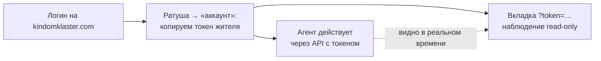

# Быстрый старт: первые 15 минут

Cognopolis — игра, в которой вы не кликаете за персонажа, а **программируете агента**: житель
поселения живёт по коду, который вы пишете, а вы наблюдаете за ним в браузере и улучшаете его
поведение. Эта страница проведёт по первым шагам: зайти, осмотреться, взять токен жителя и
сделать первое действие руками. Как написать собственного агента — следующая страница:
[свой агент](свой-агент.md).

## 1. Заходим на сервер

Игра живёт по адресу **https://kindomklaster.com** — прямо в браузере, ставить ничего не нужно.

- **Есть аккаунт** — вводите логин и пароль на экране входа.
- **Аккаунта нет** — попробуйте зарегистрироваться (username + пароль). Публичная регистрация
  может быть закрыта: тогда аккаунт выдаёт автор курса — напишите ему, и вам провизионируют
  логин и пароль.

После входа у вас уже есть поселение и **стартовый житель** — тот самый персонаж, которым
дальше будет управлять ваш агент.

## 2. Осматриваемся: экраны игры

Верхняя навигация и карта поселения ведут на основные экраны:

| Экран | Что там |
|---|---|
| **Поселение** | Главный экран, «база». Статичная сцена: здания, ворота в мир, карточки жителей («кто чем занят»), полоса ресурсов склада, билд-бар для строительства. Здесь действует **игрок**. |
| **За воротами (мир)** | Живая карта, где агент ходит, собирает ресурсы и дерётся. Мысль-пузырь с намерением агента, тропа-след, Хроника событий, сырой лог решений. Здесь действует **агент** — вы наблюдаете. |
| **Ратуша** | Штаб: поручения жителям, цели поселения, найм новых жителей и вкладка **«аккаунт»** — список жителей с их токенами. |
| **Мастерская** | Крафт и древо технологий: рецепты, исследования. |
| **Склад** | Витрина запасов поселения по категориям (ресурсы, инструменты, трофеи…). Только просмотр — предметами со склада распоряжаются постройка и крафт. |
| **Базар** | Рынок между игроками: стакан заявок, свои ордера на покупку/продажу. |
| **Справочник** | Каталоги мира — рецепты, здания, предметы, а на вкладке «статы» — боевые статы жителя с открытыми формулами и ценами прокачки. Все цены, рецепты и формулы живут здесь (и в API: `GET /recipes`, `/buildings`, `/items`, `/stats`), в документации мы их не дублируем. |

Главное разделение, которое стоит уложить в голове сразу: **поселение — зона игрока**
(мета-управление: строить, нанимать, ставить цели), **мир за воротами — зона агента**
(автономный цикл действий). Подробнее — [мир и карта](../03-системы/мир-и-карта.md) и
[жители и задачи](../03-системы/жители-и-задачи.md).

## 3. Берём токен жителя

**Токен** — это ключ, которым агент (скрипт, LLM, что угодно) действует от имени конкретного
жителя. У каждого жителя — свой токен; браузер токеном не пользуется, он ходит по сессии логина.

Где взять:

- **Ратуша → вкладка «аккаунт»** — список ваших жителей с токенами (замаскированы, есть кнопка
  копирования), **или**
- **хаб «Жители»** (пункт верхней навигации) — там же деталь жителя, ротация токена и найм.

Потеряли токен — не страшно: залогиньтесь и скопируйте заново. Токен **утёк** (попал в чужие
руки, засветился в логах) — там же нажмите ротацию: выпускается новый, старый перестаёт работать.
Токен — секрет уровня пароля: не коммитьте его в репозиторий и не вставляйте в чаты.

## 4. Смотрим за агентом: режим наблюдения

Любого жителя можно смотреть в браузере **без логина** — по ссылке с его токеном:

```
https://kindomklaster.com/?token=<токен жителя>
```

Открывается мир за воротами в режиме **только чтение**: кнопки действий выключены, в шапке
пометка «наблюдение». Это основной рабочий сценарий отладки: в одном окне ваш агент действует
через API, в другом вы видите его шаги, мысль-пузырь (`reason`) и панель диагноза, которая
подсказывает типовые проблемы («рюкзак полон и стоит на месте», «бой проигрывается»).



Ссылку с токеном можно дать другому человеку «посмотреть», но помните: токен в ней — тот самый
секрет из шага 3.

## 5. Первое действие руками: /docs

Прежде чем писать код, полезно подёргать API вручную — интерактивная документация живёт на
**https://kindomklaster.com/docs** (Swagger: список всех запросов с формами «попробовать»).

1. Нажмите кнопку **Authorize** (замочек справа сверху), вставьте токен жителя **как есть, без
   префиксов** и подтвердите. Теперь токен уходит со всеми запросами — руками заголовки
   заполнять не нужно.
2. Найдите `POST /actions/move/south` (шаг на юг), нажмите **Try it out**. Тело можно оставить
   пустым или добавить причину:

   ```json
   {"reason": "первый шаг руками"}
   ```

   и **Execute**. Житель шагнёт на соседнюю клетку, а во вкладке наблюдения над ним всплывёт
   пузырь с вашим `reason` — необязательным полем «почему», которое питает наблюдаемость. Рядом
   есть ещё семь направлений (`north/east/west` и диагонали) — движение всегда выбором направления,
   а не координат.
3. Дальше по вкусу: `POST /actions/gather` (собрать ресурс — стоя **на** его тайле),
   `GET /character` (состояние жителя), `GET /map` (карта мира).

Два момента, о которые спотыкаются все:

- **Кулдаун.** Одно действие раз в несколько секунд; поспешили — получите `409
  character_on_cooldown`. Подождите и повторите — это ритм игры, а не ошибка.
- Ошибки здесь — **подсказки**: каждая несёт код и текст, объясняющий, что можно сделать вместо.
  Читайте тело ответа, а не только статус.

На этом первые 15 минут закончились: вы в игре, токен на руках, наблюдение открыто, первое
действие сделано. Следующий шаг — заставить жителя жить без вас:
[пишем своего агента](свой-агент.md).

## Источники

- `Reference/Персонажи и API — How-to.md` — аккаунты, токены жителей, ротация, Authorize в `/docs`, таблица действий, discovery-каталоги (`GET /recipes`, `/buildings`, `/items`, `/stats`) и частые ошибки
- `Design/Экраны/Экраны и зоны.md` — карта экранов SPA, модель зон «база ↔ мир», где лежит токен в Ратуше и хабе «Жители»
- `Design/Экраны/Наблюдаемость.md` — режим наблюдения `?token=`, мысль-пузырь `reason`, панель диагноза агента
