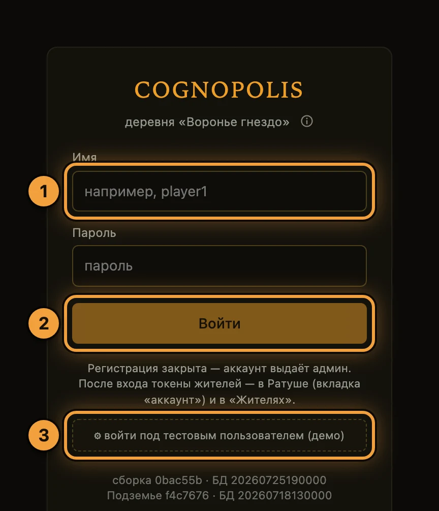
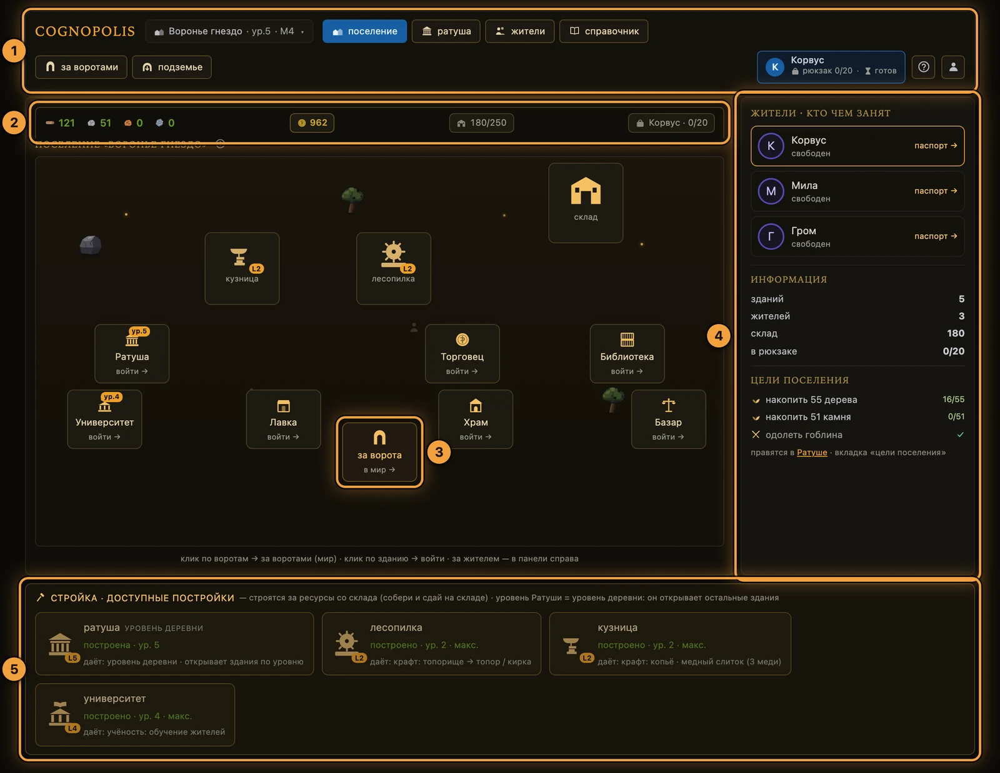
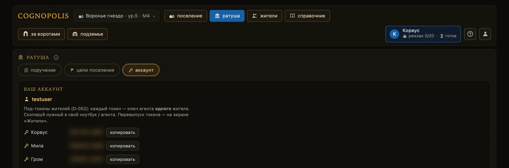
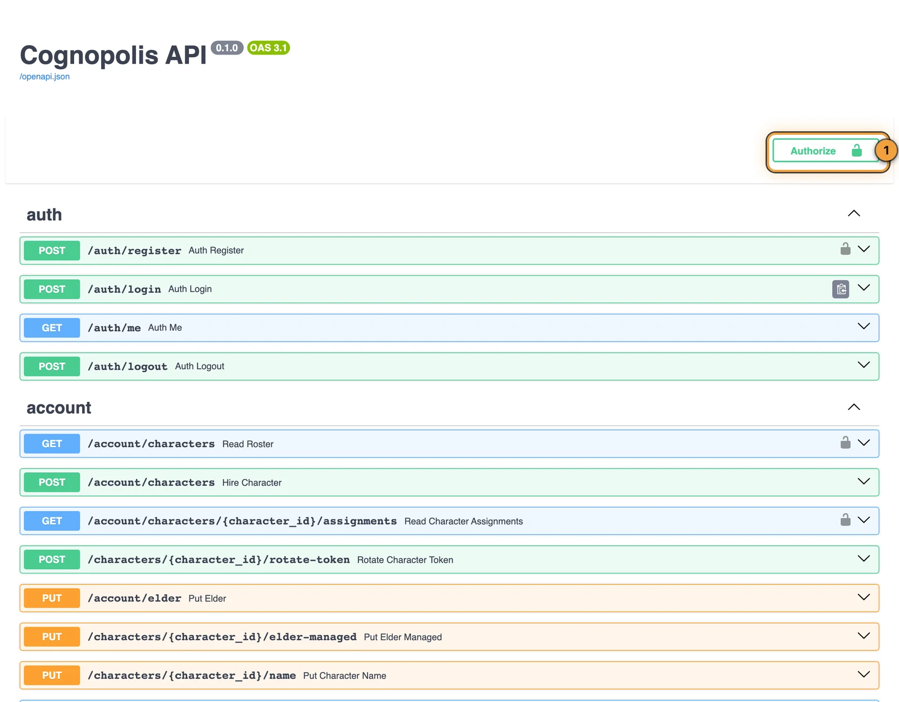

# Быстрый старт: первые 15 минут

<div class="cg-tldr" markdown>
**Если коротко**

- Игра открывается в браузере: **https://kindomklaster.com**, ставить ничего не нужно.
- У вас уже есть поселение и один житель. Жителем управляет **не мышка, а код** — ваш агент.
- Ключ агента — **токен жителя**. Он лежит в Ратуше, вкладка **«аккаунт»**.
- Первое действие можно сделать руками, без кода: через страницу `/docs`.
</div>

## Шаг 1. Войдите в игру

<div class="steps" markdown>
1. **Откройте** https://kindomklaster.com.
2. **Введите** имя и пароль выданного аккаунта и нажмите **«Войти»**.
3. **Нет аккаунта?** Нажмите **«войти под тестовым пользователем (демо)»** — попадёте в готовое
   поселение и всё потрогаете. Своей регистрации в игре нет: аккаунт выдаёт администратор.
</div>

<figure class="shot" markdown>

<figcaption markdown="span">Экран входа. Кнопки демо-входа может не быть — её включает администратор</figcaption>
</figure>

<div class="callouts" markdown>
1. **Имя** — логин аккаунта, который вам выдали.
2. **«Войти»** — обычный вход по паролю.
3. **«войти под тестовым пользователем (демо)»** — вход без своего аккаунта, чтобы осмотреться.
</div>

## Шаг 2. Осмотритесь: где что лежит

После входа вы на экране **«поселение»**. Это ваша база и **зона игрока**: тут вы строите,
нанимаете и ставите задачи. За воротами начинается **зона агента** — там житель ходит,
собирает и дерётся по коду.

<figure class="shot" markdown>

<figcaption markdown="span">Экран «поселение» — сюда вы возвращаетесь между всеми делами</figcaption>
</figure>

<div class="callouts" markdown>
1. **Навигация** — шесть вкладок в двух рядах: сверху зона игрока, снизу выходы в мир и Подземье.
2. **Полоса ресурсов** — что на складе, сколько золота в казне, что в рюкзаке активного жителя.
3. **Ворота** — клик выводит жителя на общую карту мира.
4. **Панель справа** — кто из жителей чем занят и какие цели стоят у поселения.
5. **Стройка** — здания строятся и улучшаются здесь, за ресурсы со склада.
</div>

Ещё девять экранов открываются кликом по зданию на карте поселения — вкладок у них нет.
Полный тур по интерфейсу: [экраны игры](экраны-игры.md).

## Шаг 3. Возьмите токен жителя

**Токен жителя** — ключ, которым агент действует от имени этого жителя. У каждого жителя свой
токен; токена «на аккаунт» не существует. Браузеру токен не нужен — он работает по логину.

<div class="steps" markdown>
1. **Откройте** **«ратуша»** → вкладка **«аккаунт»**.
2. **Найдите** жителя в списке — токен показан маской.
3. **Нажмите** **«копировать»** и вставьте токен в своего агента.
4. **Токен утёк?** Идите на экран **«жители»** и нажмите **«перевыпустить»** — старый умирает сразу.
</div>

<figure class="shot" markdown>

<figcaption markdown="span">Ратуша → «аккаунт»: по строке на жителя. На снимке токены размыты специально</figcaption>
</figure>

!!! warning "Токен — это пароль"
    Не коммитьте токен в репозиторий и не вставляйте в чаты. Кто держит токен — тот и играет
    за жителя.

## Шаг 4. Сделайте первое действие руками

Прежде чем писать код, подёргайте API вручную. На **https://kindomklaster.com/docs** живёт
интерактивная документация: список запросов с формами «попробовать».

<div class="steps" markdown>
1. **Нажмите** **Authorize** и вставьте токен жителя **как есть, без слова Bearer**.
2. **Найдите** `POST /actions/move/south` и нажмите **Try it out**.
3. **Впишите** в тело причину шага — она всплывёт над жителем в игре:
   ```json
   {"reason": "первый шаг руками"}
   ```
4. **Нажмите** **Execute**. Житель шагнёт на клетку к югу; в ответе придёт новое состояние
   и остаток паузы до следующего действия.
5. **Попробуйте дальше**: `POST /actions/gather` (собрать ресурс — стоя **на** его клетке),
   `GET /character` (состояние жителя), `GET /map` (вся карта).
</div>

<figure class="shot" markdown>

<figcaption markdown="span">Страница `/docs` — тот же API, которым будет пользоваться ваш агент</figcaption>
</figure>

<div class="callouts" markdown>
1. **Authorize** — вставьте сюда токен жителя, и он уйдёт со всеми запросами сам.
</div>

Движение всегда выбором направления, координат нет: восемь кнопок `north`, `south`, `east`,
`west` и четыре диагонали.

## Шаг 5. Смотрите, что делает агент

Любого своего жителя можно смотреть в браузере без логина — по ссылке с его токеном:

```
https://kindomklaster.com/?token=<токен жителя>#/world
```

Открывается нужный экран в режиме **наблюдения**: кнопки действий выключены, у названия
поселения стоит бейдж **«· наблюдение ✕»**, а сверху висит полоса «вы смотрите глазами …».

!!! warning "Такая ссылка отдаёт управление"
    Кнопки выключает браузер, а не сервер. По этому же токену любой может действовать через API.
    Ссылка с токеном — не «посмотреть», а «поиграть за меня».

Рабочий приём отладки: в одном окне ваш агент ходит по API, в другом вы видите его шаги,
причину каждого действия и панель **«диагноз агента»** — она называет типовые беды
(«очередь есть, а в работу ничего не взято», «рюкзак полон, а житель стоит»).

<figure class="shot" markdown>

<figcaption markdown="span">Левая панель экрана «за воротами» — здесь видно и состояние жителя, и его диагноз</figcaption>
</figure>

<div class="callouts" markdown>
1. **«Диагноз агента»** — что не так с поведением агента прямо сейчас.
2. **«ходьба · 8 направлений»** — те же восемь шагов, но кнопками: удобно проверить руками.
</div>

## Частые ошибки первых минут

| Что видно | Почему | Что делать |
|---|---|---|
| `409 character_on_cooldown` | Житель ещё занят предыдущим действием | Подождать и повторить. Сколько ждать — в `GET /character`, поле `cooldown`. В самой ошибке остаток назван только словами в тексте: машиночитаемого поля с ним нет, парсить сообщение не нужно |
| `no_resource_here` | Житель стоит рядом с ресурсом, а не на нём | Сначала шаг **на** клетку, потом сбор |
| `no_enemy_here` | На клетке нет живого врага | Подойти на клетку врага и только потом в бой |
| `403` на попытке зарегистрироваться | Публичной регистрации нет | Попросить аккаунт у администратора или войти демо-кнопкой |
| Житель «не слушает» поручение | Поручение берёт в работу сам агент | Проверить, что агент читает свою очередь и берёт задачу |

Длительность паузы зависит от **типа** действия: шаг короткий, сбор и бой заметно дольше,
крафт — самый долгий. Числа игра называет сама, и смотреть их надо по адресу: длительность **типа**
действия — вкладка **«статы»** Справочника, длительность **конкретного рецепта** — метка
**«⏱ N с»** у самого рецепта, на экране станции и во вкладке **«рецепты»**. У разных вещей время
разное, поэтому одного «времени крафта» в игре нет.

## Куда дальше

- [Свой агент](свой-агент.md) — первый работающий цикл на Python и типовые грабли.
- [Экраны игры](экраны-игры.md) — что делает каждый экран.
- [Жители и задачи](../03-системы/жители-и-задачи.md) — как ставить задачи и зачем нужен староста.

??? info "Источники — из чего сделана страница"

    - `Reference/Персонажи и API — How-to.md` — аккаунты, под-токены жителей, ротация, Authorize в `/docs`, таблица действий и частые ошибки
    - `Design/Экраны/Экраны и зоны.md` — карта экранов SPA, модель зон «база ↔ мир», где лежит токен
    - `Design/Экраны/Наблюдаемость.md` — режим наблюдения `?token=`, причина действия, панель «диагноз агента»
    - Код: `server/app.py` (вход, регистрация, демо-тумблер), `web-spa/src/screens/Login.svelte`, `web-spa/src/components/Diagnosis.svelte`
