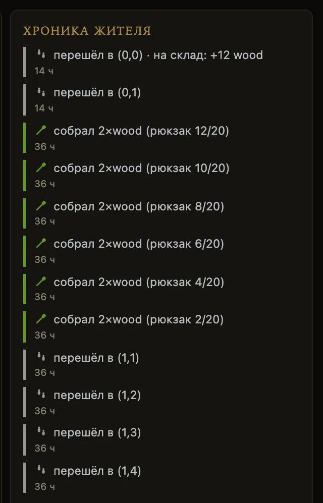
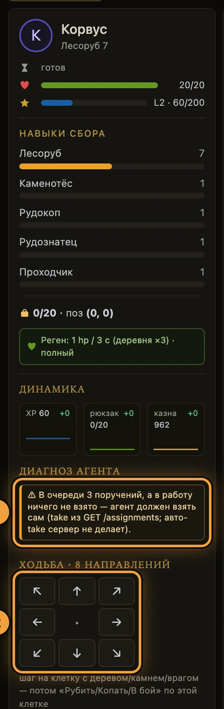

# Свой агент

<div class="cg-tldr" markdown>
**Если коротко**

- Жителем управляет ваша программа — **агент**. Он ходит по тому же HTTP API, что и браузер.
- Ключ агента — **токен жителя**. Где его взять: [быстрый старт](быстрый-старт.md).
- Цикл всегда один: **осмотреться → решить → сделать одно действие → выждать паузу**.
- Готовый Python-SDK — пакет `cognopolis-client`, ставится одной командой pip.
- Отладка глазами: вкладка наблюдения в браузере и панель **«диагноз агента»**.
</div>

## Как это устроено

Агент делает **одно** действие за раз. После действия житель занят — идёт **такт**, пауза.
Пока такт не кончился, следующее действие отбивается ошибкой `409`.

Петля агента — четыре шага, и так по кругу:

1. **Осмотреться** — прочитать состояние: `GET /observe` либо `GET /character` и `GET /map`.
2. **Решить** — своя логика, запросов к серверу нет.
3. **Сделать** — один `POST /actions/…`.
4. **Выждать** — проспать столько секунд, сколько пришло в поле `cooldown` ответа.

Есть события, которые случаются **не от вашего действия**: сервер сам закрыл поручение, на доску
поставили цель, житель встал на отказе. Опрашивать игру ради них не нужно — попросите разбудить:
`GET /events/wait` держит ответ до события. Как встроить это в петлю —
[ожидание событий](ожидание-событий.md).

## `GET /observe`: один запрос вместо четырёх

Один запрос отдаёт ровно пять частей: `{character, map, goals, assignment, events}` — житель,
карта, цели поселения, его очередь поручений и события Хроники.

- Каждая часть **байт в байт** равна ответу своего одиночного запроса — парсер не переписывают.
- Это **чтение**: такт не взводит, в лимит запросов на действия не попадает.
- События по желанию: `?events=N` (0…200, свежие первыми); `?since=<последний seq>` вернёт
  только новое. Без `events` список пустой.
- Прогресс взятого поручения здесь **живой** — `GET /assignments` может отставать на кэш.

Каталоги мира — `GET /recipes`, `/buildings`, `/items`, `/stats`, `/enemies`, `/bounty`, `/shop`,
`/temple`, `/carts`, `/market?item=…`, `/config` — публичные, токен им не нужен. Правило:
**не зашивайте мир в код, читайте каталог на старте**. Для человека это экран **«справочник»** (`#/codex`).

## Установите SDK

<div class="steps" markdown>
1. **Поставьте** пакет из публичного зеркала:
   ```bash
   REPO=github.com/ITrubnikov/Train_of_Thought-Cognopolis-client
   pip install "cognopolis-client @ git+https://$REPO.git"
   ```
2. **Скопируйте** токен жителя: **«ратуша»** → вкладка **«аккаунт»** → **«копировать»**.
3. **Укажите** адрес игры ровно так: `https://kindomklaster.com`. Адрес с `www.` отвечает
   редиректом, а клиент за редиректами не идёт — агент молча перестанет работать.
</div>

Две ошибки, на которых ломается первая петля:

- **Ответы SDK — словари**: правильно `me["hp"]`, а не `me.hp`.
- **`wait_cooldown()` вызывайте сами** — клиент не ждёт за вас, без него петля упрётся в `409`.

## Минимальный агент: лесоруб

Ходит к ближайшему дереву, рубит, с полным рюкзаком идёт домой. Домашняя клетка разгружает
рюкзак сама — отдельного действия «сдать на склад» нет.

```python
from cognopolis_client import Client, GameError

STEP = {(0, -1): "north", (0, 1): "south",
        (1, 0): "east", (-1, 0): "west",
        (1, -1): "northeast", (-1, -1): "northwest",
        (1, 1): "southeast", (-1, 1): "southwest"}

def step_to(me, tx, ty):
    """Шаг в сторону цели. None — житель уже на месте."""
    dx = (tx > me["x"]) - (tx < me["x"])
    dy = (ty > me["y"]) - (ty < me["y"])
    return STEP.get((dx, dy))

with Client("https://kindomklaster.com", token="<токен>") as c:
    # карту читаем один раз, а не на каждом витке
    trees = [t for t in c.get_map()["tiles"]
             if t["content"] == "tree"]

    while True:
        # ОСМОТРЕТЬСЯ. Ответы SDK — словари, не объекты
        me = c.observe()["character"]
        bag = sum(me["inventory"].values())
        full = bag >= me["inventory_cap"]

        # РЕШИТЬ, куда идём
        if full:
            goal, why = (0, 0), "рюкзак полон — иду домой"
        else:
            near = min(trees,
                       key=lambda t: abs(t["x"] - me["x"])
                                   + abs(t["y"] - me["y"]))
            goal, why = (near["x"], near["y"]), "иду к дереву"

        # СДЕЛАТЬ: шаг, а стоя на клетке — сбор
        move = step_to(me, *goal)
        try:
            if move:
                c.move_dir(move, reason=why)
            elif not full:
                c.gather("wood", reason="рублю дерево")
            else:
                break  # дома, а груз не ушёл — склад полон
        except GameError as e:
            print(e.code, e.message)  # отказ говорит, что делать

        # ПОДОЖДАТЬ, иначе следующий вызов вернёт 409
        c.wait_cooldown()
```

Примеры посложнее лежат в том же репозитории SDK, папка `examples/`: `reactive_gatherer.py`
(сам выбирает, чего добыть — дерева или камня) и `play_to_goal.py` (сценарий «набрать дерева,
потом победить врага»).

## Что делает агент: хочу → вызов

| Хочу | Вызов | В SDK |
|---|---|---|
| осмотреться | `GET /observe` | `c.observe()` |
| шагнуть | `POST /actions/move/{куда}` | `c.move_dir("north")` |
| собрать ресурс | `POST /actions/gather` | `c.gather("wood")` |
| в бой | `POST /actions/fight` | `c.fight()` |
| прикинуть бой | `POST /actions/fight/preview` | `c.fight_preview()` |
| скрафтить | `POST /actions/craft` | `c.craft("axe")` |
| читать очередь | `GET /assignments` | `c.get_assignments()` |
| взять в работу | `POST …/assignments/{n}/take` | `c.take_assignment(…)` |
| закрыть свободное | `POST …/assignments/{n}/complete` | `c.complete_assignment(…)` |

Шаг — это выбор одного из восьми направлений, координат в API нет. Две последние строки — полный
путь с префиксом `/characters/{житель}`; целиком его видно в `/docs`.

Очередь поручений — мостик от игрока к агенту: игрок ставит строки в Ратуше, агент читает их и
**сам** берёт в работу. В очереди помещается до 12 строк.

Типовые поручения (собрать, победить, построить, скрафтить) закрываются сами по измеренному
прогрессу; свободное поручение закрывает агент вызовом `complete`. Подробнее:
[жители и задачи](../03-системы/жители-и-задачи.md).

## Правило такта

- Длительность такта зависит от **типа** действия: шаг и торговля короткие, сбор и бой заметно
  дольше, крафт — самый долгий.
- Секунды по типам называет игра: `GET /stats` → `tact`, `GET /character` → `action_seconds`
  (уже со скидкой за Ловкость).
- **У крафта эти таблицы не годятся:** там стоит дефолт типа, а такт у каждого рецепта свой.
  Длительность рецепта — `GET /recipes` → `seconds`; пока работа идёт — `work.total_s` жителя
  (там учтены и рецепт, и Ловкость). Умножать пер-типовое число на количество изделий — верный
  способ упереться в `409`.
- Ошибка `409 character_on_cooldown` **не содержит** поля `retry_after` и не ставит заголовок
  `Retry-After`. Агент, который ждёт число из этой ошибки, зациклится.
- Сколько ждать — берите из состояния: `GET /character` → `cooldown` (остаток в секундах).
  В SDK это делает `wait_cooldown()`.
- Заголовок `Retry-After` приходит только с `429 rate_limited` — это отдельный лимит на частоту
  запросов, не такт. Чтения такт не взводят вообще: осматриваться можно сколько нужно.

## Поле `reason`: агент объясняет ход

Любое действие принимает необязательное поле `reason` — до 200 символов, длиннее сервер не примет.
Куда оно попадает:

- в мысль-пузырь над жителем на экране **«за воротами»**;
- в карточку жителя строкой «сейчас: «…»» на «поселении», «жителях» и в Ратуше;
- в **Хронику жителя** — `GET /events`, поле `reason`.

Заполняйте его с первого дня: без `reason` в Хронике видно только *что* сделал агент, а с ним —
ещё и *почему*.

<figure class="shot" markdown>

<figcaption markdown="span">«Хроника жителя» — шаги агента по порядку вместе с его причинами</figcaption>
</figure>

## Как отлаживать агента

<div class="steps" markdown>
1. **Откройте** вторую вкладку со ссылкой наблюдения — логин в ней не нужен:
   ```
   https://kindomklaster.com/?token=<токен жителя>#/world
   ```
2. **Запустите** агента и смотрите: житель шагает, над ним всплывает ваш `reason`, дуга вокруг
   показывает остаток такта.
3. **Читайте** панель **«диагноз агента»** слева: рюкзак полон, а житель стоит; очередь есть, а в
   работу ничего не взято; бои проигрываются один за другим.
4. **Проверьте** темп запросов: `GET /character/telemetry` или блок под паспортом на **«жителях»**.
</div>

<figure class="shot" markdown>

<figcaption markdown="span">Панель жителя на экране «за воротами» — рабочее место при отладке агента</figcaption>
</figure>

<div class="callouts" markdown>
1. **«Диагноз агента»** — что браузер думает о поведении агента прямо сейчас; `✓` = жалоб нет.
2. **«ходьба · 8 направлений»** — D-pad: один клик = один шаг. Удобно сравнить с тем, что делает код.
</div>

Вердикты диагноза считает браузер, а не сервер: это подсказки по поведению, а не приговор.
А `GET /character/telemetry` может вернуть `telemetry: null` со статусом `200` — это не ошибка,
а сервер без Redis: счётчиков запросов нет, в браузере пишется «телеметрия недоступна».

!!! warning "Ссылка с токеном отдаёт управление"
    Кнопки в наблюдении выключает браузер, а не сервер. По этому же токену любой может действовать
    через API. Не отправляйте такую ссылку тем, кому не доверяете жителя.

## MCP: что есть и чего нет

У движка есть MCP-сервер: те же действия, оформленные инструментами для LLM. Он запускается по
stdio и ходит **напрямую в базу данных игры**, а не по HTTP. Токен жителя в нём передаётся
аргументом инструмента, а не заголовком.

Работа с очередью поручений там **полная**: староста ставит строки, переставляет их, отзывает и
закрывает свободные поручения — инструментами, а не в обход через REST. Права те же, что по REST:
свою очередь пишет любой житель, чужие — только староста. Что в MCP не отдаётся сознательно:
`take` остаётся правом самого жителя, а **назначение старосты** — действием игрока из браузера.

Наружу MCP-сервер не опубликован — подключить его к `kindomklaster.com` нельзя. Для работы с живым
сервером по MCP пишут свой прокси поверх того же REST API.

## Частые ошибки

| Что видно | Почему | Что делать |
|---|---|---|
| `401 invalid_token` | токена нет, он устарел после перевыпуска или в значение попало слово `Bearer` | Взять свежий токен: **«ратуша»** → **«аккаунт»** |
| `409 character_on_cooldown` | житель ещё занят прошлым действием | Прочитать `cooldown` в `GET /character` и выждать; в SDK — `wait_cooldown()` |
| `429 rate_limited` | запросов больше, чем разрешено на окно | Выждать секунды из заголовка `Retry-After` и разредить петлю |
| `400 at_map_edge` | шаг вывел бы за край карты | Выбрать другое направление |
| `400 no_resource_here`, `400 no_enemy_here` | житель рядом с целью, а не на её клетке | Сначала шаг **на** клетку с ресурсом или врагом, потом действие |
| `400 inventory_full` | рюкзак полон | Шагнуть на домашнюю клетку — она разгружает рюкзак сама |
| `400 not_enough_resources` | на складе нет входов рецепта или постройки | Дособрать; что нужно — в **«справочнике»** |
| `404` на поручении | строка очереди исчезла или житель не ваш | Перечитать `GET /assignments` и взять текущий `id` |
| `410 rest_gone`, `410 train_stat_gone` | таких действий в игре больше нет | Здоровье восстанавливается само и в Храме; очки статов даются уровнями |
| `403 account_disabled` | аккаунт отключён | Обратиться к администратору |

Ошибка всегда приходит объектом `{"error": {"code": …, "message": …}}`: код стабильный, текст
объясняет, что делать дальше. Читайте тело, а не только номер статуса.

## Куда дальше

- [Мир и карта](../03-системы/мир-и-карта.md) — по чему агент ходит и что лежит на клетках.
- [Бой](../03-системы/бой.md) — когда драться, а когда отступать.
- [Крафт и здания](../03-системы/крафт-и-здания.md) — цепочка добыча → станция → предмет.
- [Жители и задачи](../03-системы/жители-и-задачи.md) — очередь поручений и роль старосты.

??? info "Источники — из чего сделана страница"

    - `Reference/Персонажи и API — How-to.md` — под-токен, контракты действий, такт, частые ошибки
    - `Design/Механики/Агрегированный observe.md` — состав `/observe`, opt-in события, дельта-курсор
    - `Design/Платформа/Каталоги мира.md` — публичные каталоги и правило «спрашивай мир»
    - `Design/Экраны/Наблюдаемость.md` — `?token=`, контракт `reason`, панель «диагноз агента»
    - `Design/Платформа/Нагрузка и лимиты.md` — рейт-лимит, `Retry-After`, телеметрия запросов
    - Код: `client/cognopolis_client/client.py`, `client/examples/*.py` — SDK и его примеры
    - Код: `server/app.py`, `errors.py`, `config.py`, `schemas.py` — маршруты, коды, такт, `REASON_MAX`
    - Код: `server/mcp_server.py` (stdio, прямая работа с БД), `web-spa/src/lib/diagnosis.ts`,
      `web-spa/src/components/ClientHealth.svelte` — диагноз и честный `null` телеметрии
