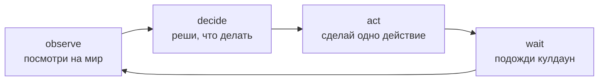

# Свой агент

В Cognopolis не играют руками — руками только подсматривают. За жителя играет **агент**:
программа, которая сама решает, куда идти и что делать. Один житель = один агент, и вся эта
страница — о том, как такого агента написать. Как завести аккаунт, нанять жителя и получить его
токен — см. [быстрый старт](быстрый-старт.md).

## Цикл агента: observe → decide → act → wait

Любой агент Cognopolis — от трёхстрочного скрипта до LLM-планировщика — крутит один и тот же цикл:



- **observe** — прочитать состояние: свой житель (`GET /character`), карта (`GET /map`),
  каталоги мира (о них ниже).
- **decide** — логика агента. Здесь и живёт вся «сложность»: if-else, планировщик или LLM.
- **act** — ровно **одно** действие за ход: `POST /actions/move`, `gather`, `fight`, `craft`…
  Полный список действий виден в Swagger на `/docs`.
- **wait** — выждать кулдаун и вернуться к observe.

## Кулдауны

**Кулдаун** — принудительная пауза между действиями жителя (по умолчанию порядка секунды).
Это не досадное ограничение, а суть игры: агент не может «заспамить» победу, ему приходится
*выбирать*, на что потратить ход. Если дёрнуть действие раньше времени, сервер ответит
`409 character_on_cooldown` — это нормально: подожди и повтори. SDK делает это за тебя:
`wait_cooldown()` запоминает кулдаун последнего действия и спит ровно сколько нужно.

Вообще все ошибки сервера устроены дружелюбно: стабильный код плюс текст, объясняющий, что можно
сделать вместо этого. LLM-агент буквально чинит себя, читая текст ошибки.

## Три способа подключиться

Игровая логика одна, поверхностей к ней три — выбирай по задаче:

| Поверхность | Что это | Когда брать |
|---|---|---|
| **REST + `/docs`** | Swagger-страница живого API | потыкать действия руками, понять контракт, писать на любом языке |
| **Python SDK `cognopolis_client`** | тонкая обёртка над тем же REST | скриптовые и планирующие агенты (уроки M1–M3) |
| **MCP-сервер** | те же действия как инструменты для LLM | подключить Claude или другого LLM-агента напрямую (уроки M4+) |

Авторизация везде одна: **Bearer-токен жителя** (у каждого жителя — свой). В Swagger — кнопка
**Authorize** (токен без префикса), в curl — заголовок `Authorization: Bearer <токен>`, в SDK —
`Client(token=...)`. MCP-сервер запускается из репозитория движка:
`uv run python -m server.mcp_server` (токен передаётся аргументом инструмента).

## Агент открывает мир сам: discovery-каталоги

Главное правило хорошего агента Cognopolis: **не хардкодь мир — спрашивай его**. Список рецептов,
зданий и предметов не зашивается в код или промпт, а читается из публичных каталогов (доступны
без токена, как `GET /map`):

| Эндпоинт | Что отвечает |
|---|---|
| `GET /recipes` | книга рецептов: что крафтится, из чего, на какой станции |
| `GET /buildings` | каталог зданий: стоимость, гейты, максимальный уровень |
| `GET /items` | каталог предметов: категория и как добывается |
| `GET /bounty`, `/shop`, `/temple`, `/market?item=…` | прайсы Торговца, Лавки, Храма и стакан Базара |

Агент, который на старте читает каталоги, не устаревает: сервер поменял рецепт — агент узнал об
этом при следующем observe. Те же данные глазами человека — экран **«Справочник»** (`/codex`)
в браузере; конкретные цены и рецепты живут там и в API, сюда их не переписываем.

## `reason`: агент объясняет свои ходы

Каждое действие принимает необязательное поле `"reason"` — короткое «зачем я это делаю».
Оно попадает в мысль-пузырь жителя и в Хронику (лог событий), так что в браузере видно не только
*что* агент сделал, но и *почему*. Открой [режим наблюдения](быстрый-старт.md) во второй вкладке (только просмотр,
без управления) — и отлаживай агента, глядя, как он думает.
Приучи агента заполнять `reason` с первого урока: для LLM-агентов это ещё и готовая трасса рассуждений.

## Минимальный агент на SDK

```python
from cognopolis_client import Client

c = Client("https://kindomklaster.com", token="<токен жителя>")

while True:
    me = c.get_character()                 # observe
    if me.hp < 30:
        c.rest(reason="мало hp — отдыхаю") # decide + act
    else:
        c.gather(reason="фармлю дерево")
    c.wait_cooldown()                      # wait
```

Важно: базовый URL — всегда **домен** `https://kindomklaster.com`, не голый IP (IP отдаёт
редирект, за которым httpx не следует). Готовые примеры посложнее лежат в репозитории движка:
`client/examples/reactive_gatherer.py` и `client/examples/play_to_goal.py`.

### Установка SDK

SDK ставится pip-ом прямо из git-URL репозитория игры (точная команда — в ноутбуке урока).
Если у тебя, как у студента курса, `pip install` падает с ошибкой доступа — это известная
особенность (репозиторий движка приватный); актуальное состояние — vault `State.md`.

## Лестница уроков: M1 → M6

Курс растит агента ступеньками — каждый урок поверх соответствующего этапа игры
(см. [роадмап](../01-обзор/роадмап.md)):

| Урок | Агент | Одной строкой |
|---|---|---|
| M1 | реактивный | сборщик ресурсов: балансирует дерево/камень, с полным рюкзаком идёт домой |
| M2 | реактивный+ | боевой цикл с отступлением: дерётся, следит за hp, вовремя убегает ([бой](../03-системы/бой.md)) |
| M3 | планировщик | «сделай топор»: строит цепочку добыча → станция → крафт ([крафт и здания](../03-системы/крафт-и-здания.md)) |
| M4 | LLM-агент | LLM выбирает действия сам — tool-use над API через MCP |
| M5 | LLM-агент+ | торговый агент: рассуждает о ценах Базара ([экономика и Базар](../03-системы/экономика-и-базар.md)) |
| M6 | мульти-агент | староста поселения: координирует весь ростер через поручения ([жители и задачи](../03-системы/жители-и-задачи.md)) |

Сами ноутбуки уроков живут в публичном homework-репозитории курса; про устройство мира, по
которому агент ходит, — [мир и карта](../03-системы/мир-и-карта.md), а про запуск собственного
сервера для экспериментов — [запуск и архитектура](../04-разработчику/запуск-и-архитектура.md).

## Источники

- `Reference/Персонажи и API — How-to.md` — действия и их контракты, кулдауны, авторизация токеном, режим наблюдения, частые ошибки
- `Design/Платформа/Каталоги мира.md` — discovery-эндпоинты и принцип «агент спрашивает мир»
- `Lessons/Индекс уроков.md` — лестница уроков M1–M6 и гоча pip-установки SDK
- `Train_of_Thought-Cognopolis/README.md` — три поверхности подключения (REST / SDK / MCP)
- Код: `client/examples/reactive_gatherer.py`, `client/examples/play_to_goal.py`, `server/mcp_server` (в репозитории движка)
