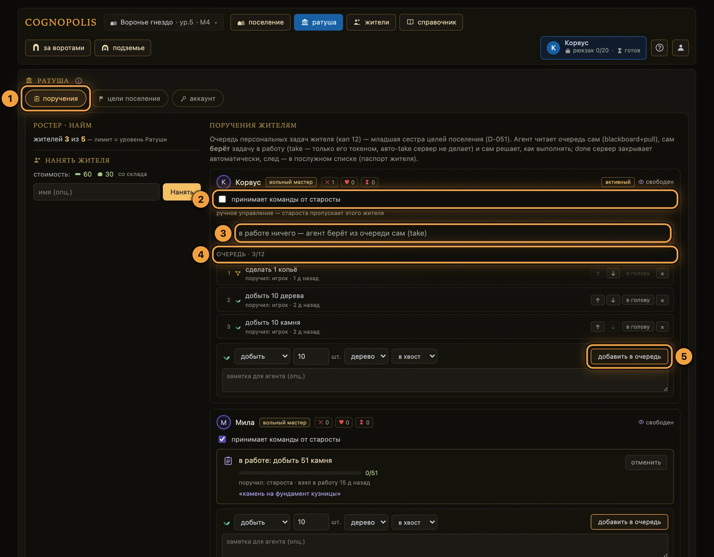
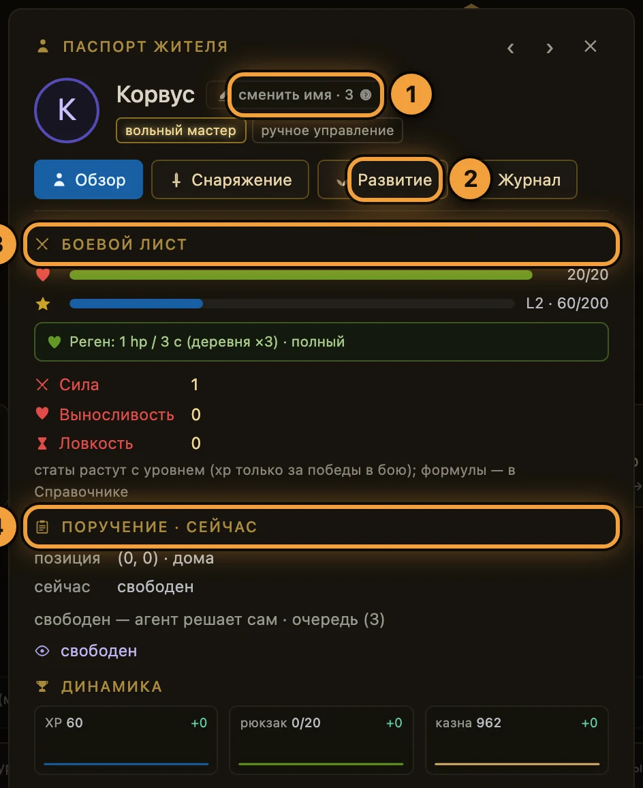
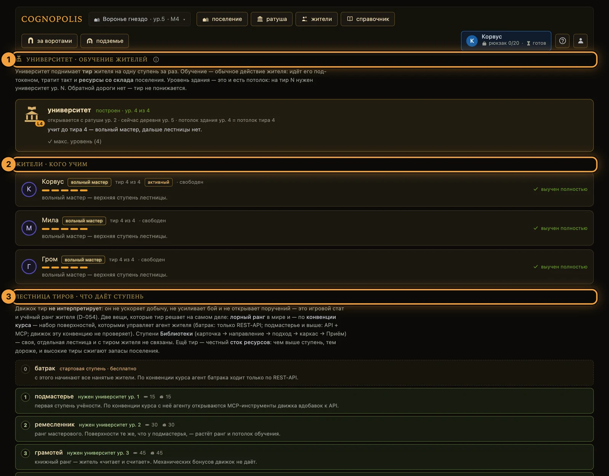
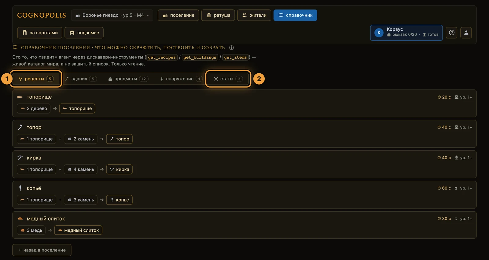

# Экраны игры

**Если коротко**

- Вкладок в шапке шесть. Экранов больше: девять открываются кликом по зданию на карте поселения.
- Экраны — пульт игрока: стройка, найм, поручения, обучение, торговля.
- Ходьбу, сбор и бой делает агент по API. Такие кнопки есть и в браузере, но они для проверки руками.
- Ссылка с `?token=` открывает режим наблюдения: видно ровно одного жителя, кнопки погашены.

## Как устроена навигация

1. **Ищите** экран в ряду 1 шапки: **«поселение»**, **«ратуша»**, **«жители»**, **«справочник»**.
2. **Смотрите** ряд 2: **«за воротами»** и **«подземье»** — это выходы в зону агента.
3. **Кликайте** по зданию на карте поселения: так открываются остальные девять экранов, вкладок у них нет.
4. **Возвращайтесь** с экрана здания кнопкой **«← назад в поселение»** внизу; кнопка «назад» браузера тоже работает.

Слева в ряду 1 — кнопка поселения **«Воронье гнездо · ур.N · M…»** со списком построенных модулей;
справа в ряду 2 — чип активного жителя, иконка помощи и меню **👤** с выходом. Адрес экрана виден
в строке браузера: `#/town-hall`.

### Все экраны сразу

| Экран | Как попасть | Что там делают | Кто действует |
|---|---|---|---|
| Поселение `#/` | вкладка **«поселение»** | строят и улучшают здания, смотрят, кто чем занят | игрок |
| За воротами `#/world` | вкладка **«за воротами»** или плитка **«за ворота»** | ходят, рубят, копают, дерутся | агент |
| Ратуша `#/town-hall` | вкладка **«ратуша»** | поручения, цели, найм, староста, токены жителей | игрок |
| Жители `#/residents` | вкладка **«жители»** | ростер, паспорт, токен, вход в наблюдение | игрок |
| Паспорт `#/residents/:id` | клик по имени жителя — модалкой или отдельным экраном | статы, снаряжение, развитие, журнал жителя | игрок |
| Справочник `#/codex` | вкладка **«справочник»** | каталоги рецептов, зданий, предметов, статов | чтение |
| Подземье `#/mine` | вкладка **«подземье»** | каталог тележек, разрез горизонтов, пульт **«мои шахтёры»** | чтение |
| Склад `#/storehouse` | клик по плитке **«склад»** | запасы, вместимость, улучшение склада | игрок |
| Лесопилка `#/sawmill` | клик по плитке лесопилки (есть после постройки) | делают предметы её рецептов | игрок и агент |
| Кузница `#/forge` | клик по плитке кузницы (есть после постройки) | делают предметы её рецептов | игрок и агент |
| Университет `#/university` | клик по карточке **«Университет»** | обучают жителей на ступень выше | игрок |
| Торговец `#/trader` | клик по карточке **«Торговец»** | продают трофеи и надетый инструмент | игрок и агент |
| Лавка `#/shop` | клик по карточке **«Лавка»** | покупают снаряжение за золото | игрок и агент |
| Храм `#/temple` | клик по карточке **«Храм»** | лечат жителя до полного здоровья | игрок и агент |
| Базар `#/market` | клик по карточке **«Базар»** | выставляют и снимают ордера | игрок и агент |
| Библиотека `#/library` | клик по карточке **«Библиотека»** | открывают ступени, скачивают Приёмы | игрок |

Плитки Лесопилки и Кузницы появляются на карте только после постройки; карточка Университета стоит
всегда, до постройки — пунктирная. У Торговца, Лавки, Храма, Базара и Библиотеки строений нет.
Бейдж **«Ручное»** у Библиотеки значит «только из браузера»: агенту её ступени недоступны.

## Поселение

<figure class="shot" markdown>

<figcaption markdown="span">Экран **«поселение»** — база игрока: стройка, склад, кто чем занят</figcaption>
</figure>

1. **Верхняя навигация** — ряд 1: «поселение · ратуша · жители · справочник»; ряд 2: «за воротами · подземье».
2. **Полоса ресурсов** — запасы склада, казна, заполненность склада, рюкзак активного жителя.
3. **Ворота «за ворота → в мир»** — выход из зоны игрока в зону агента.
4. **Правая панель** — «жители · кто чем занят», «информация», «цели поселения».
5. **Панель «стройка · доступные постройки»** — строят и улучшают за ресурсы со склада; не хватает — кнопка погашена, а подсказка называет нехватку.

## За воротами

<figure class="shot" markdown>

<figcaption markdown="span">Экран **«за воротами»** — общая карта мира и панель выбранного жителя</figcaption>
</figure>

1. **Панель жителя** — готовность, здоровье, уровень, навыки сбора, реген, диагноз агента и D-pad.
2. **Карта мира** — общая для всех игроков.
3. **Легенда карты** — расшифровка колец, дуг и значков.
4. **«Хроника жителя»** — что этот житель делал, по шагам.

Кнопки **«Рубить»**, **«Копать»**, **«В бой»** работают по своей клетке: сначала шаг, потом действие.
Рюкзак разгружается сам, когда житель возвращается домой.

## Ратуша

<figure class="shot" markdown>

<figcaption markdown="span">Ратуша → **«поручения»**: карточка на каждого жителя со своей очередью</figcaption>
</figure>

1. **Вкладки Ратуши** — «поручения» · «цели поселения» · «аккаунт».
2. **Галочка «принимает команды от старосты»** — снимите её, и очередь жителя закроется для старосты.
3. **Строка «в работе»** — задача, которую агент взял себе сам. Кнопки «начать» в браузере нет.
4. **Очередь жителя и счётчик** — в очереди помещается 12 строк, взятая в работу считается отдельно.
5. **Форма «добавить в очередь»** — тип задачи, количество, предмет и место в очереди.

Вкладка **«цели поселения»** — доска целей, кнопки **«+ добавить цель»**, **«Сохранить доску»** и блок
старосты; править доску можно с определённого уровня Ратуши. Вкладка **«аккаунт»** — токен каждого жителя.

## Жители и паспорт

Экран **«жители»** — ростер слева, паспорт справа, блок **«привязать агента»** с кнопками
**«копировать»** и **«перевыпустить»**, кнопка **«наблюдать»**. Найма тут нет, он в Ратуше.

<figure class="shot" markdown>

<figcaption markdown="span">Паспорт открывается кликом по имени жителя откуда угодно; закрывается по Esc</figcaption>
</figure>

1. **Кнопка «сменить имя»** — переименовать жителя за золото из казны.
2. **Вкладка «Развитие»** — навыки и рост уровня. Рядом «Обзор», «Снаряжение» и «Журнал».
3. **«Боевой лист»** — здоровье, уровень и три стата.
4. **«Поручение · сейчас»** — где житель и что делает по факту.

## Станции: Лесопилка и Кузница

<figure class="shot" markdown>

<figcaption markdown="span">Лесопилка — экран станции; Кузница устроена так же</figcaption>
</figure>

1. **Рецепты станции** — длительность и нехватка входов видны до клика.
2. **«сделать сейчас · …»** — в подписи стоит имя рецепта; предмет готов сразу, житель занят такт.
3. **«поручить N ×»** — строки ложатся в очередь жителя и ждут, пока агент возьмёт их сам.
4. **Строка «в очереди N»** — ссылка **«очередь целиком →»** ведёт в Ратушу.

Выберите рецепт кликом, найдите жителя в блоке **«кто делает»** и нажмите кнопку в его строке.
Кнопка погашена — причина рядом: идёт такт, житель под землёй, уровня станции мало или нет входов.

## Университет

<figure class="shot" markdown>

<figcaption markdown="span">Университет — экран открыт и до постройки здания; обучение тратит такт жителя</figcaption>
</figure>

1. **Состояние здания** — построен, уровень и потолок ступеней.
2. **«жители · кого учим»** — карточка на каждого с ценой ступени или причиной отказа.
3. **«лестница тиров»** — что означает каждая ступень.

## Склад

Шапка показывает **«склад · ур. N»** и заполненность, вкладки — категории предметов, кнопка
**«улучшить склад → ур.N»** поднимает вместимость. Блок **«инструменты:»** — что лежит на полке;
добычу ускоряет только надетый инструмент, а надевают его в паспорте, вкладка **«Снаряжение»**.

<figure class="shot" markdown>

<figcaption markdown="span">Склад общий на всё поселение: из него платят стройка и крафт</figcaption>
</figure>

## Торговец, Лавка, Храм, Базар

<figure class="shot" markdown>

<figcaption markdown="span">Торговец — сюда сдают трофеи, когда нужно золото</figcaption>
</figure>

1. **Строка трофея** — цена за штуку, сумма после комиссии, кнопки **«продать 1»** и **«продать всё»**.
2. **«Скупка инструмента»** — сбыт надетого инструмента по плоской цене.

В Лавке у товара стоят **«−»**, **«+»** и кнопка **«купить N»**; в Храме — кнопка **«исцелиться»**.
Базар — это **«книга»**, **«лента сделок»** и форма **«выставить ордер»**: до 10 лотов по 1–10 единиц.

## Справочник

<figure class="shot" markdown>

<figcaption markdown="span">Справочник — живой каталог мира, только чтение</figcaption>
</figure>

1. **Вкладка «рецепты»** — что из чего делается; рядом вкладки зданий, предметов и снаряжения.
2. **Вкладка «статы»** — боевые статы и формулы.

Экран собран из публичных каталогов, которые видит и агент: `GET /recipes`, `/buildings`, `/items`,
`/stats`. Цены, рецепты и формулы смотрите здесь — вики их не дублирует.

## Подземье

<figure class="shot" markdown>

<figcaption markdown="span">Экран **«подземье»** — контора у устья шахты: тележки и разрез горизонтов</figcaption>
</figure>

Спуск делают на экране **«за воротами»**, стоя на клетке входа: там появляется кнопка **«Спуститься в
шахту»**. Вкладки конторы — **«контора · витрина»** (тележки, горизонты) и **«мои шахтёры»** (забеги).

## Наблюдение по ссылке и роль администратора

Ссылка `https://kindomklaster.com/?token=<токен жителя>#/world` открывает игру без логина: экран берётся из хеша, а ссылка без хеша ведёт на Поселение.

- Видно **ровно одного** жителя — того, чей токен в ссылке. Ростер пуст.
- Кнопки действий погашены, панели стройки нет, вкладки **«аккаунт»** в Ратуше нет.
- Выходов два: бейдж **«· наблюдение ✕»** и полоса **«вы смотрите глазами …»** с кнопкой **«выйти»**.

!!! warning "Ссылка с токеном — это не «посмотреть»"
    Кнопки выключает браузер, а не сервер. Кто держит токен — тот играет за жителя через API.

Под ролью администратора игровых экранов нет вовсе: любой адрес уводит в операторскую консоль.

## Куда дальше

[Свой агент](свой-агент.md) · [Мир и карта](../03-системы/мир-и-карта.md) · [Бой](../03-системы/бой.md) · [Крафт и здания](../03-системы/крафт-и-здания.md) ·
[Жители и задачи](../03-системы/жители-и-задачи.md) · [Экономика и Базар](../03-системы/экономика-и-базар.md) · [Подземье](../03-системы/подземье.md)

??? info "Источники — из чего сделана страница"

    - `Design/Экраны/Экраны и зоны.md` — карта экранов, зоны, полоса ресурсов, экран Склада
    - `Design/Экраны/Наблюдаемость.md` — режим `?token=`, подписанные выходы, диагноз агента
    - `Design/Экраны/Паспорт жителя.md` — вкладки паспорта и места показа
    - Код: `web-spa/src/App.svelte`, `lib/router.svelte.ts` — ряды вкладок, маршруты, наблюдение, админ
    - Код: `web-spa/src/screens/*.svelte`, `components/ResidentPassport.svelte`, `components/passport/*`
      — экраны, дословные подписи кнопок и вкладок, паспорт жителя
    - Код: `web-spa/src/lib/tasks.ts`, `server/game.py` — кап очереди жителя, лимиты Базара
