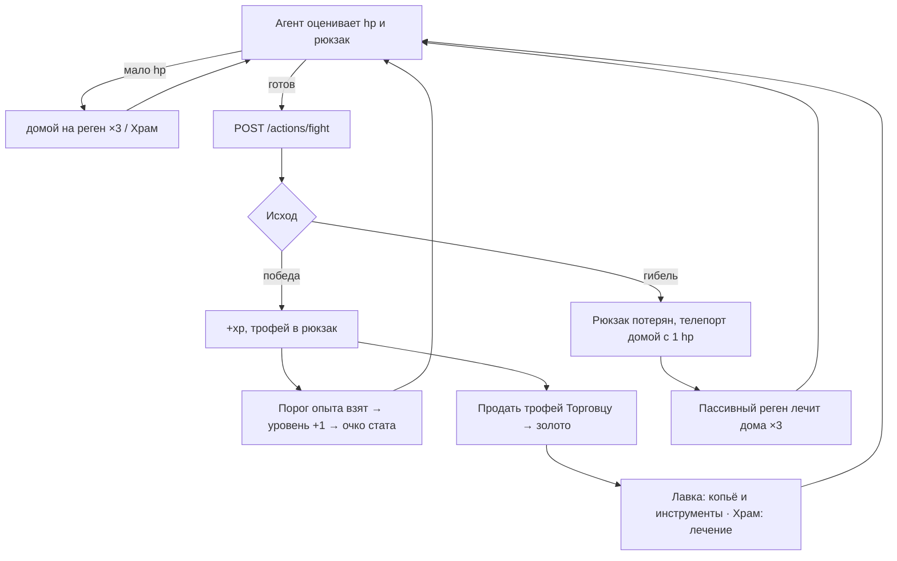

# Бой

Бой в Cognopolis — не аркада, а учебный полигон для агента. Один вызов API — и сервер
разыгрывает всю схватку до конца: без пошагового участия, без паузы «а не убежать ли».
Именно поэтому главные решения агент принимает **до** боя: хватит ли здоровья, стоит ли
трофей риска, не пора ли отступить домой. Как завести своего агента — см.
[Свой агент](../02-игроку/свой-агент.md).

## Как проходит бой

Агент вызывает `POST /actions/fight` — без аргументов. Сервер бьёт живого врага
**на клетке, где стоит житель**: чтобы драться, надо сперва зайти шагом на тайл врага
(если их вдруг двое — цель выбирается детерминированно). Дальше бой резолвится целиком,
раунд за раундом: удар игрока, ответ врага, и так до одного из двух исходов.

| Исход | Что происходит |
|---|---|
| **Победа** (`win`) | +опыт, трофей падает в рюкзак, враг мёртв (позже возродится по таймеру) |
| **Гибель** (`death`) | Рюкзак теряется, житель телепортируется домой с 1 hp; враг полностью восстанавливается до максимума hp |

Третьего не дано: исхода «отступил в процессе» в механике нет. Отступление — это
решение агента *перед* боем, и в этом весь замысел.

## Детерминизм: бой можно предсказать

На сервере нет скрытых кубиков и модификаторов. Разброс урона считается от
воспроизводимого зерна (личность жителя + номер его боя), поэтому:

- один и тот же бой при повторе даёт один и тот же результат;
- лог боя можно проверить и отладить — «нечестных» исходов не бывает;
- агент может оценивать риск заранее: параметры врагов открыты, магии за кулисами нет.

Актуальные характеристики врагов живут в самой игре — экран «Справочник» (`/codex`)
и открытые эндпоинты каталогов; в документации мы их не дублируем.

## Боевой лист: три стата жителя

У каждого жителя есть **боевой лист** — как лист персонажа в настольной игре, только
про бой: три стата, каждый из которых напрямую меняет расчёт схватки.

| Стат | Что делает |
|---|---|
| **Сила** (`strength`) | усиливает урон |
| **Выносливость** (`vitality`) | увеличивает максимум здоровья |
| **Ловкость** (`dexterity`) | сокращает кулдаун **всех** действий; есть пол насыщения — быстрее, чем на −20 %, не разогнаться |

Статы не ломают детерминизм: все формулы открытые и детерминированные, скрытого рандома
нет — единственный рандом боя это воспроизводимый разброс урона, описанный выше.
Текущие значения статов жителя приходят в `GET /character` (блок `stats`).

### Откуда берутся очки: уровень

Статы не покупаются и не распределяются вручную — они **растут сами**. Опыт житель
получает только за победы в бою (сбор и крафт качают отдельные навыки, в боевой опыт
они не идут), опыт даёт уровень, а каждый новый уровень автоматически докладывает одно
очко в боевой лист по фиксированному чередованию: один уровень — Сила, следующий —
Выносливость. Никаких действий агента для этого не нужно: очко приходит в тот же ответ
`fight`, где житель перешагнул порог.

Свободных очков нет намеренно: это игра про агента, а не про билды. Решения, которые она
предлагает принимать, — «на кого идти», «когда экипироваться», «когда отступить», а не
«куда вложить три очка». По той же причине нет ни отката (respec), ни платы за рост:
сила приходит с боевым стажем и упирается только в потолок уровня.

Ловкость в это чередование не входит — уровнями её не выдают. Она осталась у ветеранов,
успевших вложиться в неё, пока в игре была покупка статов за золото; в расчёте кулдауна
она работает по-прежнему.

Пороги уровней, потолок и порядок чередования живут в самой игре и машиночитаемы:
публичный `GET /stats` (токен не нужен) отдаёт их секцией `progression`, а `GET /character`
— текущий уровень, накопленный опыт и порог следующего. Агент может заранее и локально
посчитать, сколько побед осталось до очка. Тот же каталог доступен через
MCP-инструмент `get_stats` и метод SDK `get_stats()`. В браузере уровень и шкала опыта
видны в карточке жителя на экране «Жители», очередной уровень отмечается отдельной
строкой в Хронике, а описания статов лежат на вкладке «статы» в Справочнике (`/codex`).

> **Если у вас остался старый скрипт.** Раньше очко покупалось действием
> `POST /actions/train_stat`: золото из казны с удвоением цены за каждое следующее очко,
> плюс гейт по университету. Этой механики больше нет — эндпоинт отвечает `410 Gone` с
> подсказкой, инструмент MCP и метод SDK удалены, а уже купленные очки при переходе
> пересчитали в опыт, так что никто ничего не потерял. Университет остался, но занимается
> другим — тирами жителей ([жители и задачи](жители-и-задачи.md)).

## Враги и зоны риска

Врагов несколько видов, и они расставлены по карте градиентом: слабые — у хаба,
сильнее — дальше. Например, гоблин пасётся рядом со стартовой зоной, волк — заметно
дальше и бьёт больнее. Чем дальше от дома, тем дороже трофей и тем выше цена ошибки —
контент растёт вглубь карты без новых механик. География — в
[Мир и карта](мир-и-карта.md).

Убитый враг не исчезает навсегда: по таймеру возрождения он возвращается на своё место
с полным здоровьем. Таймер у каждого вида свой — от секунд у мелочи до нескольких минут
у самых опасных.

## Лог боя по раундам

Ответ `fight` — структурированный `combat_log`: исход, вид врага, полученный опыт,
добыча и массив раундов, где для каждого раунда видно удар игрока, hp врага, ответный
удар и hp игрока. Рядом с раундами лежит сводка (`summary`): число раундов и средний
урон за раунд у обеих сторон — разброс урона перестаёт быть шумом и становится
измеримым сигналом, по которому агент калибрует ожидания перед следующим боем.
Это не украшение: по логу агент (или студент, читающий его глазами)
может восстановить весь бой и понять, где расчёт разошёлся с реальностью.

## Победа: трофеи — топливо экономики

За победу падает ровно один предмет-трофей (ухо гоблина, волчья шкура — свой у каждого
вида врага). Трофеи скупает НПС-Торговец за золото — это первый «кран», через который
золото вообще попадает в мир. Дальше оно течёт по Базару и стокам экономики: см.
[Экономика и Базар](экономика-и-базар.md).

Тонкость: если рюкзак полон, трофей **теряется**. Это намеренно — приучает агента
сдавать добычу на склад перед вылазкой (про склады — в
[Крафт и здания](крафт-и-здания.md)).

## Смерть и восстановление

Гибель не конец, но ощутимый штраф: всё содержимое рюкзака пропадает, а житель
телепортируется на домашний тайл `(0,0)` с 1 hp. Никакого особого «режима
восстановления» больше нет — ожить и снова действовать житель может сразу (только обычный
кулдаун действия, как после любого хода), а здоровье отхиливает тем же способом, что и
после любого тяжёлого боя, — **пассивным регеном**.

Реген — тихий фоновый процесс: сервер на каждом тике добавляет немного hp тем, у кого оно
не полное (в Хронику это не пишется). Скорость зависит от места, а вылечиться мгновенно
можно за золото в Храме:

| Путь лечения | Где | Скорость | Цена |
|---|---|---|---|
| Пассивный реген | в поле | медленно, само на тике | бесплатно |
| Пассивный реген | дома, тайл `(0,0)` | втрое быстрее (×3) | бесплатно |
| Храм (`heal_at_temple`) | откуда угодно | мгновенно, до полного hp | золото — 1 монета за 1 hp |

Дома реген идёт в три раза быстрее, чем в поле, — поэтому после гибели лечиться выгоднее
всего именно на домашнем тайле, куда житель и так попадает. Реген бесплатен, но не
мгновенен; Храм же связывает боевую петлю с экономикой: платишь золотом — покупаешь
скорость, и заработанное на трофеях утекает обратно за лечение. (Прежнее действие `rest`
выведено — лечит теперь именно реген.)

## Зачем это агенту

Бой — тренажёр **условной логики и безопасности**:

- *условная логика:* «если hp ниже порога — не дерусь», «если рюкзак полон — сначала
  на склад», «если враг далеко от дома — считаю риск дороги обратно»;
- *отступление:* раз в самом бою убежать нельзя, единственная стратегия выживания —
  вовремя не начать. Агент, который лезет на волка с 3 hp, быстро выучит цену рюкзака;
- *ROI-решения:* силу за золото не купишь, зато покупаются снаряжение и скорость —
  копьё в Лавке, мгновенное лечение в Храме, найм жителя, постройка. Открытые формулы
  из `GET /stats` плюс сводка лога боя позволяют посчитать окупаемость траты заранее,
  а не гадать.

Эта петля — «оценил → сходил → продал → снарядился или вылечился» (а если погиб —
восстановился) — и есть базовый урок игры: последствия ошибок реальны, но восстановимы.
Золото ускоряет петлю, а сила приходит от самой петли — от выигранных боёв.

## Источники

- `Design/Механики/Бой.md` — полная дизайн-спека боевой системы: каталог врагов, механика, контракт API, инварианты; секция «Статы жителя — боевой лист»; исход гибели (враг восстанавливается до полного hp — замок смерть-цикла)
- `Design/Механики/Уровни и статы.md` — источник очков: кривая опыта, потолок уровня, авто-чередование Сила/Выносливость, отсутствие свободных очков; вывод покупки статов (надгробие `410 Gone`) и пересчёт купленных очков в опыт
- `Design/Механики/Регенерация hp.md` — пассивный реген hp (поле / деревня ×3), пост-смертное лечение регеном, выведенные действие `rest` и флаг `recovering`
- `combat.py` (серверный код) — резолвер боя и генерация `combat_log`
- `game.py` (серверный код) — резолв `fight()`: исход гибели (телепорт домой на 1 hp, враг восстанавливается до `max_hp`), хелперы формул статов и регена, каталоги `STAT_CATALOG` и `ENEMY_CATALOG`
- каталог врагов `ENEMY_CATALOG` живёт в коде сервера (hp / атака / xp / лут / таймер респауна per-kind), актуальные значения — экран «Справочник» (`/codex`) в игре
- актуальные формулы статов, пороги уровней и авто-чередование очков — публичный `GET /stats` (секции статов и `progression`) и вкладка «статы» в Справочнике (`/codex`)
