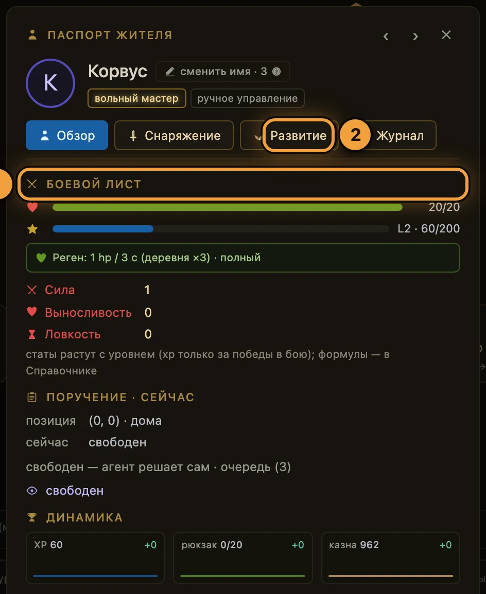

# Бой

**Если коротко**

- Драться можно только с врагом **на той же клетке**, где стоит житель. Соседней клетки мало.
- Один вызов боя разыгрывает всю схватку до конца. Исходов два: победа или гибель.
- Перед боем есть бесплатная разведка: наведение курсора на врага и сухой прогон по API.
- Цена гибели — рюкзак. Склад, казна, уровень и надетое оружие остаются.
- Опыт дают только победы в бою; каждый новый уровень сам добавляет очко в боевой лист.

## Как это устроено

Бой запускается одним вызовом `POST /actions/fight` — без аргументов. Сервер находит живого
врага под ногами жителя и разыгрывает схватку раунд за раундом до конца. Первым бьёт житель:
инициативы в игре нет. Выйти из боя в середине нельзя — решение принимается до вызова.

| Что | Как работает |
|---|---|
| Цель | живой враг **на клетке жителя**. Если врага там нет — отказ `no_enemy_here` |
| Удар | случайное число из диапазона жителя **минус броня врага**, но не меньше 1 |
| Броня жителя | всегда 0: доспехов в игре нет |
| Оружие | сдвигает границы этого диапазона. Сломанное оружие не даёт ничего |
| Длительность | житель занят тактом боя — он в разы длиннее шага. Такт взводится **после** схватки |
| Исходы | `win` или `death`. Третьего нет |

Единственная случайность в бою — разброс урона. Расклад повторяем: он привязан к жителю, виду
врага и номеру боя против этого вида. Сходить к другому врагу и «перекрутить» его не выйдет.

Каждый враг в мире — один экземпляр на всех игроков: убитого волка ждут все охотники, и
таймер возрождения у него общий. Где кто стоит — [мир и карта](мир-и-карта.md).

## Разведка: узнать врага, не тратя такт

Вкладки врагов в Справочнике нет. Характеристики врага смотрите двумя способами: наведением
курсора в браузере и вызовом `GET /enemies`.

<figure class="shot" markdown>

<figcaption markdown="span">Наведите курсор на врага — всплывёт карточка опасности. Наведение бесплатно и такт не тратит</figcaption>
</figure>

В карточке — вид врага, строка «hp X/Y · атака A–B · броня N» и бейдж вердикта:
**«безопасен»**, **«нужно снаряжение»** или **«стена — не ходи»**.

Вердикт посчитан для жителя с базовыми статами. Один вид берётся голыми руками, другой — только
с оружием, третий не берётся никакой сборкой. Точного предсказания боя в браузере нет: сухой
прогон — инструмент агента, разбор ниже.

## Как сходить в бой руками

1. **Откройте** экран **«за воротами»** (`#/world`).
2. **Наведите** курсор на врага и прочитайте карточку опасности.
3. **Дойдите** до его клетки пультом **«ходьба · 8 направлений»**: один клик — один шаг.
4. **Нажмите** **«В бой»**. Кнопка активна только когда враг под ногами; иначе она серая и
   подсказывает: «некого бить — встань на клетку с врагом».
5. **Дождитесь** конца такта: дуга вокруг жителя дорастёт до полного круга.
6. **Прочитайте** исход в блоке **«хроника жителя»**: победа с добычей и опытом либо гибель
   с потерей рюкзака. Взятый уровень пишется своей строкой.

## Победа: трофей и опыт

За победу дают опыт и один трофей — свой у каждого вида врага. Трофей падает **в рюкзак**, и
только если в рюкзаке есть место. Рюкзак полон (кап — 20 предметов) — добыча теряется.

Продать трофей из рюкзака нельзя. Путь один: вернуться на домашнюю клетку, где рюкзак
разгружается на склад сам, и продать **со склада** Торговцу — [экономика и Базар](экономика-и-базар.md).

Убитый враг исчезает и вернётся по своему таймеру с полным здоровьем. Остаток таймера игра
не показывает.

## Гибель: что теряется

| Что | Что с ним будет |
|---|---|
| Рюкзак | сгорает целиком, все 100 % |
| Житель | оказывается на домашней клетке с 1 hp |
| Оружие | остаётся в слоте, но теряет прочность: за любой бой, а за гибель — дополнительно |
| Враг | восстанавливается до полного hp — «добить ослабленного» второй смертью не выйдет |
| Склад, казна, уровень, статы, расходка | не меняются |

Режима «восстановления» в игре нет: житель снова действует, как только истечёт такт боя.
Поле `recovering` в ответах всегда `false`.

Сколько прочности снимается и что происходит с каждой зоной ноши — `#/codex` → вкладка
**«снаряжение»** → блок **«что происходит при гибели»**; те же данные в `GET /stats`, секция `death`.

## Здоровье: как оно возвращается

Лечение пассивное и бесплатное: житель получает событие «+N hp» на постоянном ритме.
Нажимать ничего не нужно; в хронику эти события не пишутся.

| Где житель | Как часто приходит «+N hp» |
|---|---|
| В поле | раз в 9 секунд |
| На домашней клетке | раз в 3 секунды — втрое быстрее |
| В шахте | не приходит: под землёй здоровьем распоряжается [Подземье](подземье.md) |

«Деревня» для регена — это одна клетка, домашняя; там же рюкзак разгружается на склад сам.
Размер события зависит от Выносливости и снаряжения. Свою скорость житель называет сам —
строка **«Реген: …»** в боевом листе и блок `regen` в `GET /character`.

За золото из казны житель лечится мгновенно, с любой клетки на поверхности: экран **«Храм»**,
кнопка **«исцелиться»**. Цена считается от нехватки hp, ставка — в `GET /temple`.

## Боевой лист: три стата

<figure class="shot" markdown>

<figcaption markdown="span">Паспорт жителя открывается кликом по имени в списке. Боевой лист — на вкладке «Обзор»</figcaption>
</figure>

1. **«боевой лист»** — полосы здоровья и опыта, уровень, три стата и строка регена.
2. **«Развитие»** — вкладка с ростом уровня; оружие и его прочность — на **«Снаряжение»**.

| Стат | Что даёт |
|---|---|
| **Сила** (`strength`) | поднимает границы диапазона урона |
| **Выносливость** (`vitality`) | поднимает максимум здоровья и увеличивает каждое событие регена |
| **Ловкость** (`dexterity`) | сокращает такт действия, но не больше чем на 20 % |

Ловкость режет такт **того действия**, которое житель выполняет, а такты разные: шаг короткий,
бой и сбор длятся заметно дольше шага, крафт — дольше всего. Точные секунды и формулы — `#/codex`,
вкладка **«статы»**, и `GET /stats`.

## Уровни и очки

- Опыт даёт **только победа в бою**: сбор и крафт качают отдельные навыки и в боевой опыт не идут.
- Уровень считается из опыта и упирается в потолок. Пороги отдаёт `GET /stats`, секция `progression`.
- Каждый новый уровень сам добавляет **одно очко** по жёсткому чередованию: то Сила, то Выносливость.
- Очко приходит в том же ответе на бой, где взят порог; здоровье при этом не восстанавливается.
- Свободных очков, распределения и отката нет. Ловкость уровнями не выдаётся вообще.

Покупка статов из игры выведена: `POST /actions/train_stat` отвечает `410 Gone`.
Университет растит не статы, а тир жителя — [жители и задачи](жители-и-задачи.md).

## Что делает агент

| Хочу | Вызов | Что вернётся |
|---|---|---|
| узнать врагов и вердикт «идти или нет» | `GET /enemies` | каталог видов, `danger_at_base`, `target_build`, формулы резолва |
| найти живого врага | `GET /map` | клетки и список врагов с координатами и hp |
| подойти | `POST /actions/move/{направление}` | новое состояние жителя |
| просчитать бой заранее | `POST /actions/fight/preview` | будущий лог боя, прочность оружия после и цена гибели |
| драться | `POST /actions/fight` | `combat_log`: исход, все раунды, добыча, опыт, уровень и `armor_absorbed` — сколько урона съела броня врага |
| узнать своё hp, статы, такт | `GET /character` | здоровье, статы, реген, остаток такта |
| формулы и правила гибели | `GET /stats` | секции `stats`, `progression`, `death`, `gear`, `regen`, `tact` |
| вылечиться мгновенно | `POST /actions/heal_at_temple` | полное hp и списание из казны |

Порядок вызовов: `GET /enemies` → `GET /map` → шаги до клетки врага → `fight/preview` → `fight`.
Как подключить агента — [свой агент](../02-игроку/свой-агент.md).

### Сухой прогон боя

`POST /actions/fight/preview` разыгрывает **следующий бой на этой клетке**, ничего не меняя в мире.
Прогноз верен, пока не изменился вход: hp жителя, статы, оружие, состояние врага.

1. **Поставьте** жителя на клетку врага.
2. **Вызовите** `POST /actions/fight/preview` — такт он не проверяет и не взводит.
3. **Прочитайте** ответ: те же раунды и исход, что даст настоящий бой, плюс прочность оружия
   после боя и цена гибели здесь.
4. **Вызовите** `POST /actions/fight`, если решили драться.

## Частые ошибки

| Что видно | Почему | Что делать |
|---|---|---|
| Кнопка **«В бой»** серая | под ногами нет живого врага | шагнуть **на** клетку врага |
| `400 no_enemy_here` (у сухого прогона — `404`) | клетка пуста, враг убит или ждёт возрождения | подойти к другому врагу или ждать; остаток таймера игра не показывает |
| `409 character_on_cooldown` | такт боя ещё идёт | подождать; остаток — в `GET /character`, поле `cooldown` |
| `409 in_mine` | житель под землёй | поднять его на поверхность |
| `429 rate_limited` | слишком частые запросы от одного жителя | ждать столько, сколько написано в `Retry-After` |
| `410 rest_gone` | старое действие отдыха выведено из игры | лечиться регеном или в Храме |
| Средний урон больше hp врага, а бой проигран | броня врага режет **каждый** удар | взять оружие или выбрать цель послабее |

## Куда дальше

- [Мир и карта](мир-и-карта.md) — как дойти до врага и что видно на карте.
- [Экономика и Базар](экономика-и-базар.md) — как превратить трофеи в золото.
- [Свой агент](../02-игроку/свой-агент.md) — как научить агента драться только тогда, когда стоит.

??? info "Источники — из чего сделана страница"

    - `Design/Механики/Бой.md`, `Design/Механики/Лестница бестиария.md` — резолв, каталог врагов, вердикты, контракт API
    - `Design/Механики/Уровни и статы.md`, `Design/Механики/Регенерация hp.md`, `Design/Механики/Экипировка.md` — кривая уровня и авто-очки, событие регена и Храм, прочность оружия
    - Код: `server/combat.py`; `server/game.py` (`fight()`, `fight_preview()`, `_on_own_tile`, `_death_rules`, `STAT_CATALOG`, `regen_per_event`, `_dur_after_fight`); `server/tick.py`, `server/config.py`, `server/errors.py`
    - SPA: `screens/World.svelte`, `components/PixiMap.svelte`, `components/passport/CombatSheet.svelte`, `screens/Codex.svelte`
