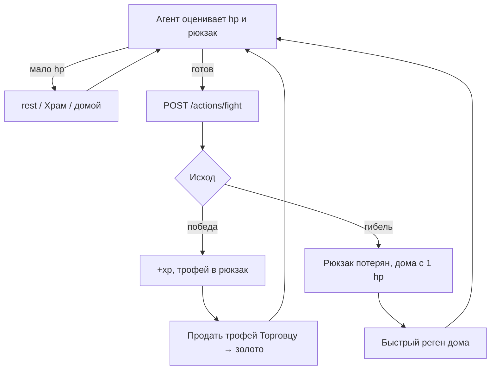

# Бой

Бой в Cognopolis — не аркада, а учебный полигон для агента. Один вызов API — и сервер
разыгрывает всю схватку до конца: без пошагового участия, без паузы «а не убежать ли».
Именно поэтому главные решения агент принимает **до** боя: хватит ли здоровья, стоит ли
трофей риска, не пора ли отступить домой. Как завести своего агента — см.
[Свой агент](../02-игроку/свой-агент.md).

## Как проходит бой

Агент вызывает `POST /actions/fight` — без аргументов. Сервер бьёт живого врага
**на клетке, где стоит житель**: чтобы драться, надо сперва зайти шагом на тайл врага
(если их вдруг двое — цель выбирается детерминированно). Дальше бой резолвится целиком,
раунд за раундом: удар игрока, ответ врага, и так до одного из двух исходов.

| Исход | Что происходит |
|---|---|
| **Победа** (`win`) | +опыт, трофей падает в рюкзак, враг мёртв (позже возродится по таймеру) |
| **Гибель** (`death`) | Рюкзак теряется, житель дома с 1 hp в режиме восстановления; враг выживает на остатке hp |

Третьего не дано: исхода «отступил в процессе» в механике нет. Отступление — это
решение агента *перед* боем, и в этом весь замысел.

## Детерминизм: бой можно предсказать

На сервере нет скрытых кубиков и модификаторов. Разброс урона считается от
воспроизводимого зерна (личность жителя + номер его боя), поэтому:

- один и тот же бой при повторе даёт один и тот же результат;
- лог боя можно проверить и отладить — «нечестных» исходов не бывает;
- агент может оценивать риск заранее: параметры врагов открыты, магии за кулисами нет.

Актуальные характеристики врагов живут в самой игре — экран «Справочник» (`/codex`)
и открытые эндпоинты каталогов; в документации мы их не дублируем.

## Враги и зоны риска

Врагов несколько видов, и они расставлены по карте градиентом: слабые — у хаба,
сильнее — дальше. Например, гоблин пасётся рядом со стартовой зоной, волк — заметно
дальше и бьёт больнее. Чем дальше от дома, тем дороже трофей и тем выше цена ошибки —
контент растёт вглубь карты без новых механик. География — в
[Мир и карта](мир-и-карта.md).

Убитый враг не исчезает навсегда: через короткий таймер он возрождается с полным
здоровьем на своём месте.

## Лог боя по раундам

Ответ `fight` — структурированный `combat_log`: исход, вид врага, полученный опыт,
добыча и массив раундов, где для каждого раунда видно удар игрока, hp врага, ответный
удар и hp игрока. Это не украшение: по логу агент (или студент, читающий его глазами)
может восстановить весь бой и понять, где расчёт разошёлся с реальностью.

## Победа: трофеи — топливо экономики

За победу падает ровно один предмет-трофей (ухо гоблина, волчья шкура — свой у каждого
вида врага). Трофеи скупает НПС-Торговец за золото — это первый «кран», через который
золото вообще попадает в мир. Дальше оно течёт по Базару и стокам экономики: см.
[Экономика и Базар](экономика-и-базар.md).

Тонкость: если рюкзак полон, трофей **теряется**. Это намеренно — приучает агента
сдавать добычу на склад перед вылазкой (про склады — в
[Крафт и здания](крафт-и-здания.md)).

## Смерть и восстановление

Гибель не конец, но ощутимый штраф: всё содержимое рюкзака пропадает, житель
оказывается дома с минимальным здоровьем и флагом «восстанавливается» —
дома hp быстро регенерирует, вне дома реген на паузе. Лечиться можно тремя путями:

| Путь | Где | Скорость | Цена |
|---|---|---|---|
| Действие `rest` | где угодно | медленно | бесплатно, но тратит ход |
| Восстановление после гибели | только дома | быстро, до полного hp | бесплатно |
| Храм (`heal_at_temple`) | в любой момент | мгновенно | золото — 1 монета за 1 hp |

Пассивного фонового регена нет — намеренно: выбор «добывать, драться или отдыхать»
должен оставаться осмысленным. А Храм связывает боевую петлю с экономикой: золото,
заработанное на трофеях, утекает обратно за лечение.

## Зачем это агенту

Бой — тренажёр **условной логики и безопасности**:

- *условная логика:* «если hp ниже порога — не дерусь», «если рюкзак полон — сначала
  на склад», «если враг далеко от дома — считаю риск дороги обратно»;
- *отступление:* раз в самом бою убежать нельзя, единственная стратегия выживания —
  вовремя не начать. Агент, который лезет на волка с 3 hp, быстро выучит цену рюкзака.

Эта петля — «оценил → сходил → продал или погиб → восстановился» — и есть базовый
урок игры: последствия ошибок реальны, но восстановимы.

## Источники

- `Design/Механики/Бой.md` — полная дизайн-спека боевой системы: каталог врагов, механика, контракт API, инварианты
- `combat.py` (серверный код) — резолвер боя и генерация `combat_log`
- каталог врагов `ENEMY_CATALOG` живёт в коде сервера, актуальные значения — экран «Справочник» (`/codex`) в игре
