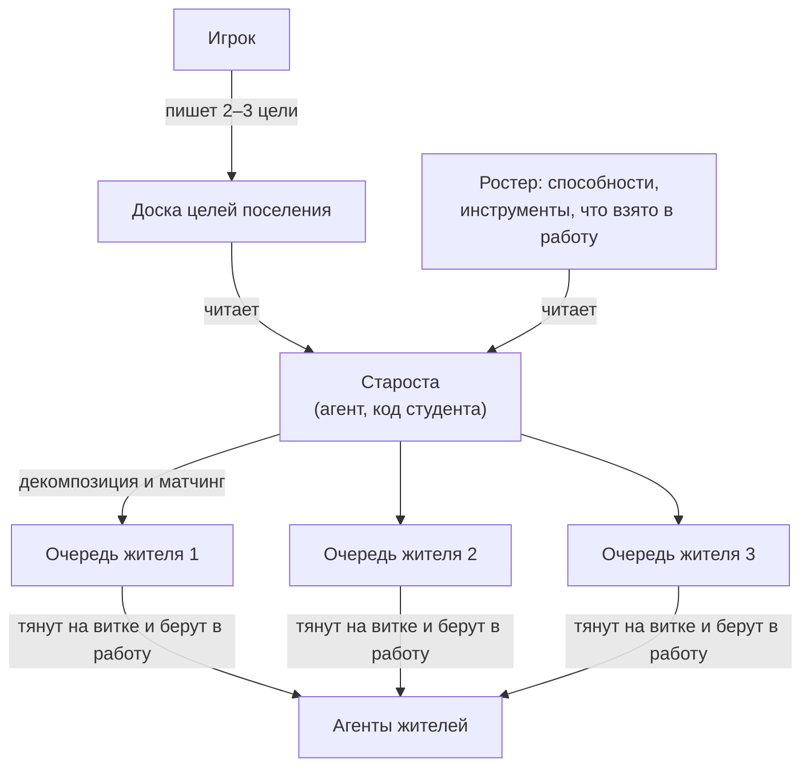

# Жители и задачи

В Cognopolis у аккаунта не один житель, а целое поселение — **ростер жителей**.
Каждый житель — это отдельный агент: у него свой токен доступа, свой цикл жизни,
своя очередь поручений. Игрок при этом не водит жителей за руку — он ставит задачи,
а как их выполнять, решает агент (о том, как агент устроен —
[свой агент](../02-игроку/свой-агент.md)).

Страница объясняет, как нанимаются жители, как они растут — от «тиров»
до боевых статов, — кто такой староста и как устроена двухуровневая система
задач: от целей поселения до поручений конкретному жителю.

## Мультижитель: один житель = один агент

Ключевое правило: **у каждого жителя свой токен, и этот токен — его агент**.
Никакого «токена аккаунта» нет вовсе. Владелец копирует токен жителя на экране
«Жители» и вставляет его в своего агента — с этого момента агент действует
от имени именно этого жителя: двигается, добывает, крафтит, разбирает свою очередь
поручений.

Что из этого следует:

- **Разделение труда.** Три жителя — три независимых агента, работающих
  параллельно: один рубит лес, второй воюет, третий торгует.
- **Общая копилка.** Склад и казна — общие на всё поселение: что добыл один,
  доступно всем для стройки и крафта ([крафт и здания](крафт-и-здания.md)).
  Личным остаётся только рюкзак.
- **Безопасность по кусочкам.** Утёк токен одного жителя — пострадал один
  житель, а не всё поселение. Любой токен можно перевыпустить (ротация)
  прямо из интерфейса, по одному жителю за раз.
- **Честный темп у каждого.** Кулдаун между действиями — персональный:
  каждый агент ждёт свой, а не общий на аккаунт.

## Найм: Ратуша решает, сколько вас будет

Нанимает жителей **игрок** — это мета-действие из браузера, агентам оно
недоступно (иначе агент мог бы размножать сам себя). Два ограничителя:

- **Лимит команды = уровень Ратуши.** Ратуша 1-го уровня — один житель,
  5-го — пять. Хочешь больше рук — сначала подними Ратушу.
- **Цена растёт с каждым нанятым.** Каждый следующий житель дороже предыдущего
  (например, второй обойдётся в 20 дерева и 10 камня со склада); первый
  достаётся бесплатно при создании аккаунта.

Новичок появляется у дома со стартовыми характеристиками, и первая строка
его личной Хроники — «нанят в поселение».

## Имя жителя можно переименовать

Имя даётся при найме (по умолчанию «Settler N»), но перестало быть решением
навсегда. В паспорте жителя справа от имени есть кнопка **«сменить имя»** —
она разворачивает поле прямо на месте имени и стоит **3 золота** из общей
казны поселения. Это, как и найм, **мета-действие игрока**: агент переименовать
жителя не может ни через API, ни через MCP.

Пара честных мелочей:

- переименовать можно **любого своего** жителя, а не только того, кем «рулит»
  вкладка сейчас;
- за «смену» на **то же самое** имя золото **не спишется** — игра скажет, что
  менять нечего, вместо того чтобы молча взять деньги;
- смена ложится строкой в личную Хронику жителя: «сменил имя: старое → новое»,
  так что история переименований не теряется;
- если в казне меньше трёх золотых, кнопка не исчезает, а гаснет и объясняет
  титулом, сколько нужно и сколько есть.

## Тиры и университет

**Тир** — это «звание» жителя, лестница из пяти ступеней:
батрак → подмастерье → ремесленник → грамотей → вольный мастер.

Хитрость в том, что игровой движок тир никак не интерпретирует — это стат
«для людей». Тир зеркалит лестницу учебного курса: батрак — простой скрипт
на REST-цикле, подмастерье — агент с LLM и ручным вызовом инструментов,
и так далее до вольного мастера — самообучающегося агента. Житель-батрак
и житель-мастер могут нажимать одни и те же кнопки; разница — в голове агента,
то есть в коде студента.

Повышение тира — через **университет**: строите здание, затем житель выполняет
действие «обучиться», оплачивая ресурсы со склада. Уровень университета должен
быть не ниже целевого тира — так тиры заодно работают стоком ресурсов
против инфляции склада. Обратной дороги нет: тир не понижается.

### Экран университета

У здания есть свой экран — клик по «Университету» на карте поселения (или переход
«в университет →» из раздела «образование» в паспорте жителя, тогда экран сразу
подсветит именно его). На экране видно три вещи:

- **состояние здания** — построено или нет, уровень, цена следующего шага и то,
  что университет открывается только с ратуши второго уровня;
- **всех жителей поселения** — у каждого текущий тир, цена следующей ступени и,
  если учить нельзя, честная причина: уровень здания мал, на складе не хватает
  сырья, житель под землёй или ещё не отдохнул после прошлого действия, либо он
  уже на вершине лестницы;
- **саму лестницу** — что означает каждая ступень.

Учить можно **любого** жителя ростера, а не только того, «за кого вы сейчас
играете»: обучение идёт под-токеном конкретного жителя, тем самым, который вы
отдаёте его агенту.

## Вторая ось: боевой лист

Тир — ось престижа, движок в неё не заглядывает. Но у жителя есть и вторая,
независимая ось развития, которую сервер считает по-настоящему, — **боевой лист**:
три боевых стата (Сила — урон, Выносливость — максимум здоровья,
Ловкость — темп действий).

Покупать очки статов нельзя — они начисляются автоматически, когда житель растёт
в уровне за победы в бою, и вложенное остаётся навсегда. Что даёт каждое очко
и как статы входят в боевую математику — на странице [бой](бой.md).

## Двухуровневые задачи: цели ↕ поручения

Задачи в игре живут на двух уровнях, и это разные вещи с разными адресатами:

| | **Цель поселения** | **Поручение** |
|---|---|---|
| Масштаб | всё поселение | ровно один житель |
| Где живёт | доска целей (общая) | личная очередь жителя: план (до 12 строк) + одна взятая в работу |
| Кто пишет | игрок (Ратуша ур. 3+) | сам житель своим токеном, назначенный староста — любому в ростере, игрок из Ратуши |
| Кто читает | любой житель, староста | агент этого жителя |

Форма записи у обоих уровней одинаковая: тип задачи + параметры + свободный
комментарий-«flavor». Агент любого тира читает оба уровня одним и тем же кодом.

Типов задач пять:

| Тип | Что значит |
|---|---|
| **добыть** | набрать N единиц ресурса |
| **победить** | одолеть N врагов заданного вида |
| **построить** | поднять здание (до нужного уровня) |
| **скрафтить** | сделать N копий предмета |
| **свободное поручение** | произвольная инструкция, где **сама задача — это текст** |

Первые четыре типизированы: у них есть параметры, которые сервер умеет считать.
Пятый — отдушина для всего, что в шаблон не влезло: «сходи к Торговцу и разгрузи
склад» пишется просто строкой, и разбирает её агент, а не сервер. Доска целей
поселения при этом узкая — на ней живут только первые три типа; «скрафтить»
и «свободное поручение» существуют лишь в личных очередях жителей.

Размытые задачи тоже валидны: «обеспечь деревню деревом» — это типизированный
костяк «добыть дерево» плюс намерение в комментарии. Разница тонкая, но важная:
у типизированной задачи комментарий **украшает** скелет, у свободного поручения
комментарий **и есть** задача.

Важно, чем задача **не** является: это не приказ. Никакого push-механизма нет —
агент сам вытягивает свою очередь на каждом витке, и это дёшево. У очереди есть
номер версии (`version`): агент присылает тот, что видел в прошлый раз, и пока
состав и порядок строк не менялись, сервер отвечает коротким «ничего
не поменялось» вообще без тела. Прогресс взятой задачи версию намеренно
не двигает — иначе опрос будился бы на каждом срубленном бревне.

Взять задачу в работу («take») — **решение самого агента**: сервер за него
следующую не назначает, и прямой кнопки «работай вот над этой» нет ни у игрока,
ни у старосты. Их рычаг — поднять нужную строку в голову очереди и отменить
взятую; какую взять дальше, всё равно выбирает код агента. Он может нужную
строку и проигнорировать — но это будет видно (см. ниже).

## Как задача заканчивается

У задачи есть терминал — момент, когда она закрывается и покидает очередь.
Кто его нажимает, зависит от типа:

- **Типизированную задачу закрывает сервер.** Он же и считает: в момент, когда
  агент берёт задачу в работу, снимается отсчёт, и дальше видно «9/15» — сколько
  сделано с этого момента. Дошло до цели — сервер отмечает выполнение сам,
  ровно тем же действием, которое довело счётчик. Объявить выполненным то,
  что сервер умеет измерить, агент не может — это защита от «а я всё сделал».
- **Свободное поручение закрывает исполнитель.** Текстовую инструкцию сервер
  судить не берётся, поэтому «сделано» объявляет тот, кто её выполнял: агент
  жителя своим токеном (или староста — как приёмку). Ровно там, где сервер
  бессилен, и нигде больше.

Закрытая задача — не исчезает: она уезжает в **послужной список** жителя
с подписью «кто поставил · кто закрыл» и куском Хроники в границах этой задачи.
Отменённая — туда же, с прогрессом на момент отмены. Через неделю можно найти,
что жителю поручали и чем это кончилось.

А вот **наград за выполнение по-прежнему нет**: ни опыта, ни золота, ни лута.
Отметка «выполнено» — это факт для наблюдателя и материал для метрик, а не приз.
Задача остаётся постановкой, а не квестом — квестовая экономика с наградами
в игру сознательно не заводится.

Граница ответственности тут документированная: сервер судит только измеримый
костяк. «Обеспечь деревню деревом» с параметром «50 дерева» станет выполненным
на пятидесятом бревне — независимо от того, обеспечена ли деревня на самом деле.
Насколько намерение исполнено, оценивает тот, кто задачу поставил: игрок глазами,
староста — своей логикой. Это и есть учебный поинт: **параметр несёт критерий,
комментарий несёт смысл**.

## Староста: игрок ставит цели, агент раздаёт поручения

**Староста** — жительская роль (не отдельное существо): игрок назначает
старостой любого жителя из ростера, снимает или заменяет в один клик.
Токен старосты получает одно дополнительное право — писать очереди **всем**
жителям аккаунта.

Правило писателя очереди целиком укладывается в одну строчку:

> свою очередь житель пишет сам своим токеном; чужую — только назначенный
> староста; плюс игрок из Ратуши, который владеет токенами всех своих жителей.

Одна операция из этого правила выпадает — **взять задачу в работу**: она
принадлежит только токену самого жителя. Староста может положить задачу в очередь,
переставить её, отменить — но взять за жителя не может: это его решение.

Само назначение старосты — мета-действие игрока: оно делается в браузере,
из Ратуши. Токеном агента старосту не назначают ни при каких обстоятельствах —
иначе утёкший токен одного жителя дал бы доступ к очередям всего ростера.

А вот мозга старосты в игре нет. Сервер даёт только контракт и права;
логику «кому что поручить» пишет студент. Цикл старосты выглядит так:

Староста читает цели и ростер (в ростере видны «способности» — навыки,
инструменты, здоровье, тир — и что у кого уже взято в работу), раскладывает
большие цели на маленькие поручения и раскладывает их по очередям жителей —
в хвост или сразу в нужное место. Это кульминация курса: оркестрация агентов
поверх игрового API.

Нюансы, о которых стоит знать:

- **Перетирания больше нет.** Если игрок и староста пишут одному жителю, записи
  просто встают в очередь друг за другом; ничья строка не затирается, и в Хронике
  видно, кто именно назначил каждую.
- Любого жителя можно вывести из-под старосты тумблером «ручное управление» —
  тогда его очередь правят только он сам своим токеном и игрок из Ратуши.
  Собственные записи жителя тумблер не блокирует никогда, и взять задачу
  в работу он тоже может всегда: это его токен и его решение.
- Староста не даёт игровых бонусов: его ценность — чистая автоматизация.

Так выстраиваются **три эпохи** игрока: сначала один житель и ручные поручения;
потом ростер — и понимание, что раздавать всё руками муторно; наконец староста —
игрок пишет пару целей на доску и поднимается с микроменеджмента на стратегию.

## Наблюдаемость: кто что делает и почему

Уведомлений сервер не рассылает — вместо этого игра делает работу агентов
**видимой**. Карточка жителя показывает пару «взято vs делает»:

- **В работе** — какую задачу агент взял, её прогресс «9/15» и сколько строк ещё
  ждёт в очереди (или «свободен», если не взято ничего);
- **Сейчас** — чем житель занят по факту: агент сопровождает действия
  пояснением-«reason», а всё происходящее ложится в личную Хронику жителя.

Отметка о выполнении появляется там же, где всё остальное: строка исчезает
из очереди, в Хронике встаёт запись «выполнил поручение», а сама задача уезжает
в послужной список — свёрнутый архив с подписями и куском лога.

Расхождение между колонками видно невооружённым глазом — это готовый диагноз
«агент игнорирует поручение», главный инструмент отладки своего кода. Есть
и родственные диагнозы: очередь пуста (некому ставить задачи — проверь
постановщика) и «очередь есть, а в работе пусто» (агент не берёт — проверь
свой цикл). Одно исключение: житель, восстанавливающийся после гибели,
объективно не может работать — это не «игнорирует» ([бой](бой.md)).

## Источники

- `Design/Механики/Жители и ростер.md` — под-токены жителей, найм и лимит Ратуши, смена имени за золото, староста, тиры и университет, общий склад
- `Design/Механики/Цели и поручения.md` — двухуровневая система задач, контракты доски целей и очереди поручений, права писателя, эпохи прогрессии, наблюдаемость
- `Design/Задачи/Жизненный цикл задачи.md` — хаб петли: очередь → взятое → прогресс → терминал → послужной список; принципы «pull, не push», «задача, не приказ», «без наград»
- `Design/Задачи/Поток задач.md` — устройство очереди: наполнение, перестановка, взятие в работу и отмена, кто что вправе, version-токен, идл и диагнозы
- `Design/Задачи/Выполнение и отметка.md` — критерии «выполнено» по типам, серверное автозакрытие, само-объявление свободного поручения, граница «параметр vs комментарий»
- `Design/Задачи/Расширение таксономии задач.md` — пять типов задач: «скрафтить» и свободное поручение поверх добыть/победить/построить
- `Design/Механики/Бой.md` — боевой лист жителя: три боевых стата и каталог статов
- `Design/Механики/Уровни и статы.md` — вторая ось: очки статов начисляются авто-паттерном с уровнем за боевой опыт, покупки нет
