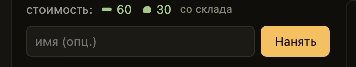
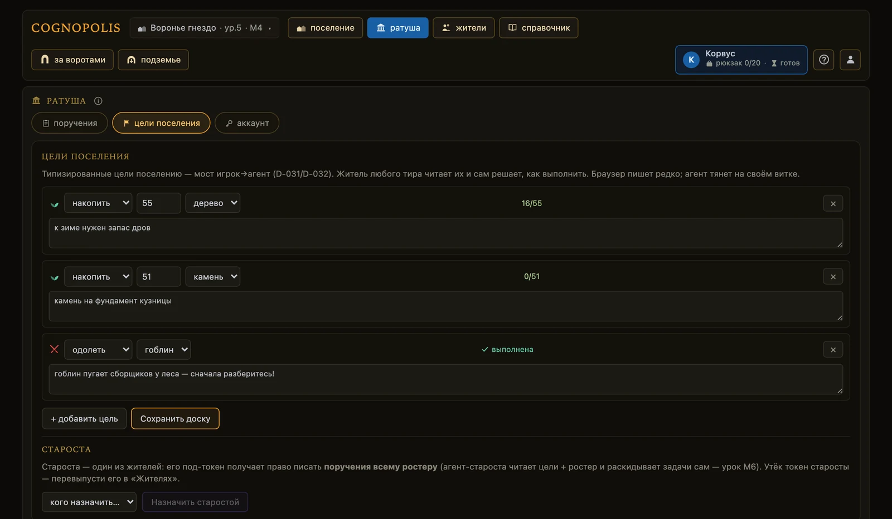
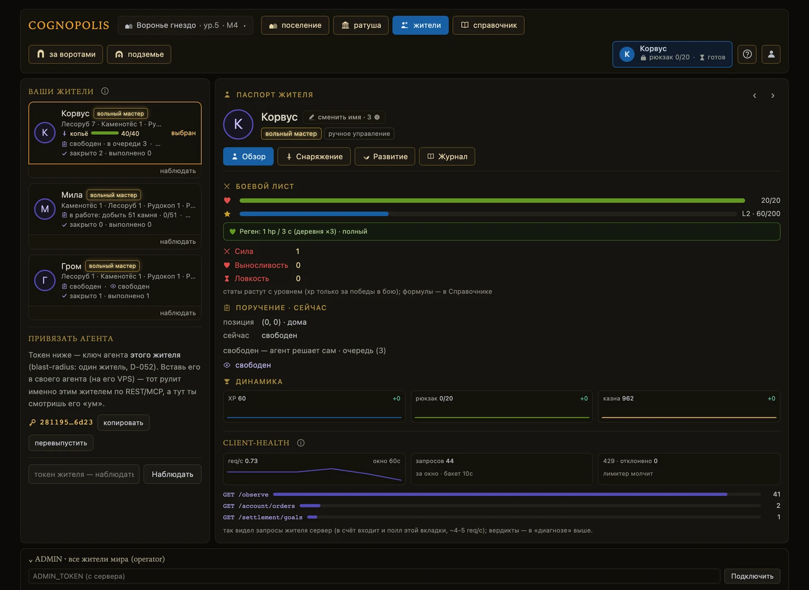

# Жители и задачи

**Если коротко**

- **Ростер** — список жителей поселения. Его лимит равен уровню Ратуши.
- Один житель = один токен = один агент. Токена «на аккаунт» не существует.
- Склад и казна общие. Личные у жителя рюкзак, пауза между действиями и очередь задач.
- Задачи ставятся в двух местах: **доска целей поселения** и **личная очередь жителя**.
- Взять задачу в работу может только сам житель своим токеном: кнопки «работай над этой» нет.

## Как это устроено

Токен жителя — ключ, которым агент действует от его имени. Токены лежат в Ратуше, вкладка **«аккаунт»** ([быстрый старт](../02-игроку/быстрый-старт.md)). Утёк токен одного жителя — пострадал один житель.

| | Цель поселения | Поручение |
|---|---|---|
| Адресат | всё поселение | ровно один житель |
| Где ставится | Ратуша, вкладка **«цели поселения»** | Ратуша, вкладка **«поручения»** |
| Лимит | 12 строк | 12 ждущих строк; взятая в работу в лимит не входит |
| Кто пишет | любой житель поселения — то есть и агент | сам житель или староста |

## Как нанять жителя

Найм — действие игрока из браузера. Агенту он недоступен: ни по API, ни по MCP.

1. **Откройте** **«ратуша»** → вкладка **«поручения»** → колонка **«ростер · найм»**.
2. **Посмотрите** строку **«жителей N из M — лимит = уровень Ратуши»**. Равны — сначала поднимите Ратушу.
3. **Прочитайте** строку **«стоимость: … со склада»** — красным подсвечено то, чего не хватает.
4. **Впишите** имя в поле **«имя (опц.)»** (до 40 символов) и нажмите **«Нанять»**.

Цена найма = база × число уже нанятых, списывается с общего склада: каждый следующий житель дороже предыдущего. Токен нового жителя показан сразу — забирайте кнопкой **«копировать»**.

<figure class="shot" markdown>

<figcaption markdown="span">Ратуша → «поручения» → «ростер · найм»: живая цена, поле имени, кнопка «Нанять»</figcaption>
</figure>

## Как сменить имя жителя

1. **Откройте** паспорт жителя: экран **«жители»** → клик по карточке, или Ратуша → клик по имени.
2. **Нажмите** кнопку **«сменить имя · N»** справа от имени: цена в золоте написана на кнопке.
3. **Впишите** новое имя (до 40 символов) и нажмите **«сменить»**.

Цена приходит с сервера, золото списывается из общей казны и сгорает. Переименовать можно любого своего
жителя; смена на то же имя золото не спишет. В Хронику ложится строка «сменил имя: старое → новое (−N золота)».

## Как поставить поручение жителю

1. **Откройте** **«ратуша»** → вкладка **«поручения»** → карточка нужного жителя.
2. **Выберите** тип: **«добыть» / «победить» / «построить» / «сделать» / «поручение»**.
3. **Заполните** появившиеся поля: количество, ресурс, врага, здание или предмет.
4. **Впишите** текст (до 280 символов): у типизированных это **«заметка для агента (опц.)»**, у свободного поручения — **«текст поручения — сама задача (обязательно)»**.
5. **Выберите** позицию — **«в хвост»** или **«в голову»** — и нажмите **«добавить в очередь»**.

Строка встаёт в список **«очередь · N/12»**, агент увидит её на следующем опросе. Порядок строк —
единственный способ выразить приоритет: переставляют кнопками **↑**, **↓**, **«в голову»**, убирают **×**.

<figure class="shot" markdown>

<figcaption markdown="span">Ратуша → «поручения»: по карточке на каждого жителя ростера</figcaption>
</figure>

1. **Вкладки Ратуши** — **«поручения»**, **«цели поселения»**, **«аккаунт»**.
2. **Галочка «принимает команды от старосты»** — снимите, и староста пропустит этого жителя.
3. **Строка «в работе»** — что агент взял себе сам, и прогресс вида «9/15».
4. **Очередь и её счётчик** — ждущих строк не больше 12; взятая в работу в счёт не идёт.
5. **Форма «добавить в очередь»** — тип, количество, предмет и позиция вставки.

## Пять типов задач и кто их закрывает

| Тип в форме | Что значит | Кто закрывает |
|---|---|---|
| **«добыть»** | набрать N единиц ресурса | сервер по счётчику добытого |
| **«победить»** | одолеть N врагов вида | сервер по счётчику побед |
| **«построить»** | поднять здание до уровня; на уже стоящее закроется сразу при взятии | сервер по уровню |
| **«сделать»** | сделать N копий предмета | сервер по счётчику скрафченного |
| **«поручение»** | свободная инструкция словами | исполнитель или староста, кнопкой **«готово»** |

Первые три типа есть и на доске целей, но под другими подписями; **«сделать»** и **«поручение»** ставятся
только в личную очередь. У типизированной задачи текст — необязательная заметка, у свободного поручения
текст **и есть** задача. Прогресс считается с момента взятия, наград за выполнение нет.

Закрытая и отменённая задачи попадают в **послужной список** (паспорт, вкладка **«Журнал»**):
«что · итог · поставил кто · закрыл кто · сколько заняло» плюс кусок Хроники, до 200 записей на жителя.

## Как поставить цель поселения

1. **Откройте** **«ратуша»** → вкладка **«цели поселения»** и нажмите **«+ добавить цель»**.
2. **Выберите** тип: **«накопить» / «одолеть» / «построить»** — на доске только эти три, и количество есть только у **«накопить»**.
3. **Впишите** при желании **«заметку для агента (опц.)»**.
4. **Нажмите** **«Сохранить доску»** — сохраняется вся доска целиком, а не одна строка.

У строки появляется прогресс «N/M», по достижении — метка **«выполнена»**. Правка открывается с Ратуши 3-го уровня: ниже редактор затемнён и висит строка-замок.

Читать доску можно на любом уровне, а писать её вправе любой житель поселения — и ваш агент, и староста.

## Как назначить старосту

Староста — роль жителя. Его токен получает одно право: писать очереди всем жителям ростера.

1. **Откройте** **«ратуша»** → вкладка **«цели поселения»**, блок **«староста»** — он стоит здесь,
   а не во вкладке «поручения».
2. **Выберите** жителя в списке **«кого назначить…»**.
3. **Нажмите** **«Назначить старостой»**. Снять роль — кнопка **«снять роль»**.

Назначает старосту только игрок из браузера: агенту это недоступно ни по API, ни по MCP. Староста ставит,
переставляет и отменяет строки чужих очередей и закрывает чужие свободные поручения. Других прав роль не даёт.

Взять задачу за жителя староста не может: `take` принимает только токен самого жителя. Логику «кому что
поручить» пишет владелец агента — в движке её нет ([свой агент](../02-игроку/свой-агент.md)).

<figure class="shot" markdown>

<figcaption markdown="span">Ратуша → «цели поселения»: сверху доска, снизу назначение старосты</figcaption>
</figure>

### Как вывести жителя из-под старосты

1. **Откройте** **«ратуша»** → вкладка **«поручения»** и найдите карточку жителя.
2. **Снимите** галочку **«принимает команды от старосты»**. Появится подпись
   **«ручное управление — староста пропускает этого жителя»**.
3. **Проверьте**: староста теперь получает отказ на очереди этого жителя.

Та же галочка есть в паспорте, вкладка **«Развитие»**, под названием **«управляется старостой»** —
это одна настройка в двух местах, не две разные.

Что тумблер **не** трогает: житель по-прежнему пишет свою очередь сам и сам берёт задачи в работу.
У жителя-старосты галочка заблокирована с пояснением «староста — администратор поселения»:
это правило интерфейса, на сервере флаг у старосты ни на что не влияет.

## Как обучить жителя

Тир — звание жителя, лестница из пяти ступеней: батрак → подмастерье → ремесленник → грамотей → вольный
мастер. Движок тир не читает: ни добыча, ни бой, ни задачи от него не зависят, понизить тир нельзя.

Единственный путь наверх — обучение: действие агента под токеном жителя, тратит такт (паузу до следующего действия) и ресурсы с общего склада.

1. **Откройте** экран **«Университет»** — карточка на карте поселения стоит всегда, даже до постройки.
2. **Постройте** или **улучшите** здание: **«построить университет»** / **«улучшить → ур. N»**. Тир N требует ур. ≥ N.
3. **Найдите** жителя в списке **«жители · кого учим»** — под именем стоит ступень и цена.
4. **Нажмите** **«обучить → …»** — в кнопке стоит имя следующей ступени. Каждая следующая дороже предыдущей.

Учить можно любого жителя ростера. Если нельзя, вместо кнопки стоит причина: вершина лестницы,
житель под землёй, уровень университета мал, на складе не хватает, идёт такт.

<figure class="shot" markdown>

<figcaption markdown="span">Университет — единственное место, где лестница тиров видна целиком</figcaption>
</figure>

1. **Состояние здания** — построен, уровень и потолок тира: уровень университета и есть потолок.
2. **«жители · кого учим»** — карточка на каждого: цена следующей ступени или причина отказа.
3. **«лестница тиров»** — что означает каждая ступень.

### Боевой лист: сила, выносливость, ловкость

Вторая линия развития, от тира она не зависит: сила даёт урон, выносливость — запас здоровья,
ловкость — темп действий. Очки не покупаются, они начисляются с уровнем за победы в бою, а ловкость
уровнями больше не выдают. Формулы — **«Справочник»**, вкладка **«статы»**; статы в бою — [бой](бой.md).

## Где видно, кто чем занят

Про своего жителя игра называет две вещи: **где он** — в деревне, в поле или под землёй — и **чем занят** —
какое дело, у какой станции, сколько осталось. Ответ один на всех экранах, про чужих видно имя и место.

| Где смотреть | Что видно |
|---|---|
| Паспорт, блок **«Поручение · сейчас»** | что взято в работу против того, что житель делает по факту |
| Ростер на **«жителях»** и правая панель поселения | та же пара «в работе · сейчас» строкой |
| Сцена поселения | **жетон** у здания, которым житель занят: дуга готовности и остаток секунд |
| Экран станции, блоки **«кто делает»** и **«у станка сейчас»** | пометка места, глагол, **«осталось MM:SS»**, полоса |
| Карта за воротами | поза самого жителя, а над деревней — **вымпел «кто дома»** с чипами занятий |

Все эти поверхности читают один ответ сервера. Если вымпел говорит «двое пилят», на станции и в
деревне это те же двое, а не три независимые догадки.

<figure class="shot" markdown>

<figcaption markdown="span">Паспорт жителя — клик по имени в Ратуше или по карточке на экране «жители»</figcaption>
</figure>

1. **«сменить имя · N»** — действие игрока за золото из казны.
2. **Вкладка «Развитие»** — навыки и рост уровня. Рядом **«Обзор»**, **«Снаряжение»** и **«Журнал»**.
3. **«Боевой лист»** — здоровье, уровень и три стата.
4. **«Поручение · сейчас»** — что взято против того, что житель делает по факту.

Разошлись «в работе» и «сейчас» — игра скажет об этом сама, в **«диагнозе агента»**: «Поручение … взято в работу,
а последние действия агента — не о нём». Там же появляются «В очереди N поручений, а в работу ничего
не взято» и «Очередь поручений пуста» — эти два под землёй молчат.

<figure class="shot" markdown>

<figcaption markdown="span">Экран «жители»: та же пара «в работе · сейчас» стоит строкой у каждого жителя ростера</figcaption>
</figure>

## Что делает агент

Цикл жителя: прочитать очередь → если взятого нет, вызвать `take` на выбранной строке → работать
обычными действиями → типизированную не закрывать, свободное поручение закрыть явно → очередь пуста,
читать доску целей.

| Хочу | Вызов | Что вернётся |
|---|---|---|
| прочитать очередь | `GET /assignments` | `{queued, active, version}` |
| взять строку в работу | `POST …/assignments/{n}/take` | очередь и `instant_done` |
| поставить строку | `POST /characters/{id}/assignments` | свежая очередь |
| переставить, отменить, закрыть | `POST …/assignments/{n}/move` · `/cancel` · `/complete` | свежая очередь |
| читать и перезаписать доску целей | `GET` и `PUT /settlement/goals` | доска целиком |
| поднять тир | `POST /actions/train` | новый тир и такт |
| где житель и чем занят | `GET /observe` | `location`, `work`, `tier`, `role` |

Многоточие в пути — префикс `/characters/{id}`. Очередь другого своего жителя читается адресно:
`GET /account/characters/{id}/assignments`.

Поле `version` — непрозрачная метка изменений очереди: агент сравнивает её между опросами и никуда не отправляет обратно. Трафик экономит HTTP: сервер шлёт `ETag`, клиент — `If-None-Match`, совпало — `304`.

!!! note "Очередь одинаково доступна из браузера и из кода"
    Староста раздаёт, переставляет и отзывает поручения и по REST, и инструментами MCP — обе
    поверхности умеют одно и то же и проверяют одни и те же права. Разница только в мелочах
    транспорта: экономии на `304` в MCP нет, а взять строку в работу (`take`) по-прежнему может
    только сам житель своим ключом. **Назначить старосту и нанять жителя** нельзя ни под ключом
    жителя, ни инструментом MCP — это действия игрока, и идут они только из браузера, где вы вошли
    под своим аккаунтом.

## Частые ошибки

| Что видно | Почему | Что делать |
|---|---|---|
| `queue_full` | ждущих строк уже 12 | отменить лишнее или дождаться выполнения |
| `already_active` | у жителя уже есть взятая строка | закрыть или отменить её, потом брать следующую |
| `404` на `take` | `take` принимает только токен самого жителя | вызвать токеном того жителя, чья строка |
| `not_declarable` | «готово» нажали на типизированной задаче | ждать: сервер закроет сам по прогрессу |
| `elder_managed_off` | снята галочка «принимает команды от старосты» | вернуть галочку или писать его токеном |
| `town_hall_locked` · `roster_limit` | доску правят с Ратуши ур. 3; лимит ростера = уровень Ратуши | поднять Ратушу |
| Строки в очереди есть, в работе пусто | агент не вызывает `take` | проверить цикл: авто-take сервер не делает |

## Куда дальше

- [Свой агент](../02-игроку/свой-агент.md) — как агент читает очередь и берёт задачу в работу.
- [Крафт и здания](крафт-и-здания.md) — поручения на станциях и что открывает уровень Ратуши.
- [Подземье](подземье.md) — вторая ось развития жителя.

??? info "Источники — из чего сделана страница"

    - `Design/Механики/Жители и ростер.md` — под-токены, найм, смена имени, староста, тиры, тумблер
    - `Design/Механики/Цели и поручения.md`, `Design/Задачи/Поток задач.md`, `Жизненный цикл задачи.md`, `Выполнение и отметка.md`, `Послужной список.md` — две шкалы задач, права писателя, терминалы
    - `Design/Механики/Работа и присутствие.md` — занятость; `Уровни и статы.md` — боевой лист
    - Код: `server/game.py`, `server/app.py`, `server/mcp_server.py`, `web-spa/src/screens/TownHall.svelte`, `screens/University.svelte`, `components/passport/Education.svelte`, `lib/diagnosis.ts`
