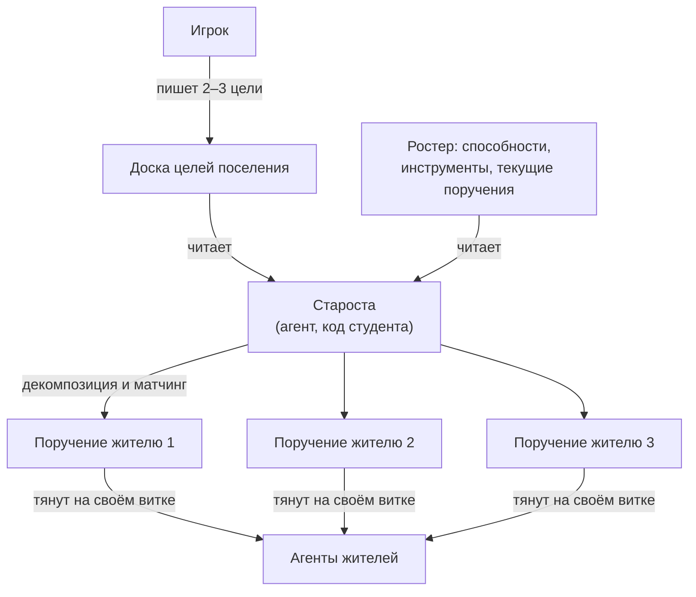

# Жители и задачи

В Cognopolis у аккаунта не один житель, а целое поселение — **ростер жителей**.
Каждый житель — это отдельный агент: у него свой токен доступа, свой цикл жизни,
своё поручение. Игрок при этом не водит жителей за руку — он ставит задачи,
а как их выполнять, решает агент (о том, как агент устроен —
[свой агент](../02-игроку/свой-агент.md)).

Страница объясняет, как нанимаются жители, как растут их «тиры», кто такой
староста и как устроена двухуровневая система задач — от целей поселения
до поручений конкретному жителю.

## Мультижитель: один житель = один агент

Ключевое правило: **у каждого жителя свой токен, и этот токен — его агент**.
Никакого «токена аккаунта» нет вовсе. Владелец копирует токен жителя на экране
«Жители» и вставляет его в своего агента — с этого момента агент действует
от имени именно этого жителя: двигается, добывает, крафтит, читает своё поручение.

Что из этого следует:

- **Разделение труда.** Три жителя — три независимых агента, работающих
  параллельно: один рубит лес, второй воюет, третий торгует.
- **Общая копилка.** Склад и казна — общие на всё поселение: что добыл один,
  доступно всем для стройки и крафта ([крафт и здания](крафт-и-здания.md)).
  Личным остаётся только рюкзак.
- **Безопасность по кусочкам.** Утёк токен одного жителя — пострадал один
  житель, а не всё поселение. Любой токен можно перевыпустить (ротация)
  прямо из интерфейса, по одному жителю за раз.
- **Честный темп у каждого.** Кулдаун между действиями — персональный:
  каждый агент ждёт свой, а не общий на аккаунт.

## Найм: Ратуша решает, сколько вас будет

Нанимает жителей **игрок** — это мета-действие из браузера, агентам оно
недоступно (иначе агент мог бы размножать сам себя). Два ограничителя:

- **Лимит команды = уровень Ратуши.** Ратуша 1-го уровня — один житель,
  5-го — пять. Хочешь больше рук — сначала подними Ратушу.
- **Цена растёт с каждым нанятым.** Каждый следующий житель дороже предыдущего
  (например, второй обойдётся в 20 дерева и 10 камня со склада); первый
  достаётся бесплатно при создании аккаунта.

Новичок появляется у дома со стартовыми характеристиками, и первая строка
его личной Хроники — «нанят в поселение».

## Тиры и университет

**Тир** — это «звание» жителя, лестница из пяти ступеней:
батрак → подмастерье → ремесленник → грамотей → вольный мастер.

Хитрость в том, что игровой движок тир никак не интерпретирует — это стат
«для людей». Тир зеркалит лестницу учебного курса: батрак — простой скрипт
на REST-цикле, подмастерье — агент с LLM и ручным вызовом инструментов,
и так далее до вольного мастера — самообучающегося агента. Житель-батрак
и житель-мастер могут нажимать одни и те же кнопки; разница — в голове агента,
то есть в коде студента.

Повышение тира — через **университет**: строите здание, затем житель выполняет
действие «обучиться», оплачивая ресурсы со склада. Уровень университета должен
быть не ниже целевого тира — так тиры заодно работают стоком ресурсов
против инфляции склада.

## Двухуровневые задачи: цели ↕ поручения

Задачи в игре живут на двух уровнях, и это разные вещи с разными адресатами:

| | **Цель поселения** | **Поручение** |
|---|---|---|
| Масштаб | всё поселение | ровно один житель |
| Где живёт | доска целей (общая) | личный слот жителя (один, без очереди) |
| Кто пишет | игрок (Ратуша ур. 3+) | игрок вручную — или староста |
| Кто читает | любой житель, староста | агент этого жителя |

Форма записи у обоих уровней одинаковая: тип задачи (добыть / победить /
построить) + параметры + свободный комментарий-«flavor». Агент любого тира
читает оба уровня одним и тем же кодом. Размытые задачи тоже валидны:
«обеспечь деревню деревом» — это типизированный костяк «добыть дерево»
плюс намерение в комментарии.

Важно, чем задача **не** является: это не приказ. Никакого push-механизма нет —
агент сам вытягивает своё поручение на каждом витке (дёшево: сервер отвечает
«ничего не поменялось», если слот не менялся). Наград за выполнение нет,
серверной галочки «выполнено» тоже: задача — постановка, а не квест.
Агент может поручение и проигнорировать — но это будет видно (см. ниже).

## Староста: игрок ставит цели, агент раздаёт поручения

**Староста** — жительская роль (не отдельное существо): игрок назначает
старостой любого жителя из ростера, снимает или заменяет в один клик.
Токен старосты получает одно дополнительное право — писать и снимать
поручения **всем** жителям аккаунта.

А вот мозга старосты в игре нет. Сервер даёт только контракт и права;
логику «кому что поручить» пишет студент. Цикл старосты выглядит так:

Староста читает цели и ростер (в ростере видны «способности» — навыки,
инструменты, здоровье, тир — и уже висящие поручения), раскладывает большие
цели на маленькие поручения и записывает их в слоты. Это кульминация курса:
оркестрация агентов поверх игрового API.

Нюансы, о которых стоит знать:

- Если игрок и староста пишут один слот, побеждает последняя запись —
  но в Хронике видно, кто именно назначил.
- Любого жителя можно вывести из-под старосты тумблером «ручное управление» —
  тогда его слот пишет только он сам (и игрок его токеном).
- Староста не даёт игровых бонусов: его ценность — чистая автоматизация.

Так выстраиваются **три эпохи** игрока: сначала один житель и ручные поручения;
потом ростер — и понимание, что раздавать всё руками муторно; наконец староста —
игрок пишет пару целей на доску и поднимается с микроменеджмента на стратегию.

## Наблюдаемость: кто что делает и почему

Обратной связи «задача выполнена» сервер не шлёт — вместо неё игра делает
работу агентов **видимой**. Карточка жителя показывает пару «назначено vs делает»:

- **Поручение** — что назначено и как давно (или «свободен»);
- **Сейчас** — чем житель занят по факту: агент сопровождает действия
  пояснением-«reason», а всё происходящее ложится в личную Хронику жителя.

Расхождение между колонками видно невооружённым глазом — это готовый диагноз
«агент игнорирует поручение», главный инструмент отладки своего кода.
Одно исключение: житель, восстанавливающийся после гибели, объективно
не может работать — это не «игнорирует» ([бой](бой.md)).

## Источники

- `Design/Механики/Жители и ростер.md` — под-токены жителей, найм и лимит Ратуши, староста, тиры и университет, общий склад
- `Design/Механики/Цели и поручения.md` — двухуровневая система задач, контракты доски целей и слота поручения, эпохи прогрессии, наблюдаемость
