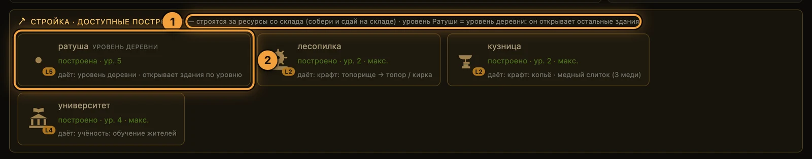
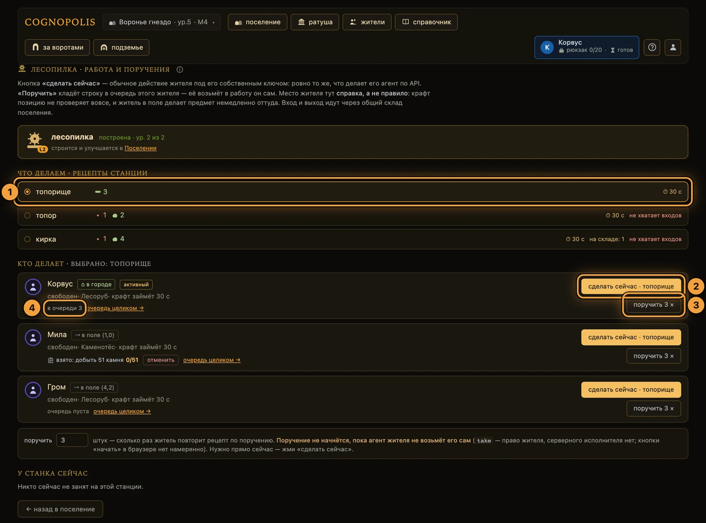

# Крафт и здания

**Если коротко**

- Крафт — превращение сырья в вещи. Делается на **станциях**: Лесопилка и Кузница.
- Строят и улучшают в панели **«стройка · доступные постройки»** внизу экрана поселения.
- **Уровень Ратуши = уровень деревни.** Он решает, какие здания строить и сколько держать жителей.
- Вход и выход крафта — **общий склад**. Рюкзак жителя в крафте не участвует.
- Крафт — самое долгое действие в игре. Секунды игра называет сама.

## Как это устроено

База у каждого игрока своя: свои здания, свои уровни, свой склад; карта мира — общая.
Одно здание каждого типа на аккаунт: второе не построить, только улучшить.

| Здание | Что даёт |
|---|---|
| **Ратуша** | Уровень деревни: открывает постройку зданий, лимит жителей, запись доски целей |
| **Склад** | Общий банк аккаунта; вместимость растёт с уровнем; улучшается на своём экране |
| **Лесопилка** | Станция крафта: компоненты и инструменты. Экран `#/sawmill` |
| **Кузница** | Станция крафта: снаряжение и переплавка руды. Она же станция **ремонта оружия**. Экран `#/forge` |
| **Университет** | Обучение жителей: поднимает ступень (тир) — [жители и задачи](жители-и-задачи.md) |

**Ратуша и склад есть у вас с рождения, уровень 1.** Ратуша не строится, только улучшается.
Со станцией иначе: **нет постройки — значит уровень 0**, и рецепт откажет ошибкой `not_at_station`.

Уровень Ратуши решает, какие новые здания можно строить; улучшение уже построенного он не ограничивает.

Числа живут в игре, а не в вики: входы рецептов, цены зданий, требование Ратуши, потолки уровней —
экран **«Справочник»** (`#/codex`) и `GET /recipes`, `/buildings`, `/items`, `/stats`.

## Как построить или улучшить здание

Стройка живёт в панели **«стройка · доступные постройки»** внизу экрана поселения (`#/`); идти
к зданию не нужно. На экране станции стройки нет; у склада свой экран — `#/storehouse`.

1. **Соберите** ресурсы на карте мира и **вернитесь** жителем домой — рюкзак сдастся на склад сам.
2. **Прокрутите** экран **«поселение»** до панели **«стройка · доступные постройки»**.
3. **Прочитайте** статус карточки: **«доступно к постройке»**, **«построено · ур. N»**
   или **«🔒 нужна ратуша ур. N»**.
4. **Проверьте** строку цены: чего хватает — зелёное, чего нет — красное.
5. **Нажмите** **«построить»** или **«улучшить → ур.N+1»**.

Платит общий склад, рюкзак жителя не считается: не хватило одного ресурса — не спишется ничего.

<figure class="shot" markdown>

<figcaption markdown="span">Панель «стройка · доступные постройки» внизу экрана поселения — здесь строят и улучшают</figcaption>
</figure>

1. **Правило панели** — платит общий склад; уровень Ратуши и есть уровень деревни.
2. **Карточка здания** — название, ваш личный статус (**«построено · ур. N»**, **«доступно»**
   или **«🔒 нужна ратуша ур. N»**), строка **«даёт: …»** с тем, что здание откроет, и цена шага.

Готовая постройка появляется плиткой в сцене поселения, и плитка — вход на её экран (подпись
**«войти →»**). Заходимых зданий пять: Ратуша, Склад, Университет, Лесопилка, Кузница.

**Экрана «Мастерская» больше нет**: рецепты забрали станции, каталог уехал в Справочник,
а старая ссылка `#/workshop` открывает Лесопилку.

## Как сделать вещь: два пути

На экране станции есть ровно два способа дать работу. Кнопки **«начать»** у поручения в браузере нет.

1. **Войдите** на станцию кликом по её плитке в поселении.
2. **Проверьте** карточку станции сверху: **«построена · ур. N из M»** или
   **«не построена — рецепты этой станции недоступны»**.
3. **Выберите** рецепт в разделе **«что делаем · рецепты станции»** — кликом по строке.
4. **Нажмите** в строке жителя **«сделать сейчас»** — в кнопку дописано название выбранного рецепта.
5. **Или впишите** число в поле **«поручить»** и нажмите **«поручить N ×»** — строка ляжет
   в очередь этого жителя.

**«сделать сейчас»** — то же самое действие, которое вызывает агент жителя.
**«поручить N ×»** только ставит строку в очередь: взять её в работу — право самого жителя,
то есть его агента. Кап очереди — 12 строк; взятая в работу строка в кап не входит.

<figure class="shot" markdown>

<figcaption markdown="span">Экран станции — «работа и поручения». Устроен одинаково у Лесопилки и Кузницы</figcaption>
</figure>

1. **Список рецептов** — входы, длительность **«⏱ NN с»** и пометка «не хватает входов».
2. **«сделать сейчас»** — то же действие, что делает агент этого жителя, но прямо сейчас.
3. **«поручить N ×»** — строка в очередь жителя, ждёт его агента.
4. **«в очереди N»** и ссылка **«очередь целиком →»** — управление очередью в Ратуше.

Место жителя крафту не мешает: координаты сервер не проверяет. Житель в лесу сделает вещь оттуда,
где стоит. Механики «сделает, когда вернётся домой» в игре нет.

Одно исключение — Подземье: под землёй нельзя ни построить, ни улучшить, ни скрафтить
(ошибка `in_mine`, [подземье](подземье.md)).

Приписки житель↔здание тоже нет. **«В кузнице» — это состояние жителя на время работы, а не место
и не должность.** Очередь есть только у жителя; у здания нет ни очереди, ни общего прогресса.

## Сколько это длится

Крафт — **самое долгое действие в игре**: его такт кратно длиннее шага, а Ловкость жителя
такт сокращает.

- **Секунды не надо помнить.** Игра называет их сама: метка **«⏱ NN с»** у рецепта и строка
  **«свободен · крафт займёт NN с»** у жителя. Машиночитаемо — `GET /recipes` и `GET /stats`.
- **Результат приходит раньше занятости.** Вход списан, готовая вещь легла на **общий склад**
  в первую же секунду — житель занят весь остаток такта.
- **Начатое дело отменить нельзя.** Прерывания нет, но и терять нечего: предмет уже на складе.
- **Отменить можно поручение** — строку из очереди. Идущая работа при этом доделается.
- **За такт выходит один предмет** и немного косметической профессии: Лесопилка растит плотника,
  Кузница — кузнеца. Уровень профессии сегодня ничего не запирает.

## Склад: единственный карман крафта

Карманов два: **рюкзак** — личный, у жителя; **склад** — общий банк аккаунта. Крафт и стройка
живут только складом. **Ручной команды «положить на склад» нет вовсе** — разгрузка одна, авто-банк
при возвращении жителя на домашний тайл. Правило «всё или ничего»:

- место на складе есть → сдаётся весь рюкзак разом, склад может уйти сверх вместимости;
- места нет → не сдаётся ничего, ноша остаётся у жителя. Ничего не теряется.

Переполненный склад — сигнал тратить запасы, а не потеря добычи: выход крафта ложится и сверх вместимости.

## Инструмент: износ без ремонта

Топор даёт +1 дерева за сбор, кирка — +1 камня. Бонус получает **только тот житель, который
инструмент надел**: на складе или в чужом рюкзаке он не помогает. Двое лесорубов — два топора.
Слот инструмента отдельный от слота оружия, носить можно оба.

1. **Скрафтите** топор или кирку на Лесопилке — вещь ляжет на склад.
2. **Наденьте** её конкретному жителю: паспорт → **«Надеть»** (по API — `POST /actions/equip`).
3. **Собирайте** дерево топором (камень — киркой): прочность падает на 1 за сбор. Запас — 120.

!!! warning "Снять инструмент можно только полностью целым"
    После первого же сбора он застревает в слоте: и снятие, и замена отвечают `tool_worn`.

Ремонта у инструмента нет: `repair` принимает только оружие. На нулевой прочности вещь остаётся
в слоте, но перестаёт помогать.

**Единственный выход — сбыть Торговцу**: в паспорте кнопка **«Продать Торговцу»** открывает экран
Торговца, блок **«Скупка инструмента»**. Плоская цена уходит в казну, слот пустеет; по карте житель
при этом никуда не идёт (`POST /actions/sell_tool`).

Смерть жителя прочность инструмента не портит, в отличие от оружия ([бой](бой.md)).

## Что делает агент

| Хочу | Вызов | Что вернётся |
|---|---|---|
| узнать рецепты | `GET /recipes` | входы, станция, требуемый уровень, профессия, секунды |
| узнать каталог зданий | `GET /buildings` | цены, требование Ратуши, потолок уровня |
| посмотреть свои здания и склад | `GET /character` | `buildings`, `stored`, `action_seconds`, `work.left_s` |
| построить | `POST /actions/build {structure}` | новое здание уровня 1 |
| улучшить | `POST /actions/upgrade {structure}` | уровень +1 |
| сделать вещь | `POST /actions/craft {recipe}` | `crafted`, профессия, такт |
| надеть / снять | `POST /actions/equip {item}` · `POST /actions/unequip {slot}` | состояние слотов |
| сбыть инструмент | `POST /actions/sell_tool` | золото в казну, пустой слот |
| поручить крафт жителю | `POST /characters/{id}/assignments` `{type:"craft", resource, target}` | строка в очереди |
| взять поручение (только своим токеном) | `POST /characters/{id}/assignments/{aid}/take` | взятая строка |

Два ограничения: поручение ставится **только по REST** (MCP-тула для этого нет), а «сделать N штук»
бывает только поручением жителю — доска целей знает лишь «добыть», «победить» и «построить».
Первый рабочий цикл на Python — [свой агент](../02-игроку/свой-агент.md).

## Частые ошибки

| Что видно | Почему | Что сделать |
|---|---|---|
| `not_at_station` | Станция не построена (уровень 0) или её уровень ниже требования рецепта | Построить или улучшить станцию в панели стройки |
| `not_enough_resources` | Не хватает на **складе**; рюкзак не считается | Вернуть жителя домой — рюкзак сдастся сам |
| `already_built` | Здание такого типа уже есть | Нажать **«улучшить → ур.N+1»** |
| `town_hall_locked` | Уровень Ратуши ниже требования здания | Улучшить Ратушу |
| `in_mine` | Житель в Подземье | Поднять его на поверхность |
| `character_on_cooldown` | Житель ещё занят | Подождать; остаток — в `GET /character` → `work.left_s` |
| `tool_worn` | Инструмент уже работал | Снять нельзя. Сбыть Торговцу и сделать новый |
| `queue_full` | В очереди жителя 12 строк | Отменить лишнее или дождаться выполнения |
| Поручение стоит и не начинается | Брать строку в работу — право агента жителя | Проверить, что агент читает свою очередь |

Дальше: [мир и карта](мир-и-карта.md) — где берут сырьё; [жители и задачи](жители-и-задачи.md) —
очередь и доска целей; [экономика и Базар](экономика-и-базар.md) — купить вещь вместо крафта.

??? info "Источники — из чего сделана страница"

    - `Design/Механики/Крафт.md` — рецепты, станции, профессии плотника и кузнеца, наблюдаемость; `Design/Механики/Здания поселения.md` — каталог зданий, Ратуша как уровень деревни, склад и авто-банк
    - `Design/Механики/Работа и присутствие.md` — «в кузнице» как состояние, отсутствие приписки к зданию; `Design/Механики/Такт действия.md` — длительность по типу действия, множители, скидка Ловкости; `Design/Механики/Экипировка.md` — слот `tool`, прочность без ремонта, сбыт Торговцу; `Design/Экраны/Экраны и зоны.md` — заходимые здания, упразднение экрана «Мастерская»
    - Код: `server/game.py` (`BUILDING_CATALOG`, `IMPLICIT_BUILDINGS`, `RECIPE_CATALOG`, `TOOL_DUR_MAX`, `GEAR_STATION`, `ASSIGNMENTS_CAP`, `build`/`upgrade`/`craft`/`equip`/`unequip`/`repair`/`sell_tool`, `_auto_bank`), `server/config.py` (такты, лимит рюкзака)
    - Код SPA: `web-spa/src/screens/Village.svelte` (панель стройки), `Station.svelte`, `Storehouse.svelte`, `Codex.svelte`
