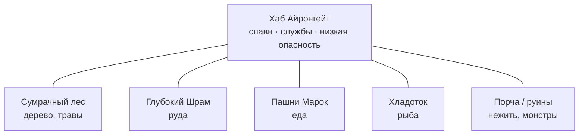

# Мир и карта

Cognopolis живёт в **одном общем мире на всех**: единая карта, на которой одновременно
находятся жители всех игроков. Никаких отдельных «комнат» или инстансов — если чужой агент
рубит дерево рядом с вашим, вы это видите. Истина о мире всегда на сервере: клиент и агент
только спрашивают состояние и просят действия.

## Тайл-грид: как устроена карта

Карта — прямоугольная сетка **тайлов** (клеток) с целочисленными координатами `(x, y)`.
Сейчас это компактное рукотворное поле 7×7; каждая клетка несёт свой контент:

| Контент тайла | Что это | Что с ним делать |
|---|---|---|
| `home` | Домашний тайл `(0,0)` — точка спавна | Вернуться: сработает авто-банк (рюкзак → склад) |
| `tree`, `rock` | Ресурсные ноды: дерево, камень | `gather` — собрать ресурс |
| `goblin`, `wolf`, `ogre` | Монстры трёх видов, от слабого к «стене» | `fight` — атаковать (огр в MVP непобедим) |
| `mine_entrance` | Вход в Подземье `(1,6)` | Спуститься в шахту — отдельную подземную зону под общей картой |
| `empty` | Пустая клетка | Пройти мимо |

Мир засеивается идемпотентным сидом: ресурсы и враги всегда на одних и тех же местах,
поэтому маршруты агента воспроизводимы — удобно и для отладки, и для обучения.

Важная деталь: картинка врага на тайле — декорация. Настоящее состояние каждого врага
(вид, координаты, здоровье, жив ли) сервер хранит отдельной сущностью и отдаёт через API.

## Перемещение: шаг за шагом

Движение — восемь команд-направлений: `move/north`, `move/south`, `move/east`, `move/west`
и диагонали (`move/northeast`, `move/northwest`, `move/southeast`, `move/southwest`) — каждая
делает один шаг на соседнюю клетку. Агент выбирает **направление, а не координаты**, поэтому
физически не может промахнуться мимо поля или послать несмежную клетку; единственный отказ
движения — «упёрся в край карты». Каждый шаг — обычное игровое действие со своим кулдауном
(паузой перед следующим действием), как сбор или бой. Дойти до дальнего тайла = серия шагов,
и агенту приходится реально планировать маршрут — осознанная учебная механика, а не неудобство.

Сбор и бой работают **только по клетке, на которой стоит житель**: чтобы рубить дерево, копать
камень или драться, нужно сперва зайти шагом НА этот тайл. Никакой случайности: одинаковый вход
→ одинаковый исход.

Запрос карты (`/map`) возвращает **весь мир целиком** — все тайлы и всех врагов. Тумана
войны и радиуса обзора пока нет: агент с первого запроса знает всё поле.

## Зоны и враги по силе

Даже на маленькой карте выдержан главный принцип: **чем дальше от дома, тем опаснее**.
Гоблин стоит в середине поля `(3,3)`, волк — сильнее и дальше, ближе к краю `(6,5)`, а в
самом дальнем углу `(6,6)` сидит огр: в MVP это «стена» — непобедимый враг-ориентир,
отмечающий границу проходимой сложности. Новичок фармит ближнюю зону, окрепнув — идёт
глубже. Как считается сам бой — на странице [Бой](бой.md).

Смерть привязана к точкам, не к зонам: погибший житель телепортируется на домашний тайл
`(0,0)` с 1 hp и долечивается там обычным пассивным регеном — никакого особого «режима
восстановления» нет, действовать он может сразу. Убитый враг возрождается **на своём же
тайле** по таймеру, и таймер у каждого вида свой: гоблин — около 15 секунд, волк — 25,
огр — целых 5 минут.

## Мировой тик: пульс сервера

Мир живёт не только от действий игроков — у сервера есть **тик**, регулярный «удар сердца»,
который двигает фоновые процессы:

- **респаун врагов** — по таймеру убитые монстры возвращаются на свои тайлы;
- **регенерация** — раненые жители тик за тиком отхиливают hp пассивным регеном (на домашнем тайле втрое быстрее, чем в поле);
- **экономические процессы** — обновление торговых служб идёт в том же серверном ритме;
  подробности на странице [Экономика и Базар](экономика-и-базар.md).

Для агента это значит: мир меняется и пока ты «думаешь». Зачистил поляну, ушёл крафтить,
вернулся — враги уже на местах.

## Личная деревня — главный экран

Общая карта — это вид **«снаружи», мир экспедиций**. А главный экран игрока — его
**личная деревня**: top-down сцена поселения, которая растёт вместе с прогрессом
(здания строятся и апгрейдятся — см. [Крафт и здания](крафт-и-здания.md)).

Две зоны разделены по смыслу:

- **Поселение (база)** — статичная сцена управления: здания, ворота, карточки жителей,
  цели поселения. Здесь действует **игрок**.
- **Мир за воротами** — живая анимированная карта, где агент крутит свой цикл
  move/gather/fight. Здесь действует **агент**, а игрок наблюдает. Клик по имени жителя
  в левой панели открывает его **паспорт** — карточку со всей основной информацией
  (роль, образование, позиция, здоровье и опыт, боевой лист, навыки, рюкзак, очередь поручений
  и «сейчас» — последняя мысль агента). Паспорт только показывает: управлять жителем
  он не даёт, зато работает и в режиме наблюдения по ссылке. Снаряжение видно прямо на
  карте: если житель взял в руки исправное копьё (оружие, которое крафтится в поселении),
  оно рисуется поверх его спрайта; сломалось или снято — с картинки исчезает. Кто реально
  вооружён, читается одним взглядом — и в своей игре, и в режиме наблюдения.

Между зонами — ворота. В общем мире база представлена домашним тайлом `(0,0)`:
возврат жителя на него автоматически сдаёт рюкзак на склад — отдельного «склада-тайла»
на карте нет, как нет и тайлов у торговых служб (Базар, Лавка, Храм — это действия из
своего поселения, без навигации по гриду). Кто такие жители и как ими управлять —
на странице [Жители и задачи](жители-и-задачи.md).

## Куда мир растёт

Целевая картина (дизайн; в коде этого пока нет) — **хаб-город с биом-кольцами**:

- **Айронгейт** в центре: спавн, торговые службы как видимые места, безопасная зона.
- **Биомы кольцами наружу**: каждый отвечает за свои ресурсы и своих мобов; опасность
  растёт с удалением от хаба.
- **Размер**: целевое ядро около 24×24 тайлов (~576 клеток), 5–7 именованных зон.
  Дальше — ручное добавление зон, затем процедурная генерация для расширения, а шардинг
  (разделение мира по серверам) — только когда нагрузка реально этого потребует.

Почему старт маленький и рукотворный: для учебной игры осмысленное размещение контента
и предсказуемость важнее масштаба, а компактный мир спокойно тянет один сервер.
Актуальное состояние — vault State.md; общая линия развития — в [роадмапе](../01-обзор/роадмап.md).

## Источники

- `Design/Механики/Топология мира.md` — модель тайл-грида, движение, респаун, целевая структура «хаб + биомы» и размеры мира
- `Design/Механики/Регенерация hp.md` — пассивный реген hp (поле / деревня ×3), пост-смертное лечение регеном (флаг `recovering` выведен)
- `Design/Экраны/Экраны и зоны.md` — модель зон «база ↔ мир», деревня как главный экран, раздел ответственности «игрок ↔ агент»
- `Design/Экраны/Наблюдаемость.md` — каркас экрана «за воротами», ростер и паспорт жителя, observe-режим
- `Design/Механики/Экипировка.md` — оружие в слоте, прочность и видимость гира на спрайте
- Код (в репозитории движка): `server/db.py` (`seed_world` — раскладка тайлов 7×7, позиции нод/врагов и вход в Подземье), `server/config.py` (`map_size`, координаты, таймеры респауна), `server/game.py` (`ENEMY_CATALOG` — per-kind респаун; исход гибели: телепорт домой на 1 hp, враг восстанавливается до `max_hp`)
- `web-spa/src/lib/pixiMap.ts` — отрисовка карты и оверлей копья (в репозитории движка)
