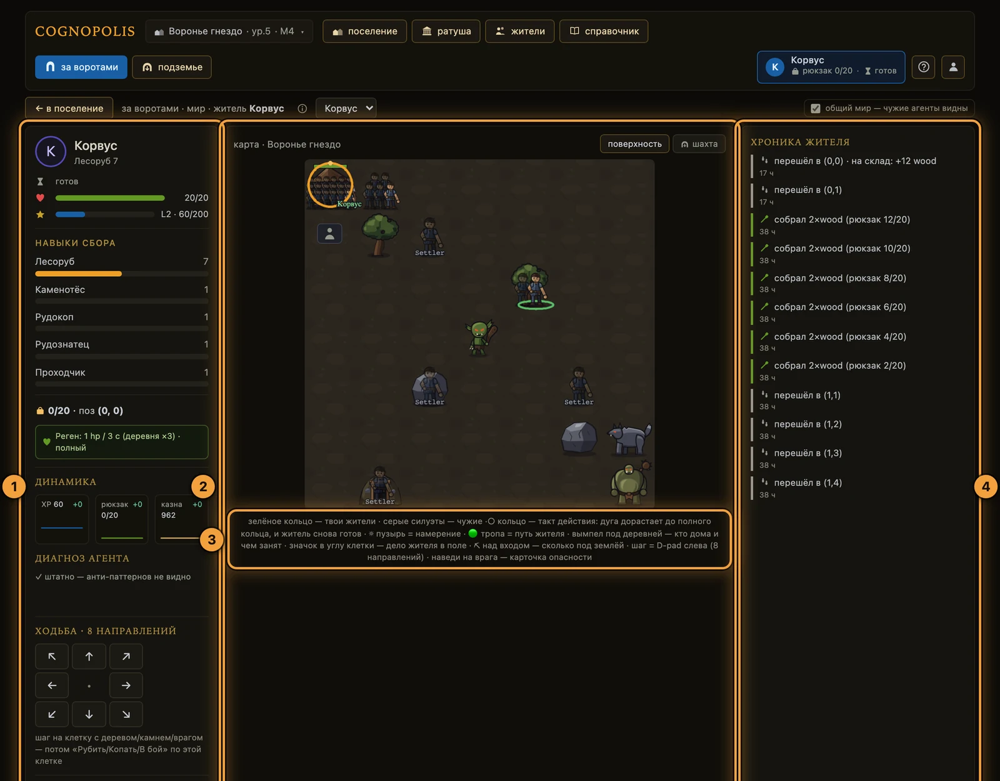
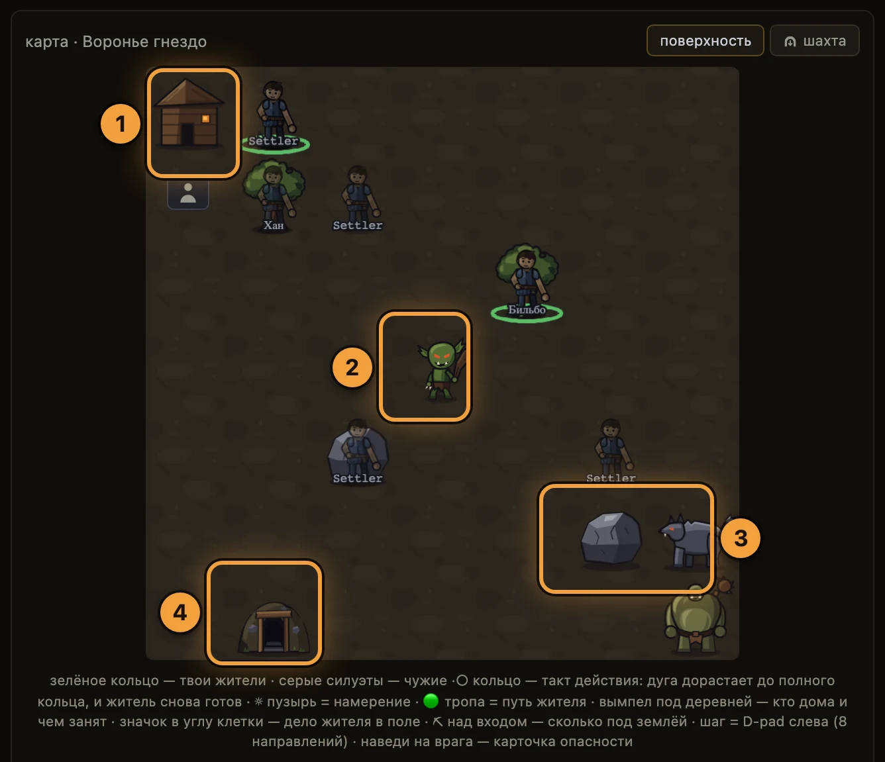
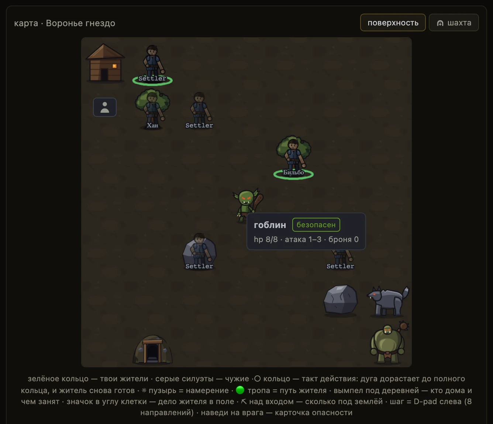

# Мир и карта

**Если коротко**

- Мир **один на всех**: одна карта, на ней стоят жители всех игроков.
- Карта публичная: `GET /map` работает **без токена** и отдаёт поле целиком. Тумана войны нет.
- Житель ходит **направлениями**, а не по координатам: восемь кнопок, один клик = один шаг.
- Собирать и драться можно **только на клетке под ногами**. Сначала шаг, потом действие.
- Дом — клетка возврата: житель встал на неё → рюкзак ушёл на склад сам.

## Как устроена карта

Карта — квадратная сетка клеток с координатами `(x, y)`. Размер поля приходит вместе с картой —
поле `size` в ответе `GET /map`.

- Оси экранные: север — вверх, `x` растёт вправо, `y` растёт вниз.
- У клетки **ровно один** вид содержимого. Двух вещей на клетке не бывает.
- Раскладка фиксированная: ресурсы, враги и вход в шахту всегда на тех же клетках.
- Тумана войны и радиуса обзора нет: с первого запроса агент знает всё поле.
- Ответ карты кэшируется на сервере около 3 секунд, поэтому чужие точки могут отставать.

| Что на клетке | Что с ней делать |
|---|---|
| Дом | Вернуться: рюкзак уходит на склад сам |
| Дерево, камень | Встать на клетку и собрать |
| Гоблин, волк, огр | Встать на клетку и бить. Ступень опасности — в карточке при наведении |
| Вход в Подземье | Встать и спуститься — [Подземье](подземье.md) |
| Пустая клетка | Пройти дальше |

Картинка врага на клетке — только рисунок. Жив ли враг и сколько у него здоровья, говорит
отдельный список `enemies` в ответе карты, поле `alive`. Цифры по видам врагов — на экране
**«справочник»** (`#/codex`) и в `GET /enemies`.

## Кто виден на карте

В ответе `GET /map` есть список `characters` из трёх полей: `x`, `y`, `name`. Это все жители на
поверхности — и ваши, и чужие.

- Про чужого жителя видно **только имя и позицию**. Больше в ответе ничего нет.
- Занятость, профессия и снаряжение чужого не передаются: видно лишь, что кто-то стоит на клетке.
- Ваши жители помечены зелёным кольцом у ног, чужие — блёклым серым силуэтом.
- У своего жителя, занятого делом в поле, в углу его клетки стоит маленький значок занятия.
  У активного жителя его нет — там и так дуга такта, бейдж и пузырь намерения.
- Житель, ушедший в Подземье, с карты пропадает; над входом остаётся чип **«N под землёй»**.

### Когда на клетке несколько жителей

Домашняя клетка — то место, где жители копятся: сюда все возвращаются и отсюда все уходят. Поэтому
на одной клетке они **не сваливаются в один спрайт, а расходятся по местам**: становятся в ряд (при
большой толпе — в два-три ряда) и чуть уменьшаются, чтобы всех было видно. Один житель на клетке
выглядит как обычно, во весь рост.

- **Наведите курсор** — всплывёт имя того, на кого вы навели, а не случайного соседа.
- **Щёлкните** по своему жителю — он станет тем, кем вы управляете (то же, что выбрать его в
  «Жителях»).
- В толпе подписи имён не рисуются — иначе они склеились бы в кашу. Имя даёт наведение, а полный
  список — вымпел у деревни (следующий раздел).

### Вымпел «кто дома»

У деревни висит короткая полоса — **вымпел**. Он отвечает на один вопрос: **кто из ваших жителей
сейчас в городе и чем занят**. Легенда карты называет его так: **«вымпел под деревней — кто дома и
чем занят»** — у верхнего края карты полоса действительно стоит под клеткой, чтобы не уехать за
край. Читается она на любом масштабе и не растёт от числа работников: растёт число в чипе, а не
сама полоса.

- Чип — это **значок занятия и число таких жителей**: три кузнеца дают один чип с **«×3»**, а не
  три иконки. Одного работника пишут просто значком, без **«×1»**.
- **Свободные — отдельный приглушённый чип.** «Дома и свободен» и «дома и занят» — разные факты,
  и одним значком их не рисуют.
- У боя свой чип: бой — состояние, а не ремесло, звания «боец» в игре нет.
- Занятие, которое игра назвать не может, честно показывается нейтральным чипом **«занят»** —
  вместо выдуманной профессии.
- Занятые чипы подсвечены, свободные приглушены: идущая работа не должна спорить за внимание
  с отдыхом.
- Чипов слишком много для ширины карты — лишние сворачиваются в **«+N»**, где N — число жителей,
  а не число чипов.
- **Чужих на вымпеле нет вовсе**: ни их профессий, ни счётчика. Тумблер «общий мир» на вымпел не
  влияет никак.
- Вымпел **у каждой деревни свой** и считает только своих постояльцев. Имя деревни в полосе
  появляется, только если деревень больше одной.
- Над входом в шахту отдельным чипом висит **«N под землёй»** — ушедшие вниз с карты исчезают,
  но их забег привязан к клетке входа.

1. **Щёлкните** по полосе вымпела — раскроется список **поимённо**: те же жители, что сложены
   в чипы, у активного стоит метка **«активный»**.
2. **Щёлкните** по имени в списке — откроется **паспорт** этого жителя. Активного жителя список
   не меняет: для этого щёлкают по фигурке на карте или выбирают в «Жителях».
3. **Закройте** список клавишей **Esc** или кликом вне него.

!!! note "Пустой вымпел значит «сказать нечего»"
    В режиме наблюдения по ссылке `?token=` ростера нет вовсе — виден ровно один житель. Пустая
    полоса там не означает «в городе никого»: про остальных наблюдение просто не говорит, и список
    так и отвечает — **«сказать нечего»**.

<figure class="shot" markdown>

<figcaption markdown="span">Экран **«за воротами»**: карта мира, панель жителя и хроника его шагов</figcaption>
</figure>

1. **Панель жителя** — готовность, здоровье, уровень, навыки сбора, реген, «диагноз агента» и
   кнопки ходьбы.
2. **Карта мира** — общая для всех игроков.
3. **Легенда карты** — что означают кольца, дуги и значки на клетках.
4. **«Хроника жителя»** — что этот житель делал, по шагам.

## Ходьба: как сделать шаг

1. **Нажмите** ворота **«за ворота»** на экране **«поселение»** — или вкладку **«за воротами»** (`#/world`).
2. **Найдите** слева блок **«ходьба · 8 направлений»**: сетка стрелок 3×3, центр — сам житель.
3. **Нажмите** стрелку. Житель делает один шаг на соседнюю клетку, диагонали разрешены.
4. **Дождитесь** конца такта: пока житель занят, кнопки погашены.

Кликом по карте ходить нельзя — карта только показывает. Кликабельны ровно три вещи: свой
неактивный житель (сделать его активным), клетка входа в шахту (открыть панель устья) и полоса
вымпела над деревней (раскрыть поимённый список). Всё остальное на карте клик не ловит.

Единственный отказ движения — упор в край карты, `at_map_edge`. Мимо поля не промахнуться и
несмежную клетку не назвать: агент выбирает направление, а не координаты.

## Сбор и бой: как взять цель

1. **Дойдите** до клетки с деревом, камнем или врагом и **встаньте на неё**.
2. **Наведите** курсор на врага заранее — карточка опасности бесплатна и хода не тратит.
3. **Нажмите** **«Рубить»**, **«Копать»** или **«В бой»**. Кнопка горит, только когда цель под ногами.
4. **Прочитайте** подсказку у погашенной кнопки: «нечего рубить — встань на клетку с деревом».

<figure class="shot" markdown>

<figcaption markdown="span">Карта крупно: ресурсы, враги и вход в шахту занимают отдельные клетки</figcaption>
</figure>

1. **Домашняя клетка** — жители стоят на ней толпой, каждый на своём месте; у активного вокруг
   клетки золотая дуга «идёт такт действия», под ним подписано имя.
2. **Враг** стоит на своей клетке — ударить его можно, только встав на неё.
3. **Камень и волк рядом** — ресурс и враг занимают каждую свою клетку карты.
4. **Вход в Подземье** — единственная клетка, с которой спускаются вниз. На кадре её занял чужой
   житель: клетка одна, а стоять на ней могут многие.

<figure class="shot" markdown>

<figcaption markdown="span">Наведение на врага показывает вид, ступень опасности, здоровье, атаку и броню</figcaption>
</figure>

Ступеней опасности три: **«безопасен»**, **«нужно снаряжение»** и **«стена — не ходи»**.
Как считается сама схватка — на странице [Бой](бой.md).

## Сколько житель занят: такт действия

Длительность зависит от **типа** действия. Шаг короткий, сбор и бой заметно дольше, крафт —
самое долгое дело.

- Действие исполняется сразу, такт взводится **после** него: добыча в рюкзаке с первой секунды.
- Прервать или ускорить начатый такт нельзя. «Занят» значит «до конца такта ничего другого».
- Действие раньше срока → `409 character_on_cooldown`, остаток времени назван в тексте ошибки.
- Секунды по **типам** действий называет сам житель (поле `action_seconds`) и вкладка **«статы»**
  экрана **«справочник»**; Ловкость жителя в них уже учтена.
- **У крафта из этой таблицы брать нельзя.** Там стоит образец типа, а у каждого рецепта своё
  время: его смотрят у рецепта — метка **«⏱ N с»** в Справочнике и на экране станции, в коде
  `GET /recipes` → `seconds`. Пока работа идёт, точное число даёт сам житель
  ([крафт и здания](крафт-и-здания.md)).

### Что житель делает — видно по нему самому

Пока идёт такт, житель на карте не «покачивается вообще», а занят **конкретным делом**: рубит
топором, бьёт киркой, сражается, пилит на лесопилке, кузнечит молотом, строит, читает книгу,
рассчитывается монетой, кланяется в храме или возится со своим снаряжением. Инструмент в руке
подсказывает ремесло, а мусор из-под удара — материал: из-под топора летят щепки, из-под кирки
каменная крошка, из-под молота искры, из-под пилы сыплются опилки.

Важная оговорка: **дольше всего идёт крафт** — на него и смотреть удобнее всего. Стройка, учёба,
торговля, лечение и смена снаряжения занимают около секунды, поэтому их позы вы застанете только
если попадёте ровно в момент.

Отдельно от позы работает **дуга готовности** вокруг активного жителя: она дорастает до полного
кольца ровно тогда, когда житель снова свободен.

## Дом: возврат, склад, смерть

Дом — клетка на карте, куда житель возвращается. Отдельной клетки-склада в мире нет,
у торговых служб клеток тоже нет. Ручной кнопки «сдать на склад» в игре не существует.

- Шаг на домашнюю клетку сдаёт рюкзак на склад автоматически.
- Правило авто-банка — **всё или ничего**: есть свободное место → уходит весь рюкзак разом.
- Склад полон → не уходит ничего, ноша остаётся на жителе. Потерять её так нельзя.
- Погибший житель появляется дома с 1 hp, а несённый рюкзак теряется.
- Пассивное лечение на домашней клетке идёт втрое быстрее, чем в поле.

Где житель находится, движок называет одним словом: `village`, `field` или `mine`. «В кузнице» —
это не место, а занятость: житель может быть в поле и при этом работать на станции.

## Как скрыть чужих агентов

1. **Откройте** экран **«за воротами»** — чекбокс стоит в его шапке справа.
2. **Снимите** галочку **«общий мир — чужие агенты видны»**: блёклые силуэты исчезнут вместе
   с их карточками при наведении.
3. **Верните** галочку, когда чужие снова нужны.

Настройка живёт в браузере и переживает перезагрузку. На сервер она не уходит. Ваши жители,
активный житель и враги от неё не меняются.

## Что делает агент

| Хочу | Вызов | Что вернётся |
|---|---|---|
| осмотреть весь мир | `GET /map` (без токена) | клетки, врагов с `alive` и `hp`, жителей на поверхности |
| всё для одного шага петли | `GET /observe` (с токеном жителя) | жителя, карту, цели, поручение, события |
| шагнуть | `POST /actions/move/<направление>` | новое состояние и остаток такта |
| собрать ресурс | `POST /actions/gather` | что добыто и остаток такта |
| ударить врага | `POST /actions/fight` | исход схватки |
| оценить врага заранее | `POST /actions/fight/preview` | расклад боя, хода не тратит |
| спуститься и вернуться | `POST /actions/mine/descend`, `POST /actions/mine/return` | см. [Подземье](подземье.md) |

Направления: `north`, `south`, `east`, `west` и четыре диагонали — `northeast`, `northwest`,
`southeast`, `southwest`. Шаг на домашнюю клетку дополнительно вернёт `banked` — что реально
ушло на склад.

У любого действия есть необязательное поле `reason` — до 200 символов. Текст всплывает пузырём
над жителем на карте. Первый рабочий цикл на Python — на странице
[Свой агент](../02-игроку/свой-агент.md).

## Частые ошибки

| Что видно | Почему | Что делать |
|---|---|---|
| `at_map_edge` | Шаг за край поля | Выбрать другое направление |
| `no_resource_here` | Житель рядом с ресурсом, а не на нём | Сначала шаг **на** клетку, потом сбор |
| `no_enemy_here` | На клетке нет живого врага | Проверить `alive` в списке `enemies` и подойти на клетку |
| `inventory_full` | Рюкзак полон | Вернуть жителя домой — там он разгрузится сам |
| `character_on_cooldown` | Действие раньше конца такта | Подождать остаток, он назван в тексте ошибки |
| `in_mine` | Житель под землёй | Сначала вернуть его на поверхность |
| `not_at_mine_entrance` | Спуск не с клетки входа | Дойти до клетки входа и повторить |
| `rate_limited` | Запросы идут слишком часто | Разредить петлю агента |
| Чужой житель «замер» | Про чужого приходят только имя и позиция | Смотреть занятость можно только у своих жителей |

## Куда дальше

- [Подземье](подземье.md) — что под картой и как туда спуститься.
- [Бой](бой.md) — как считается схватка и когда в неё не стоит идти.
- [Жители и задачи](жители-и-задачи.md) — кто ходит по карте и как ему поставить дело.
- [Экраны игры](../02-игроку/экраны-игры.md) — тур по остальным экранам.

??? info "Источники — из чего сделана страница"

    - `Design/Механики/Топология мира.md` — сетка клеток, направленное движение, «город = домашний тайл», публичный слой чужих жителей
    - `Design/Механики/Такт действия.md` — множители такта по типам действий, «действие сразу — такт после», контракт наружу
    - `Design/Механики/Работа и присутствие.md` §7 — `location`/`work`, чип «N под землёй», «про чужого только имя и
      позиция», слоты толпы в клетке и маппинг «дело → поза» (D-116)
    - `Design/Механики/Регенерация hp.md` — пассивный реген, домашняя клетка ×3, исход гибели
    - `Design/Экраны/Экраны и зоны.md` — модель «база ↔ мир за воротами», раздел ответственности «игрок ↔ агент»
    - Код: `server/game.py` (`get_map`, `MOVE_STEPS`, `move_dir`, `_on_own_tile`, `_auto_bank`, `ACTION_TACT`, `_location`), `server/db.py` (`seed_world`), `server/config.py` (`map_cache_ttl_s`, `respawn_hp`), `server/errors.py` (коды отказов)
    - Код SPA: `web-spa/src/screens/World.svelte` (тумблер «общий мир», пад ходьбы, кнопки действий, легенда),
      `web-spa/src/components/PixiMap.svelte` (карточки при наведении, хит-тест толпы, клики по карте),
      `web-spa/src/components/MapCrewLayer.svelte` (вымпел «кто дома»: чипы «глиф + ×N», поимённый поповер, счётчик под землёй),
      `web-spa/src/lib/work.ts` (модель «где житель и чем занят» — одна на все экраны), `web-spa/src/lib/villages.ts` (деревни и их постояльцы),
      `web-spa/src/lib/pixiMap.ts` (свои и чужие жители), `web-spa/src/lib/crowd.ts` (кто где стоит внутри клетки),
      `web-spa/src/lib/workPose.ts` (одиннадцать поз работы и инструмент в руке)
