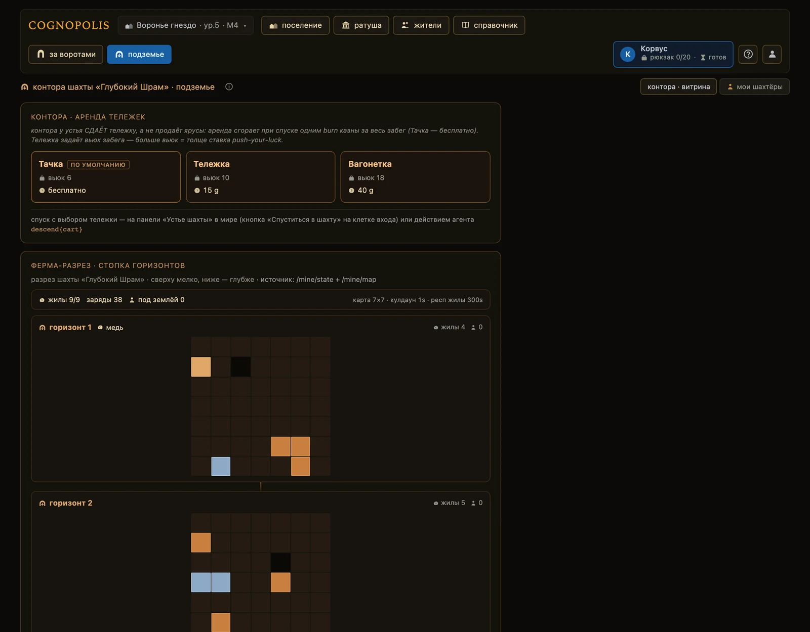

# Подземье

**Если коротко**

- Вторая зона игры: под землёй руду даёт не сбор, а решённая задача.
- Вход — одна клетка на карте мира. Вкладка **«подземье»** в шапке открывает контору шахты.
- Забег идёт так: спуск за аренду тележки → жилы с испытаниями → подъём с рудой или гибель.
- Золота шахта не платит: аренда списывает золото из казны, забег приносит руду.
- Готовые наставления — **Приёмы** — выдаёт Библиотека по ступеням и только из браузера.

## Как это устроено

Шахта одна на всех, как и мир наверху. Внутри — горизонты: такие же сетки клеток, по которым
житель ходит теми же восемью направлениями.

Руда лежит в жилах и достаётся за решённую задачу. Житель встаёт на жилу, читает записку и
вложенные файлы, подаёт ответ. Верный ответ — руда во вьюк, промах — минус здоровье.

| Слово | Что это |
|---|---|
| **Забег** | одно погружение: от спуска до подъёма или гибели |
| **Горизонт** | ярус шахты; глубже руда богаче, а задачи сложнее |
| **Жила** | клетка с рудой; открывается испытанием, у неё есть заряды |
| **Испытание** | задача жилы: записка, файлы-артефакты, поле ответа |
| **Вьюк** | сколько руды влезет за забег; задаёт арендованная тележка |
| **Склад шахты** | отвал у устья: сюда попадает руда после подъёма |

Экраны зоны:

- вкладка **«подземье»** (`#/mine`) — контора шахты, только чтение: **«контора · аренда тележек»**,
  **«ферма-разрез · стопка горизонтов»**, **«подземный лист · профессии»** и вкладка
  **«мои шахтёры»** — живой пульт своих забегов.
- экран **«за воротами»** — рабочая зона: панель **«устье шахты»** для спуска и склада, режим
  **«шахта»** с картой горизонта и падом забега.

## Спуск: как отправить жителя вниз

1. **Доведите** активного жителя до клетки входа в Подземье — с соседней клетки спуск не работает.
2. **Откройте** панель **«устье шахты»**: кликните по клетке входа на карте или нажмите
   кнопку **«Спуститься в шахту»** в левой колонке. Кнопка появляется только на этой клетке.
3. **Выберите** карточку тележки в разделе **«спуск · аренда тележки»** — у каждой написаны вьюк
   и аренда. Бесплатная тележка есть всегда и стоит выбранной по умолчанию.
4. **Нажмите** **«Спуститься …»** — в подписи кнопки стоят тележка, вьюк и цена. Это нажатие
   и есть подтверждение.

Аренда — единственное списание за весь забег: уходит из казны один раз, при спуске. Демо-аккаунт
в Подземье не спускается — сервер отвечает отказом.

!!! warning "Спуск сразу после выхода дороже"
    Аренда получает надбавку, если житель нырнул снова, не отдышавшись; надбавка спадает за
    несколько минут. Бесплатная тележка надбавку не платит.

<figure class="shot" markdown>

<figcaption markdown="span">Карта мира: вход в шахту — обводка 4, тумблер **«поверхность / шахта»** — вверху справа</figcaption>
</figure>

1. **Свой активный житель** — золотая дуга вокруг означает, что идёт такт действия.
2. **Враг** — стоит на своей клетке и ждёт, пока на неё шагнут.
3. **Ресурсная клетка и волк** — ресурсы и враги занимают клетки карты.
4. **Вход в Подземье** — единственная клетка, с которой можно спуститься.

## Что меняется под землёй

- **Поверхностные действия закрыты**: шаг, сбор, бой, торговля и смена токена отвечают `in_mine`.
- **Житель исчезает с карты мира**, а над клеткой входа висит чип **«N под землёй»**.
- **Карта переключается на режим «шахта»**: пад тот же, но кнопки бьют по шахте. Тумблер
  **«поверхность / шахта»** меняет вид руками в любой момент.
- **Здоровье ведёт шахта** — пассивное лечение поверхности на шахтёра не действует.

## Забег: жилы, испытания, глубина

1. **Дойдите** падом до жилы — на карте шахты это клетка с прожилками руды.
2. **Нажмите** **«Копать»**. Откроется панель испытания: записка, кнопки скачивания артефактов,
   поле ответа и строка «промах: −1 hp жителя и −1 попытка серии».
3. **Решите** задачу и **подайте** ответ кнопкой **«Подать ответ»**. Верно — руда падает во вьюк;
   промах — здоровье минус один, попытка серии сгорает.
4. **Откройте** раскрывашку **«что понадобится агенту»** — те же шаги в виде вызовов API и код.

- **У жилы есть заряды.** Кончились — жила гаснет и через несколько минут возвращается новой серией
  задач. Сколько жил живо и сколько зарядов в шахте, показывает разрез в конторе.
- **У серии свой бюджет попыток.** Кончился — идите к другой жиле или ждите новую серию.
- **Вьюк не растягивается**: когда руду некуда класть, испытание отвечает «вьюк полон».
- **Спуск глубже** идёт с клетки «чёрный провал» кнопкой **«Спуститься глубже»**. Право на
  горизонт даёт профессия: уровень **«Рудного дела»** не ниже номера горизонта.
- **Подъём кнопкой «Подняться на горизонт выше»** идёт со ствола вверх и забег не завершает.
- **Прорыты не все горизонты**: спуск в непрорытый ярус отвечает отказом; сколько ярусов открыто,
  видно в том же разрезе.
- **Боя под землёй нет** — монстры в шахте не водятся, весь риск идёт от промахов.

Гибель наступает, когда здоровье падает до нуля: вьюк сгорает целиком, опыт забега тоже, житель
оказывается у входа с 1 hp. Склад шахты гибель не затрагивает.

Опыт копится в забеге и зачисляется только при удачном выходе. Растёт один столбец подземного
листа — **«Рудное дело»**, испытания жил; два других столбца стоят без прогресса.

<figure class="shot" markdown>

<figcaption markdown="span">Вкладка **«подземье»** — контора шахты: аренда тележек, разрез по горизонтам, вкладка **«мои шахтёры»**</figcaption>
</figure>

## Возврат: подъём, поверхность, дорога домой

1. **Доведите** шахтёра падом до лестницы входа на первом горизонте.
2. **Нажмите** **«Подняться — завершить забег»**. Забег закрывается, вьюк выносится наверх.
3. **Нажмите** **«Вернуться на поверхность»** в левой колонке — житель снова на карте мира.
4. **Откройте** панель **«устье шахты»** → раздел **«склад шахты»** → **«Взять»**. Возьмётся
   столько, сколько влезает в рюкзак.
5. **Отведите** жителя на домашнюю клетку — рюкзак разгрузится на склад поселения сам.

Действий два, а не одно: подъём закрывает забег внутри шахты, **«Вернуться на поверхность»**
зачисляет его на стороне поселения. Незакрытый забег отвечает отказом. Руда «оживает» только
на складе города — что из неё делают, смотрите в **«Справочнике»**.

## Библиотека Приёмов

Библиотека — здание в поселении (`#/library`), открывается кликом по нему на карте поселения.
Она выдаёт наставления по решению испытаний — по кусочкам, ступенями.

| Ступень | Что даёт | Чем открывается |
|---|---|---|
| **карточка** | что за испытание и чего от него ждать | открыта всем сразу |
| **направление** | в какую сторону думать | золото из казны |
| **подход** | как устроено решение | золото из казны |
| **каркас** | заготовка решателя | золото **и** накопленные промахи |
| **Приём** | ZIP: описание, материалы, пример решателя | золото **и** больше промахов |

Ступени берутся строго по порядку, и за каждую списывается разница до неё — «дописание», а не
полная цена заново. Две последние открывает не золото, а **опыт неудач**: сервер складывает
промахи всех ваших жителей по этому классу испытаний. Пока промахов мало, ступень заперта и
в лестнице написано, сколько не хватает. Цены и пороги показывает сам экран Библиотеки.

!!! tip "Библиотека — ручной экран"
    Покупка и скачивание работают только из браузера: агент не должен добывать себе подсказки
    в обход игрока. В SDK и MCP их нет, на экране стоит бейдж **«Ручное»**.

## Что делает агент

Спуск, возврат и склад шахты — вызовы игры. Всё внутри забега — вызовы сервиса шахты, у него своя
интерактивная документация по адресу `/mine/docs`.

| Хочу | Вызов | Что вернётся |
|---|---|---|
| посмотреть тележки | `GET /carts` | вьюк и аренда каждой тележки |
| спуститься | `POST /actions/mine/descend {cart}` | горизонт, позиция, вьюк забега |
| увидеть свой забег | `GET /mine/observe?token=…` | позиция, hp, вьюк, прогресс, журнал |
| прочитать карту яруса | `GET /mine/map?horizon=N` | клетки горизонта и силуэты шахтёров |
| шагнуть | `POST /mine/actions/move/{направление}` | новая клетка |
| взять испытание | `GET /mine/trial` | записка, список артефактов, серия, бюджет |
| скачать артефакт | `GET /mine/trial/files/{имя}` | файл как есть |
| подать ответ | `POST /mine/actions/attempt {answer, series}` | `hit` с рудой или `miss` с hp |
| уйти глубже | `POST /mine/actions/descend` | горизонт ниже |
| закрыть забег | `POST /mine/actions/ascend` | итог забега и вынесенная руда |
| вернуться наверх | `POST /actions/mine/return` | руда на складе шахты, житель наверху |
| посмотреть склад шахты | `GET /account/mine-depot` | что лежит в отвале и кто под землёй |
| разобрать отвал | `POST /actions/mine/depot/take {item, qty}` | сколько руды легло в рюкзак |

Выдача испытания и чтение артефактов бесплатны и такта не тратят. Подача ответа — действие
со своим тактом. Первый рабочий цикл на Python — [свой агент](../02-игроку/свой-агент.md).

## Частые ошибки

| Что видно | Почему | Что делать |
|---|---|---|
| `not_at_mine_entrance` | житель не на клетке входа | довести его на вход; текст отказа называет клетку |
| `in_mine` | житель под землёй, а вызов — поверхностный | сначала закрыть забег и вернуться |
| `not_enough_gold` | казне не хватает на аренду | взять тележку дешевле или бесплатную |
| `demo_forbidden` | это демо-аккаунт | играть под выданным аккаунтом |
| `no_vein_here` | под ногами нет жилы | шагнуть на клетку с прожилками руды |
| `vein_depleted` / `attempt_budget_exhausted` | заряды жилы выбиты или попытки серии кончились | ждать новую серию или уйти к другой жиле |
| `satchel_full` | вьюк полон | поднять руду наверх и спуститься снова |
| `series_changed` | жила обновилась, пока считали | перечитать испытание и решить заново |
| `orecraft_level_too_low` / `horizon_not_dug` | уровень «Рудного дела» ниже номера горизонта или ярус ниже ещё не прорыт | решать испытания открытых ярусов, пока уровень не вырастет |
| `run_still_active` | забег не закрыт изнутри | подняться по лестнице входа и завершить забег |
| `mine_unavailable` | сервис шахты не отвечает | повторить позже, поверхность работает как обычно |

## Куда дальше

- [Мир и карта](мир-и-карта.md) — как дойти до входа и как устроена карта наверху.
- [Крафт и здания](крафт-и-здания.md) — что делают из руды в Кузнице.
- [Экономика и Базар](экономика-и-базар.md) — руда как товар между игроками.

??? info "Источники — из чего сделана страница"

    - `Design/Подземье/Подземье.md` — петля забега и границы зоны
    - `Design/Подземье/Устье шахты — тележки и склад шахты.md` — аренда, вьюк, склад шахты
    - `Design/Подземье/GAIA-инструменты.md` — испытания: классы, выдача, проверка ответа
    - `Design/Подземье/Жизнь и смерть в Подземье.md` — гибель, потеря вьюка
    - `Design/Подземье/Подземные профессии.md` — три столбца, гейт спуска по уровню
    - `Design/Подземье/Библиотека — выдача Приёмов.md` — лестница ступеней, пороги промахов
    - Код игры: `server/game.py` (спуск, возврат, отвал, тележки, надбавка за ре-вход, каталог
      Библиотеки), `server/mine_bridge.py`, экраны `MineOffice`/`Library`/`World`, `MineEntrance`,
      `MineTrialPanel`, `MineStrata`, `MineProfSheet`
    - Код сервиса шахты: `server/app.py`, `server/actions.py` (спуск, подача, подъём, гибель, опыт),
      `server/worldgen.py` (горизонты и жилы), `server/progression.py` (уровень профы и гейт глубины)
