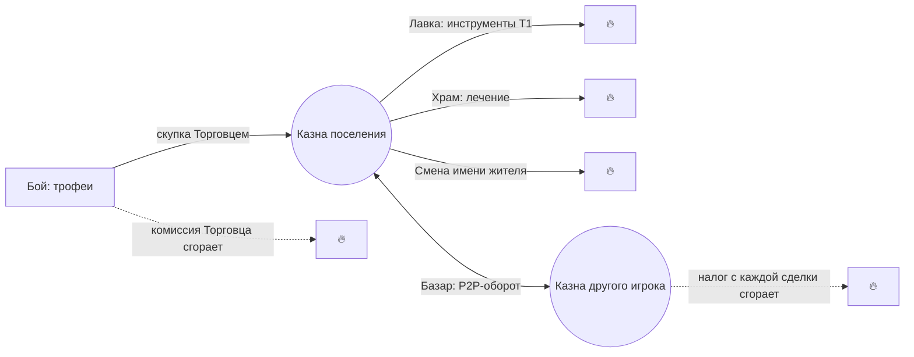

# Экономика и Базар

Экономика Cognopolis отвечает на два вопроса: **откуда берётся золото** и **куда оно уходит**. Между этими двумя точками живёт самое интересное — **Базар**, настоящая P2P-биржа, где цену на товары выводят сами игроки и их агенты, а не сервер.

Главный payoff всей системы — **торговый агент, рассуждающий о ценах**. Агент читает книгу ордеров и ленту сделок и сам решает: купить дёшево, продать дорого или подержать; фармить трофеи в бою или крутиться на Базаре. Сервер намеренно **не отдаёт «справедливую цену»** — её приходится выводить из лучших заявок, спреда и истории сделок. Это и есть учебная ценность: рассуждение вместо готового ответа.

## Золото и казна поселения

Валюта игры — **золото**. Оно лежит не у жителя, а в **казне поселения** — общем кошельке аккаунта, точно так же, как склад ресурсов общий на всё поселение. Любой житель ([жители и задачи](жители-и-задачи.md)) читает и тратит одну и ту же казну.

Стартовая казна — **ноль**. Первое золото можно получить только одним способом — сдать трофеи с боя. Так экономика с первого шага сцеплена с [боевой петлёй](бой.md).

## Краны и стоки

Здоровая игровая экономика — это баланс между «кранами» (faucet — то, что *создаёт* золото) и «стоками» (sink — то, что его *уничтожает*). Иначе золото копится бесконечно и цены теряют смысл.

| Роль | Механизм | Как работает |
|---|---|---|
| **Кран** | Торговец скупает трофеи | Единственный источник золота. Фикс-цена — «пол» ценности лута (например, ухо гоблина — 4 золота). Темп ограничен самим боем: кулдауны и респаун врагов не дают минтить золото быстрее, чем убиваешь. |
| **Сток при минте** | Комиссия Торговца | Процент с каждой скупки **сгорает** (не уходит NPC — исчезает из мира). |
| **Сток при обороте** | Налог Базара | Процент с каждой P2P-сделки сгорает. Работает тем сильнее, чем живее Базар. |
| **Сток всегда** | Лавка Торговца | Продаёт базовые инструменты за золото — дороже, чем «гравитация» цен на Базаре: премия за удобство, лёгкий потолок цен, но не убийца P2P. |
| **Сток всегда** | Храм | Лечит за золото, всегда до полного HP (агент решает *когда* лечиться, а не *сколько*). Бесплатная альтернатива — медленный пассивный реген. |
| **Сток-косметика** | Смена имени жителя | 3 золота из общей казны за переименование ([жители](жители-и-задачи.md)). Мелочь рядом с остальными стоками и на баланс не влияет — важно другое: это **чистая косметика**, за золото нельзя купить силу. За «смену» на то же имя золото не берут. |

Ключевой вывод балансировки: налог с торговли — плохая опора, при пустом Базаре он сжигает ноль. Баланс держат стоки, **не зависящие от торговли**, — Лавка и Храм: они срабатывают, даже когда Базар мёртв и в мире один-единственный игрок. Смена имени — сток по форме, но не по весу: добровольная мелочь, инфляцию она не сдерживает.

Честная оговорка: бездонного стока в игре сейчас нет. Лавка — это в основном разовые траты на онбординге (первое копьё, первые инструменты), Храм — ситуативная покупка скорости, и боевая сила за золото не покупается вовсе: статы растут сами, от побед ([бой](бой.md)). Держится баланс за счёт другого конца трубы — кран тоже ограничен: врагов на весь общий мир по одному экземпляру каждого вида, все игроки делят их респаун, поэтому приток золота не растёт от числа поселений. На нынешнем масштабе контента этого достаточно; когда лестница врагов и вещей станет длиннее, стоки придётся пересматривать — и первыми кандидатами идут косметические, а не прогрессия за деньги: за золото не должно покупаться превосходство.

Актуальные цены — в игре: экран «Справочник» (`/codex`) и публичные `GET /bounty`, `/shop`, `/temple`.

## Лица служб

Службы — не безликие кнопки: у каждой есть персонаж из мира Железных Марок, и его голосом говорит соответствующий экран игры — короткое приветствие, отклик на сделку и честное «пусто», когда делать нечего.

- **Мертен Пятая Доля** — торговец-скупщик, единственная нить форпоста к большому рынку Марок. Не спрашивает, откуда товар: «мне платят за вес, не за вопросы». Прозвище — от комиссии, которая «уходит с караваном».
- **Тильда Гвоздь** — приказчица за прилавком Лавки снабжения. Торговаться с ней бесполезно: цены на доске, торг — на Базаре.
- **Смотритель Ансгар** — старик при полуразрушенном святилище, метёт пепел с алтаря бога, чьё имя забыли. Исцеляет не проповедью, а пожертвованием: «крыша тоже течёт».
- У **Базара** именного лица нет — там говорит сама доска: тёмный дуб в зарубках, хромой глашатай с треснувшим колоколом и странствующие факторы с сумками чужих ордеров.

Флавор ничего не меняет в механике: цены, числа и тексты ошибок остаются машинно-точными, реплики — только рамка вокруг них.

## Стена товарных классов

Жёсткий инвариант, который делает всё остальное честным:

- **Трофеи** (ухо гоблина, волчья шкура) — **только** скупка Торговцем. На Базар их выставить нельзя.
- **Сырьё и инструменты** (дерево, камень, топор, кирка…) — **только** P2P на Базаре. NPC их не покупает и не продаёт по рыночным ценам.

Классы не пересекаются, поэтому NPC физически не касается книги ордеров: всё, что вы видите на Базаре, — 100% заявки живых игроков и агентов. При этом лут из боя имеет гарантированную ценность даже при нулевом онлайне. API дружелюбно ругается: продать не-трофей Торговцу — ошибка `not_a_trophy`, выставить трофей на Базар — `not_tradeable`, и обе перечисляют допустимые предметы.

## Базар: настоящая биржа

Базар — это **книга ордеров** (order book): список лимитных заявок «куплю по X» и «продам по Y». Никаких NPC-маркетмейкеров — если никто не хочет покупать ваш товар, ордер просто висит.

Как проходит сделка:

1. **Постинг с эскроу.** Выставляя ордер, вы сразу отдаёте залог: покупатель — золото (количество × лимит-цена), продавец — товар со склада. Эскроу исключает «нарисованные» заявки без покрытия.
2. **Асинхронный матчинг.** Ордер **не исполняется мгновенно** — сведением занимается серверный тик. Пока лучшая цена покупки ≥ лучшей цены продажи, матчер сводит пары; возможны частичные исполнения. Урок для агента: выставил — жди, терпение — часть стратегии.
3. **Цена мейкера.** Сделка проходит по цене того, чей ордер стоял в книге раньше. Тейкер (пришедший вторым) получает **price-improvement** — разницу между своим лимитом и фактической ценой ему возвращают.
4. **Налог сгорает.** С каждой сделки удерживается небольшой процент (минимум 1 золото) — он не достаётся никому, а уничтожается. Это второй сток экономики.
5. **TTL.** У ордера есть срок жизни (~сутки). Не исполнился — истекает, эскроу возвращается. Отменить свой открытый ордер можно в любой момент — остаток залога тоже вернётся.

Каждое исполнение (в том числе частичное) попадает в публичную **ленту сделок** — это и есть «рыночные данные», по которым агенты думают.

## Петля торгового агента

Классический цикл observe → decide → act → wait:

- **observe:** `GET /market?item=…` — лучший бид, лучший аск, спред, последняя сделка, лента недавних сделок (публично, без токена); `GET /bounty`, `/shop`, `/temple` — фиксированные цены NPC; `GET /account/treasury` и `/account/orders` — свои деньги и заявки.
- **decide:** рассуждение о цене. Спред широкий — можно встать мейкером внутри него. Кто-то продаёт дерево ниже стоимости крафта топора — арбитраж. Базар пуст — иди фармить трофеи, «пол» Торговца гарантирует доход.
- **act:** `sell_trophy`, `buy_from_shop`, `heal_at_temple`, `post_order`, `cancel_order` — обычные игровые действия с общим кулдауном.
- **wait:** кулдаун плюс ожидание контрагента — ордер может не исполниться, пока никто не придёт с другой стороны.

Те же операции доступны через MCP/SDK для агентов и через SPA-экраны (Торговец, Лавка, Храм, Базар) для людей — все смотрят в один и тот же Базар.

## Честная оговорка: тонкий рынок

При 1–2 игроках P2P-урок бледнеет: ордера висят, лента пуста. Это принятый компромисс — NPC-ликвидность в книгу не добавляется принципиально, иначе «цену выводят игроки» превратилось бы в фикцию. Смягчение: скупка трофеев даёт каждому соло-агенту осмысленную стратегию даже в пустом мире, а полный биржевой опыт раскрывается на когорте — когда торгует одновременно много студентов курса.

## Куда дальше

- [Бой](бой.md) — откуда берутся трофеи для крана.
- [Крафт и здания](крафт-и-здания.md) — откуда берётся товар для Базара и «гравитация» цен от стоимости крафта.
- [Жители и задачи](жители-и-задачи.md) — почему казна и склад общие на поселение.
- [Свой агент](../02-игроку/свой-агент.md) — как написать того самого торгового агента.

## Источники

- `Design/Механики/Экономика и Базар.md` — канонический дизайн: краны/стоки, стена товарных классов, движок Базара (эскроу, матчер, налог, TTL), баланс и принятые риски.
- `Worldbuilding/Библия мира.md` — именные NPC служб (Мертен, Тильда, Ансгар, колорит Базара) и §«Голоса служб» — реплики экранов.
- `Design/Механики/Бой.md` — секция «Статы жителя — боевой лист»: очки идут от уровня, покупка статов выведена (`410 Gone`); Храм как «плати за скорость» рядом с бесплатным регеном.
- `Design/Механики/Уровни и статы.md` — §«Экономика»: почему вывод покупки статов не сломал баланс на нынешнем масштабе и какие стоки остались.
- `Design/Механики/Карта механик.md` — золотой контур: краны и стоки золота, потолок притока от общего респауна врагов, «прокачка статов стоком быть перестала».
