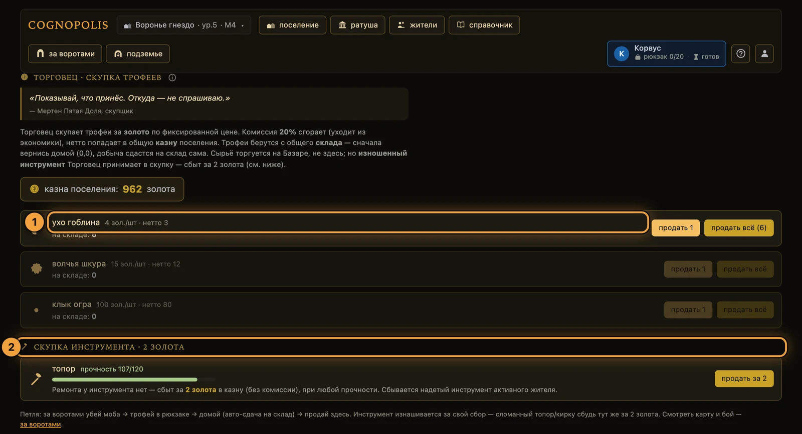
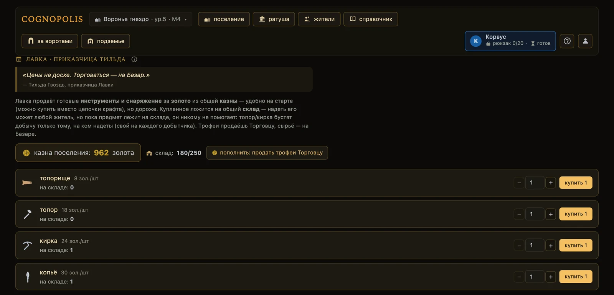
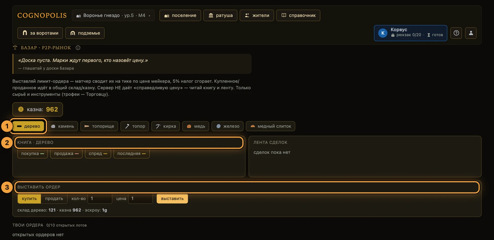
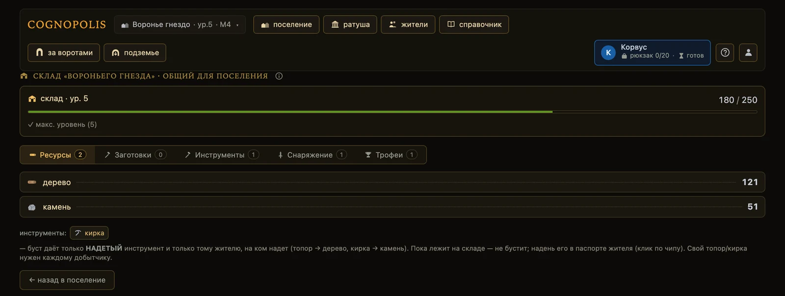

# Экономика и Базар

**Если коротко**

- Валюта одна — **золото**. Казна и склад общие на всё поселение, рюкзак и слоты — личные у жителя.
- Золото приходит от **Торговца** (скупка трофеев и сбыт инструмента) и от продаж на **Базаре**.
- Уходит в **Лавку**, **Храм**, Библиотеку, аренду тележки, смену имени жителя и в залог заявки.
- **Базар** — лимитные заявки между игроками. Сервер не подсказывает «правильную» цену.
- Все экраны экономики открываются кликом по зданию на экране **«поселение»** (`#/`) — вкладок у них нет.

## Как это устроено

Стартовая казна — ноль. Первое золото вы берёте у Торговца: приносите трофеи с боя и сдаёте.

- **Общее на поселение:** казна и склад — их тратит любой житель.
- **Личное у жителя:** рюкзак, слот оружия, слот инструмента.
- **Клетка для торговли не важна:** торгуйте с любой точки поверхности, из шахты — нельзя.
- **Такт торговли базовый** — короче, чем у сбора, боя и крафта. Секунды — вкладка **«статы»** в Справочнике (`#/codex`).

## Откуда золото приходит

| Источник | Что происходит |
|---|---|
| Скупка трофеев Торговцем | В казну падает **нетто**: цена минус комиссия. Комиссия сгорает, NPC её не забирает |
| Сбыт надетого инструмента Торговцу | Плоская цена целиком в казну, **комиссии нет** |
| Продажа на Базаре | Продавцу приходит сумма сделки минус налог |
| Возврат разницы цены на Базаре | Покупателю вернут разницу, если сделка прошла дешевле его лимита |

## Куда золото уходит

| Сток | Что происходит |
|---|---|
| Лавка (`#/shop`) | Покупка инструмента или снаряжения на общий склад |
| Храм (`#/temple`) | Лечение до полного здоровья, цена зависит от нехватки hp |
| Заявка на покупку на Базаре | Залог списывается сразу; при отмене или истечении возвращается |
| Смена имени жителя | Косметика, цена — в `GET /config`, поле `rename_cost_gold` |
| Библиотека (`#/library`) | Покупка ступени Приёма — наставления для работы в Подземье |
| Аренда тележки при спуске в Подземье | Списывается при спуске, за частые повторные входы берут надбавку |

Что из этого следует:

- Новое золото в мир приносит только Торговец. Базар золото не создаёт, а перекладывает между игроками и сжигает налог с каждой сделки.
- Залог заявки золото не уничтожает, а блокирует — до сделки, отмены или истечения.
- Силу за золото не купить: статы растут с уровнем, а уровень — от побед в [бою](бой.md).
- Цены видны прямо на экранах Торговца, Лавки и Храма; в API — `GET /bounty`, `/shop`, `/temple`.

## Торговец: как продать трофеи

Порядок обязателен — трофеи списываются **со склада**, а не из рюкзака.

1. **Убейте** врага за воротами — трофей упадёт в рюкзак жителя.
2. **Приведите** жителя на домашнюю клетку — рюкзак сам уйдёт на склад.
3. **Откройте** сцену поселения (`#/`) и нажмите плитку **«Торговец»**.
4. **Проверьте** в строке трофея поле **«на складе»**.
5. **Нажмите** **«продать 1»** или **«продать всё»**.

<figure class="shot" markdown>

<figcaption markdown="span">Экран **«Торговец · скупка трофеев»** — единственное место, где трофеи становятся золотом</figcaption>
</figure>

1. **Строка трофея** — цена за штуку, нетто после комиссии, кнопки **«продать 1»** и **«продать всё»**.
2. **«Скупка инструмента»** — сбыт надетого инструмента по плоской цене, без комиссии.

Поштучная продажа комиссию не обходит: её считают на всю сделку разом.

Блок **«Скупка инструмента»** виден, только когда у **активного** жителя надет топор или кирка.
Прочность не важна — берут и сломанный. Ремонта у инструмента нет, снять изношенный нельзя,
поэтому сбыт — единственный способ освободить слот.

## Лавка: как купить инструмент

1. **Откройте** сцену поселения (`#/`) и нажмите плитку **«Лавка»**.
2. **Наберите** количество кнопками **−** и **+**, затем нажмите **«купить N»**. Покупка упирается
   и в казну, и в свободное место склада.
3. **Наденьте** покупку на жителя: паспорт → вкладка **«Снаряжение»**. Лежащий на складе инструмент не помогает никому.

<figure class="shot" markdown>

<figcaption markdown="span">Экран **«Лавка · Приказчица Тильда»** — цены стоят прямо в строках товара</figcaption>
</figure>

## Что где торгуется

| Класс товара | Где торгуется | Отказ, если перепутать |
|---|---|---|
| Трофеи | Только скупка Торговцем | `not_tradeable` при попытке выставить на Базар |
| Сырьё, компоненты, снаряжение | Только Базар, между игроками | `not_a_trophy` у Торговца |
| Инструменты | Лавка продаёт, Торговец скупает надетый, Базар торгует | — |

В книге заявок нет ни одной заявки NPC — маркетмейкера в игре нет. На экране Базара выбор ограничен
сырьём, инструментами и компонентами: снаряжение движок торговать разрешает, но только через API.

## Базар: как выставить заявку

1. **Откройте** сцену поселения (`#/`) и нажмите плитку **«Базар»**.
2. **Выберите** товар чипом и прочитайте панель **«книга»**: покупка, продажа, спред, последняя.
3. **Переключите** в форме **«выставить ордер»** тумблер **«купить»** или **«продать»**.
4. **Заполните** **«кол-во»** и **«цена»**, сверьтесь со строкой **«эскроу»** — это то, что заблокируется.
5. **Нажмите** **«выставить»**.

<figure class="shot" markdown>

<figcaption markdown="span">Экран **«Базар · P2P-рынок»** — цену тут выводят игроки, а не сервер</figcaption>
</figure>

1. **Выбор товара** — у каждого товара своя книга заявок.
2. **«книга»** и **«лента сделок»** — лучшая покупка, лучшая продажа, спред и последняя цена.
3. **Форма «выставить ордер»** — купить или продать, количество и цена за штуку.

Правила, в которые вы упираетесь сразу:

- Залог списывается **сразу**: покупка — золото из казны, продажа — товар со склада.
- Жёсткие лимиты: **10 единиц** в лоте, **10 открытых лотов** на поселение (покупки и продажи вместе), потолок цены за единицу — **100 000**, срок жизни заявки — около **24 часов**.
- Мгновенного исполнения нет: книгу сводит серверный такт, примерно раз в **5 секунд**. Частичные исполнения нормальны — каждое идёт отдельной строкой в ленте сделок.
- Сделка идёт по цене того, чья заявка встала раньше; второму возвращают разницу.
- Налог — **5 %** суммы сделки, минимум 1 золото. Платит продавец, налог сгорает.
- Отменить можно только свою открытую заявку; остаток залога вернётся.
- Покупка на Базаре вместимость склада **не проверяет** — товар зачислится сверх потолка. Покупка в Лавке проверяет и отдаёт `storehouse_full`.

!!! warning "Об исполнении игра не уведомляет"
    В Хронику сделка не пишется. Вы узнаёте о ней только по `GET /account/orders` и по изменившимся
    складу и казне.

## Склад и авто-банк

Ручного «положить» и «забрать» в игре нет вовсе: разгрузка автоматическая.

- Житель заходит на домашнюю клетку — рюкзак уходит на склад сам.
- Правило **«всё или ничего»**: есть хоть одно свободное место — уйдёт весь рюкзак, даже сверх потолка; мест нет вовсе — не уйдёт ничего. Вещи не теряются никогда.
- Переполненный склад — не ошибка, а пауза авто-банка. Разгрузка одна: тратить (крафт, улучшение зданий) или продавать (Торговцу, на Базаре).
- Вместимость = уровень склада × вместимость за уровень; число за уровень — в `GET /buildings`. Полный рюкзак останавливает сбор кодом `inventory_full`.

<figure class="shot" markdown>

<figcaption markdown="span">Экран **«склад»** — витрина имущества и одна кнопка: **«улучшить склад → ур.N+1»**</figcaption>
</figure>

Руду со склада шахты экономика не видит: крафт, стройка и Базар считают только городской склад.
Забирайте руду в рюкзак и несите домой — см. [Подземье](подземье.md).

## Что делает агент

Действия идут под токеном жителя, тратят такт и работают только на поверхности. Цены NPC читаются без токена, `/account/…` — только с ним.

| Хочу | Вызов | Что вернётся |
|---|---|---|
| узнать цены NPC | `GET /bounty`, `/shop`, `/temple` | прайс трофеев с комиссией, ассортимент Лавки, цена за 1 hp |
| прочитать сигналы цены | `GET /market?item=…` | бид, аск, спред, последняя сделка, лента сделок |
| посмотреть казну и заявки | `GET /account/treasury`, `GET /account/orders` | золото поселения, статусы и остатки заявок |
| продать трофеи | `POST /actions/sell_trophy` | нетто в казне |
| сбыть надетый инструмент | `POST /actions/sell_tool` | пустой слот, золото в казне |
| купить в Лавке | `POST /actions/buy_from_shop` | предмет на общем складе |
| вылечиться | `POST /actions/heal_at_temple` | полное hp |
| выставить заявку | `POST /actions/post_order` | id заявки, залог списан |
| отменить заявку | `POST /actions/cancel_order` | статус `cancelled`, залог возвращён |

Те же операции есть в MCP и в Python-SDK — см. [свой агент](../02-игроку/свой-агент.md).
Порядок, который нельзя нарушать: `fight` → трофей в рюкзаке → `move` домой → авто-банк →
`sell_trophy`. Свободное золото меньше поля `gold` на сумму открытых заявок на покупку.

## Частые ошибки

| Что видно | Почему | Что делать |
|---|---|---|
| `not_a_trophy` | Торговцу принесли не трофей | Прочитать список в тексте отказа или `GET /bounty` |
| `not_tradeable` | Трофей выставляют на Базар | Трофеи продаются только Торговцу |
| `not_enough_resources` | Трофея нет на складе | Довести жителя домой и дождаться авто-банка |
| `not_enough_gold` | Не хватает золота в казне | Продать трофеи Торговцу |
| `storehouse_full` | Покупка в Лавке не влезает на склад | Разгрузить склад или улучшить его |
| `too_many_orders` | Уже 10 открытых лотов | Отменить лишнюю заявку |
| `order_not_open` | Заявка исполнена, отменена или истекла | Смотреть статус в `GET /account/orders` |
| `slot_empty` | Сбыт при пустом слоте инструмента | Надеть инструмент или выбрать другого жителя |
| `409 character_on_cooldown` | Такт ещё не вышел | Подождать, остаток — в `GET /character` |

## Куда дальше

- [Бой](бой.md) — откуда берутся трофеи.
- [Крафт и здания](крафт-и-здания.md) — откуда берётся товар для Базара.
- [Жители и задачи](жители-и-задачи.md) — почему казна и склад общие.
- [Подземье](подземье.md) — аренда тележки, склад шахты и ступени Приёмов за золото.

??? info "Источники — из чего сделана страница"

    - `Design/Механики/Экономика и Базар.md` — краны и стоки, стена товарных классов, движок Базара; `Design/Механики/Такт действия.md` — базовый такт против множителей сбора, боя и крафта
    - `Design/Механики/Здания поселения.md` — склад и вместимость; `Design/Подземье/Устье шахты — тележки и склад шахты.md`, `Design/Подземье/Библиотека — выдача Приёмов.md` — стоки казны, связанные с Подземьем
    - Код: `server/game.py` (`sell_trophy`, `sell_tool`, `buy_from_shop`, `heal_at_temple`, `post_order`, `cancel_order`, `_auto_bank`, `_market_tax`, лимиты книги), `server/config.py` (налог, TTL, каденция матчера), `server/errors.py` (коды отказов), `web-spa/src/screens/` (Market, Trader, Shop, Temple, Storehouse)
