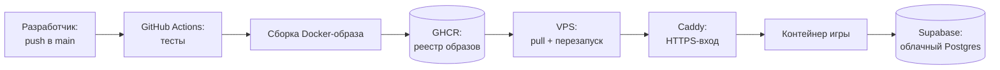

# Деплой и прод: как игра попадает на боевой сервер

Коротко: **разработчик пушит код в ветку `main` — дальше всё происходит само**. Никаких ручных
копирований файлов на сервер, никаких «зайди по SSH и перезапусти». Эта страница объясняет, из каких
шагов состоит этот автоматический путь и почему он устроен именно так.

Как устроено само приложение (движок, SPA, Redis) — см. [Запуск и архитектура](запуск-и-архитектура.md).
Актуальное состояние прода (что именно сейчас крутится и когда проверялось) — vault `State.md`.

## Путь кода: от `git push` до живой игры

Разберём цепочку по звеньям.

### 1. GitHub Actions — конвейер

**GitHub Actions** — это встроенный в GitHub «конвейер»: набор шагов, которые запускаются
автоматически при событиях в репозитории. У Cognopolis конвейер состоит из трёх работ:

| Шаг | Что делает | Когда запускается |
|---|---|---|
| `test` | Гоняет тесты (pytest) | На каждый push **и** на pull request |
| `build-and-push` | Собирает Docker-образ и кладёт его в реестр | Только push в `main` |
| `deploy` | Обновляет контейнеры на сервере | Только push в `main` |

Важное следствие: pull request проверяется тестами, но **ничего не деплоит** — на прод попадает
только то, что влито в `main`.

### 2. GHCR — реестр образов

Собранный образ (упакованная игра со всеми зависимостями, включая заранее собранный
веб-интерфейс) отправляется в **GHCR** (GitHub Container Registry) — хранилище Docker-образов при
GitHub. Каждая сборка получает две метки: `latest` и уникальную — по хешу коммита. Вторая метка
и есть страховка: **откат** на прошлую версию — это просто «запусти образ с предыдущим хешем»,
без правок кода.

### 3. VPS — боевой сервер

Игра живёт на арендованном **VPS** (виртуальном сервере). Конвейер подключается к нему по SSH,
скачивает свежий образ из GHCR и перезапускает контейнеры через Docker Compose. На сервере
работают три контейнера:

- **Caddy** — «входная дверь» (о нём ниже);
- **приложение** — движок игры (FastAPI + SPA);
- **Redis** — быстрое хранилище для rate-limit'ов и кэшей, снаружи не виден.

Секреты (строка подключения к БД, токены) лежат в конфиг-файле на самом сервере — деплой его
**не трогает**, поэтому секретов нет ни в репозитории, ни в образе.

## Caddy: HTTPS без ручной возни с сертификатами

**Caddy** — это реверс-прокси: сервер, который стоит перед приложением и принимает весь входящий
трафик. Только он смотрит в интернет (порты 80/443); контейнер игры снаружи вообще недоступен —
Caddy передаёт ему запросы по внутренней сети.

Главный подарок Caddy — **автоматический TLS**: он сам получает и продлевает сертификаты
Let's Encrypt, поэтому игра доступна по `https://` (браузер показывает замочек), а команде не нужно
помнить про «срок сертификата истекает». Заодно Caddy сводит все адреса к одному каноническому
домену, чтобы куки сессий не расползались по вариантам хоста.

## База данных: облачный Supabase и репозиторий миграций

Базы данных на игровом сервере **нет**. Движок ходит во внешний **Supabase** — облачный сервис,
дающий управляемый **PostgreSQL** (плюс веб-студию для просмотра таблиц). Там лежит весь мир:
жители, инвентари, здания, заявки Базара.

### Схема живёт в отдельном репозитории

Структура таблиц (схема БД) описана не в коде движка, а в отдельном репозитории —
**`Cognopolis-bd`**. Он хранит **миграции** — пронумерованные SQL-файлы, каждый из которых
описывает одно изменение схемы («добавить таблицу», «добавить колонку»). Применяются они строго
по порядку, и их сумма — это и есть текущая схема прода. Отсюда правило:

> **Миграции — источник истины схемы.** Движок умеет сам создавать таблицы (code-first), но в
> проде этот режим выключен: схему меняют только миграции из `Cognopolis-bd`. Любое изменение
> схемы — это пара правок: миграция в репо БД **и** модель в коде движка, чтобы они не разошлись.

### Деплой миграций: git → cloud

У репозитория БД свой, отдельный конвейер: push в его `main` подхватывается интеграцией Supabase
с GitHub («Deploy to production»), и новые миграции автоматически применяются к боевой базе.
То есть и код, и схема едут в прод одинаково — через `git push`, просто в разные репозитории.

## Золотое правило: миграция — ДО кода

Когда изменение затрагивает и схему, и код, порядок выкатки критичен:

1. Миграция пишется **аддитивной** (только добавляет: новую таблицу, новую колонку — ничего не
   ломает для старого кода) и **идемпотентной** (`IF NOT EXISTS` — повторное применение безвредно).
2. Сначала пушится репозиторий БД, миграция доезжает до Supabase.
3. Только потом пушится движок, который эту схему ждёт.

Почему так: старый код спокойно работает с расширенной схемой (лишнюю колонку он просто не
замечает), а вот **новый код на старой схеме падает** — запросит колонку, которой ещё нет.
Обратный порядок открывает окно ошибок на время сборки образа. Нюанс из практики: авто-применение
миграций может лагать, поэтому «пуш БД первым» — необходимое, но не достаточное условие; перед
тем как доверять выкатке, стоит убедиться, что миграция реально применилась.

## Что где искать

| Вопрос | Куда смотреть |
|---|---|
| Как игра устроена внутри | [Запуск и архитектура](запуск-и-архитектура.md) |
| Что сейчас живо на проде | vault `State.md` |
| Как устроена документация проекта | [Документация проекта](документация-проекта.md) |
| Игровые системы, которые всё это обслуживает | [Экономика и Базар](../03-системы/экономика-и-базар.md), [Мир и карта](../03-системы/мир-и-карта.md) |

## Источники

- `Reference/БД и миграции.md` — устройство облачного Supabase, репозиторий `Cognopolis-bd`, флоу git→cloud и правило аддитивных миграций.
- `State.md` — актуальное состояние прода (что развёрнуто, последние проверки).
- `.claude/skills/cognopolis-deploy/SKILL.md` (репо движка) — рабочий ранбук деплоя: шаги пайплайна GitHub Actions, Caddy/TLS, откаты, гочи выкатки.
- `.github/workflows/deploy-server.yml` (репо движка) — сам конвейер: test → build-and-push → deploy.
