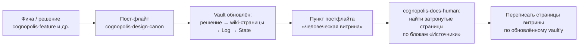

# Как устроена документация проекта

У Cognopolis два вида читателей — **агенты** (LLM-помощники, которые пишут код и ведут заметки)
и **люди** (команда, студенты курса, гости). Читают они по-разному, поэтому документация живёт
в **двух отдельных репозиториях** с разными правилами. Эта страница объясняет, где что лежит,
кто это обновляет и как не запутаться.

## Двухрепная схема

| Репозиторий | Аудитория | Роль |
|---|---|---|
| `Train_of_Thought-Cognopolis-obsidian` (дальше — **vault**) | агенты + автор-куратор | **Память проекта, единственная истина**: как устроены системы, текущее состояние, история решений |
| `Train_of_Thought-Cognopolis-obsidian-for-man` (**этот репо**, «витрина») | люди | **Презентационный слой**: пересказывает истину живым языком; сам истину не хранит |

Ключевое следствие: если витрина противоречит vault'у или коду — это **баг витрины**,
и чинится он здесь, а не в vault.

Третий участник — репозиторий движка `Train_of_Thought-Cognopolis`. Он документацию **не хранит**
(только код, README и короткий указатель «документация — в соседних репо»), зато в нём живут
рабочие скиллы — о них ниже.

### Vault: память для агентов

Vault — это Obsidian-хранилище, устроенное по модели «LLM-wiki»: агент выступает библиотекарем,
автор курирует. Внутри три слоя (полная схема — в `CLAUDE.md` самого vault'а):

- **RAW (история, только дозапись)** — `Log.md` (одна строка на событие) и
  `Decisions/Журнал решений.md` (журнал принятых решений). Записи задним числом не переписываются.
- **WIKI (живые страницы)** — `Design/**` (механики, экраны, платформа), `Roadmap.md`,
  `Worldbuilding/`, `Art/`, `Lessons/`, `Reference/`. Каждая страница отражает **только текущую**
  истину системы: отгрузили фичу — вшили её в текст «как будто так было всегда», без приписок
  «обновление от такого-то числа».
- **SCHEMA (правила)** — `CLAUDE.md` vault'а и шаблоны в `_templates/`.

Отдельно стоят два навигационных файла: `Home.md` — индекс всех страниц, и `State.md` —
снимок текущего состояния. **Статус проекта живёт только в `State.md`** — ни на одной другой
странице (включая всю эту витрину) статусов нет; актуальное состояние — vault `State.md`.

### Витрина: рассказ для людей

Этот репозиторий разложен по читателям:

```
README.md             — обложка проекта
docs/01-обзор/        — концепция и роадмап человеческим языком
docs/02-игроку/       — быстрый старт, как написать своего агента
docs/03-системы/      — игровые системы: мир, бой, крафт, экономика, жители
docs/04-разработчику/ — запуск, деплой, эта страница
```

Правила витрины закреплены в её `CLAUDE.md`; выжимка — в конце этой страницы.

## Скиллы: кто всё это обновляет

Скиллы — это заготовленные рабочие процедуры для агента (папка `.claude/skills/` в репо движка).
Для документации важны прежде всего два:

| Скилл | Что делает |
|---|---|
| `cognopolis-design-canon` | **Пре-флайт**: перед любой работой грузит из vault канон и инварианты. **Пост-флайт**: после работы прогоняет обновление памяти (журнал решений → системные страницы → `Log.md` → `State.md`) и `vault-lint` — проверку битых ссылок и противоречий |
| `cognopolis-docs-human` | Ведёт **эту витрину**: находит затронутые страницы и переписывает их по обновлённому vault'у |

Рядом — рабочие скиллы дисциплин, каждый из которых порождает изменения, доезжающие до документации:
`cognopolis-feature` (игровая фича вертикальным срезом), `cognopolis-agent-lesson` (учебные уроки),
`cognopolis-deploy` (операции на проде — см. [деплой и прод](деплой-и-прод.md)),
`cognopolis-game-design` (механики и баланс), `cognopolis-worldbuilding` (лор и нейминг),
`cognopolis-art` (стиль и ассеты).

## Поток обновления: от фичи до этой страницы

Витрина обновляется **событийно**, а не по расписанию. Цепочка такая:



Связующее звено — блок **«Источники»** внизу каждой страницы витрины: в нём перечислены
vault-страницы (и файлы кода), из которых страница сделана. Изменилась vault-страница —
скилл по этим блокам находит, какие человеческие страницы устарели, и перегенерирует именно их.
Публикация — обычный git push, отдельного CI у витрины нет.

## Правила витрины (если пишете страницу руками)

Коротко — то, что нельзя нарушать:

1. **Никаких статусов и дат**: ни «готово», ни «задеплоено тогда-то», ни счётчиков тестов.
   Единственная допустимая формула: «актуальное состояние — vault `State.md`».
2. **Каждая страница заканчивается блоком «Источники»** — без него скилл не узнает,
   когда страницу пора обновить.
3. **Живой русский для новичка**: термин объясняется при первом употреблении; номера решений
   из журнала в тексте не нужны — глубина достаётся через «Источники».
4. **Никаких секретов**: пароли, ключи, строки подключения, приватные адреса — не пишутся
   даже в примерах.
5. **Не дублировать справочники**: каталоги рецептов, зданий и цен живут в самой игре —
   экран «Справочник» (`/codex`) и API `GET /recipes|/buildings|/items`. Ссылайтесь,
   не копируйте значения (одно-два числа для примера — можно).

Соседние страницы раздела: [запуск и архитектура](запуск-и-архитектура.md),
[деплой и прод](деплой-и-прод.md).

## Источники

- vault `CLAUDE.md` — схема LLM-wiki: три слоя, навигация, железные правила, операции ingest/query/lint
- `Train_of_Thought-Cognopolis-obsidian-for-man/CLAUDE.md` — правила витрины, структура папок, событийное обновление
- `Train_of_Thought-Cognopolis/CLAUDE.md` — список скиллов репо движка и границы «код здесь, документация в соседних репо»
