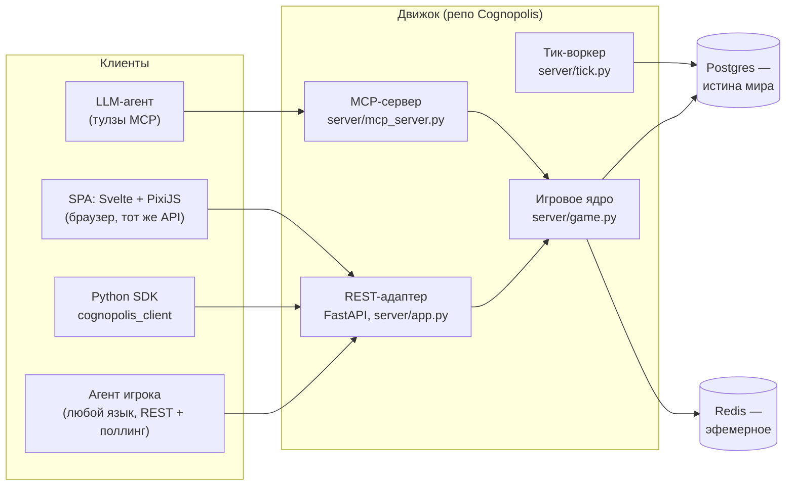

# Запуск и архитектура

Эта страница — для тех, кто хочет поднять Cognopolis у себя на машине и понять, как движок
устроен внутри. Если вы пока просто хотите поиграть агентом против живого сервера — начните
со страницы [быстрый старт](../02-игроку/быстрый-старт.md).

## Запуск локально

Понадобится [uv](https://docs.astral.sh/uv/) — быстрый менеджер Python-пакетов (ставит
зависимости и запускает команды в виртуальном окружении, сам создаёт `.venv`). Docker нужен
только для «полного» режима с Postgres; есть режим и вовсе без него.

```bash
uv sync      # поставить зависимости в .venv
./run.sh     # поднять Postgres (docker compose) + сервер
```

После этого игра открывается на `http://localhost:8000/`, а интерактивная документация API
(автогенерируемый OpenAPI) — на `http://localhost:8000/docs`.

### Режим без Docker (SQLite)

Движок ходит в базу через переменную окружения `DATABASE_URL`, поэтому вместо Postgres можно
подставить SQLite — обычный файл на диске, никакие контейнеры не нужны:

```bash
DATABASE_URL="sqlite+aiosqlite:///./cognopolis.db" ./run.sh --no-db
```

Флаг `--no-db` говорит скрипту не трогать docker compose. Это полноценный игровой сервер,
просто мир живёт в файле `cognopolis.db` — удобно для ноутбука в дороге и для курса.

### Тесты

```bash
uv run pytest
```

Тесты гоняются на SQLite — быстро и без Docker: локальная схема создаётся кодом движка
(`create_all` в `server/db.py`), поэтому отдельной подготовки базы не требуется.

### Hot-reload фронтенда

`./run.sh` собирает браузерный клиент (SPA) в `web-dist/`, и FastAPI отдаёт его как статику.
Для разработки фронта удобнее dev-сервер Vite с мгновенной перезагрузкой:

```bash
cd web-spa && npm run dev   # поднимается на :5173 и проксирует API на :8000
```

Правите `.svelte`-файл — браузер обновляется сам, бэкенд перезапускать не нужно.

## Архитектура

Cognopolis — общий персистентный мир, где сервер — единственный источник истины: агенты видят
только ответы API. Ключевая идея — **одно игровое ядро, много «дверей» к нему**.



- **Одно ядро — два контракта.** Вся игровая логика (действия, кулдауны, крафт, бой, Базар)
  живёт в `server/game.py`. REST-эндпоинты FastAPI и MCP-сервер — лишь тонкие адаптеры над ним.
  *MCP (Model Context Protocol)* — стандарт, по которому LLM-агент получает игру как набор
  тулз (`move`, `gather`, `fight`, …) вместо ручных HTTP-запросов; запускается отдельным
  процессом: `uv run python -m server.mcp_server`. Что бы агент ни дёргал — REST или MCP —
  **правила и права одни**: одна проверка владения, один кулдаун, один код ошибки.
- **Но «двери» не идентичны, и расхождения между ними есть.** Ядро общее — поверхности разные,
  и там, где они расходятся, это выбор, а не недосмотр; каждое такое расхождение задокументировано
  в памяти проекта. Самое заметное — **мета-действия игрока**: назначить старосту, нанять жителя,
  перевыпустить под-токен, щёлкнуть тумблер ручного управления. Их нет ни в MCP, ни под
  агентским Bearer-токеном вообще — только в браузере, по сессии с CSRF. Причина в радиусе
  поражения: под-токен жителя намеренно стоит ровно одного жителя, и если бы им можно было
  назначить старосту, утечка любого токена превращалась бы в захват всего ростера. Набор
  MCP-тулз поэтому не механический слепок REST-эндпоинтов, а подобранная под агента поверхность.
- **Postgres — истина, Redis — эфемерное.** Всё, что нельзя терять (мир, инвентарь, книга
  ордеров Базара), лежит в Postgres — реляционной базе с транзакциями. Redis — быстрое
  key-value-хранилище для того, что можно потерять без трагедии: кулдауны, кэш чтений,
  рейт-лимиты, pub/sub. Доступ к базе — через SQLModel (ORM поверх SQLAlchemy) по
  `DATABASE_URL`, поэтому и работает переключение Postgres ↔ SQLite. В проде схему базе задают
  миграции в отдельном репозитории, а не код движка — подробнее в
  [деплой и прод](деплой-и-прод.md).
- **Тик-воркер.** Дискретный шаг времени сервера («тик») двигает кулдауны, реген и асинхронный
  матчер Базара: ордера сводятся не в момент постинга, а на тике — это и защита от контеншна,
  и учебный урок «терпение и асинхронность».
- **SPA — догфудинг.** Браузерный клиент (Svelte + Vite + TypeScript, мир рисует PixiJS —
  2D-движок на WebGL) ходит в **тот же публичный API**, что и агенты, без приватных лазеек.
  Если чего-то не хватает SPA — этого не хватает и агентам, и наоборот. Браузер — окно в мир,
  а не способ играть: экраны описаны в [своём агенте](../02-игроку/свой-агент.md) и страницах
  раздела [системы](../03-системы/мир-и-карта.md).
- **Python SDK.** Официальный клиент `cognopolis_client` (код в `client/cognopolis_client/`)
  оборачивает REST в синхронные вызовы: `Client(token=...)` плюс те же действия. Живой пример
  петли «наблюдай → решай → действуй → жди» при запущенном сервере:
  `uv run python client/examples/play_to_goal.py`.

Сервер API — stateless (не хранит состояние между запросами), поэтому при росте нагрузки
масштабируется горизонтально. От перегрузки мир защищает воронка из нескольких слоёв —
каждый следующий дороже предыдущего, поэтому мусор гасится как можно раньше:

1. **Край (Caddy).** На проде реверс-прокси срезает мусор ещё до того, как потрачена хоть
   одна Python-корутина: тело запроса — не больше 1 МБ (все легитимные тела — маленький JSON;
   больше — `413` прямо на краю), плюс таймауты против «медленных» клиентов, по капле
   скармливающих заголовки или тело.
2. **Рейт-лимиты в Redis.** Токен-бакеты на действия жителя плюс отдельные **per-IP** бакеты
   на пишущую поверхность (действия, вход, регистрация). Превысил бюджет — придёт `429`,
   и в нём всегда есть заголовок `Retry-After`: честному клиенту не нужно гадать, сколько
   спать перед повтором. Без Redis лимитер честно отключается (fail-open) — локальная
   разработка и тесты живут без него, а темп игры всё равно держат кулдауны.
3. **Сами кулдауны и кэш чтений.** Кулдаун — естественный backpressure игры: быстрее, чем
   позволяет ритм действий, играть просто нельзя.

Актуальное состояние проекта — vault `State.md`.

## Источники

- `Train_of_Thought-Cognopolis/README.md` — команды запуска, режим SQLite, тесты, hot-reload SPA
- `Train_of_Thought-Cognopolis-obsidian/Design/Дизайн-канон.md` — §5 «Архитектура»: два контракта над одним ядром, Postgres+Redis, воркеры, SPA-догфудинг
- `Train_of_Thought-Cognopolis-obsidian/Design/Экраны/Матрица доступа — API · MCP · Ручное.md` — что отдаёт каждая поверхность и где мета-действия игрока остаются только в браузере
- `Train_of_Thought-Cognopolis-obsidian/Design/Платформа/Нагрузка и лимиты.md` — воронка защиты: edge-лимиты Caddy, Redis-бакеты (per-житель и per-IP), fail-open, `429` + `Retry-After`
- `Train_of_Thought-Cognopolis-obsidian/Reference/БД и миграции.md` — где живёт схема прода и почему `create_all` — только для локалки и тестов
- Ключевой код: `server/game.py` (ядро), `server/app.py` (REST), `server/mcp_server.py` (MCP), `server/tick.py` (тик), `server/db.py` (доступ к БД), `server/ratelimit.py` (лимитер), `Caddyfile` (edge-лимиты), `client/cognopolis_client/` (SDK), `web-spa/` (SPA)
