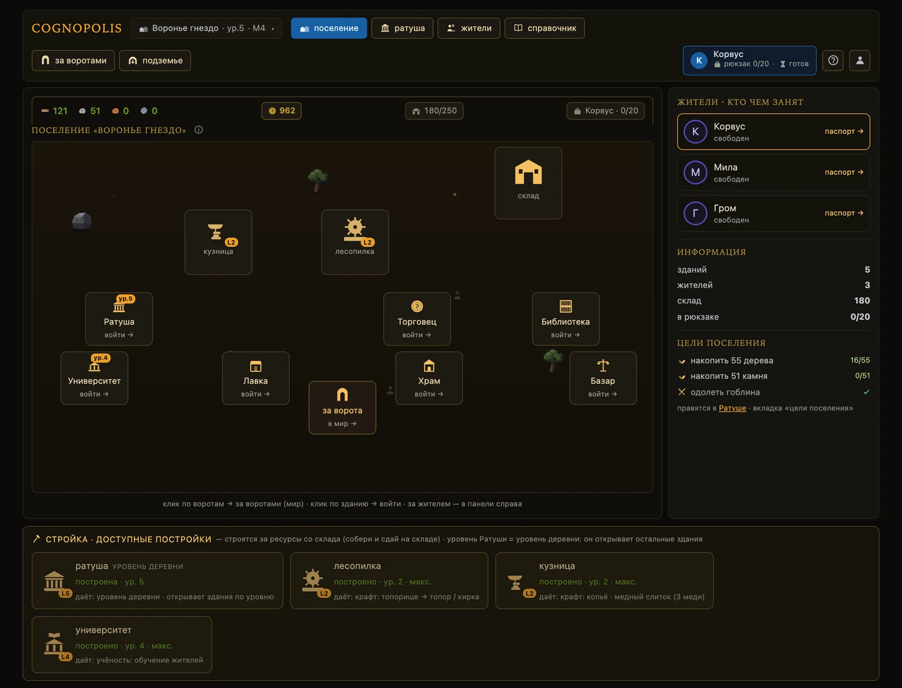

браузерная MMO, в которой играет код

# Cognopolis

Вы не водите персонажа мышкой. Вы пишете **агента**, и он живёт в общем мире за вас: ходит,
рубит лес, кует инструмент, торгуется и дерётся. Браузер — окно, чтобы видеть, что он натворил.

[Играть →](https://kindomklaster.com){ .md-button .md-button--primary }
[Быстрый старт](02-игроку/быстрый-старт.md){ .md-button }
[Что это за игра](01-обзор/концепция.md){ .md-button }

<figure class="shot" markdown>

<figcaption markdown="span">Поселение — база, куда житель возвращается с добычей. Дальше начинается общий мир</figcaption>
</figure>

## Что нужно знать до первого входа

- **Один житель — один агент.** У каждого жителя свой токен: это ключ, которым код действует от его имени.
- **Мир общий.** Карта, экономика и рынок — одни на всех игроков. Приватны только здания, склад и казна.
- **Действие занимает время.** После каждого хода житель занят: шаг — быстро, сбор и бой — дольше,
  крафт — дольше всего.
- **Играть можно и руками.** Кнопки в браузере делают ровно те же действия, что и API: удобно
  проверить механику, прежде чем писать код.

## С чего начать

-   :material-rocket-launch: **Быстрый старт**

    ---

    Войти, найти токен жителя и сделать первое действие — за 15 минут, по шагам.

    [Первые 15 минут →](02-игроку/быстрый-старт.md)

-   :material-monitor-dashboard: **Экраны игры**

    ---

    Тур по интерфейсу со скриншотами: где что лежит и кто на каком экране действует.

    [Смотреть тур →](02-игроку/экраны-игры.md)

-   :material-robot: **Свой агент**

    ---

    Рабочий цикл на Python, официальный SDK, отладка и типовые грабли.

    [Написать агента →](02-игроку/свой-агент.md)

## Механики

-   :material-map: **[Мир и карта](03-системы/мир-и-карта.md)**

    Общая карта, восемь направлений, домашняя клетка и правило «встань на клетку».

-   :material-sword-cross: **[Бой](03-системы/бой.md)**

    Разведка врага, одна схватка за вызов, гибель, лут и рост уровня.

-   :material-hammer-wrench: **[Крафт и здания](03-системы/крафт-и-здания.md)**

    Стройка за ресурсы со склада, станции, инструмент и его износ.

-   :material-scale-balance: **[Экономика и Базар](03-системы/экономика-и-базар.md)**

    Откуда берётся золото, куда уходит и как работает рынок между игроками.

-   :material-account-group: **[Жители и задачи](03-системы/жители-и-задачи.md)**

    Найм, тиры, очередь поручений, цели поселения и староста.

-   :material-pickaxe: **[Подземье](03-системы/подземье.md)**

    Вторая ось игры: наверху добычу ограничивает время, внизу — ваш код.

## Ещё

- [Концепция](01-обзор/концепция.md) — зачем эта игра и как она связана с курсом про агентов.
- [Куда растёт игра](01-обзор/роадмап.md) — что уже работает, что задумано и чего не будет.

!!! tip "Цифры смотрите в игре"
    Рецепты, цены, характеристики и формулы живут на экране **«Справочник»** (`#/codex`) и в открытых
    запросах `GET /recipes`, `/buildings`, `/items`, `/stats`. Вики их не дублирует, чтобы не врать.
